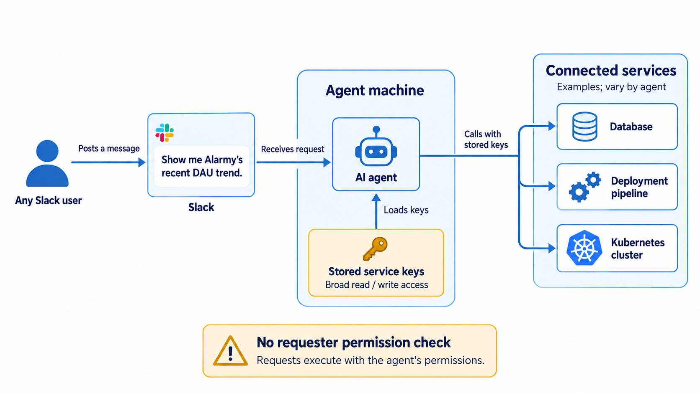
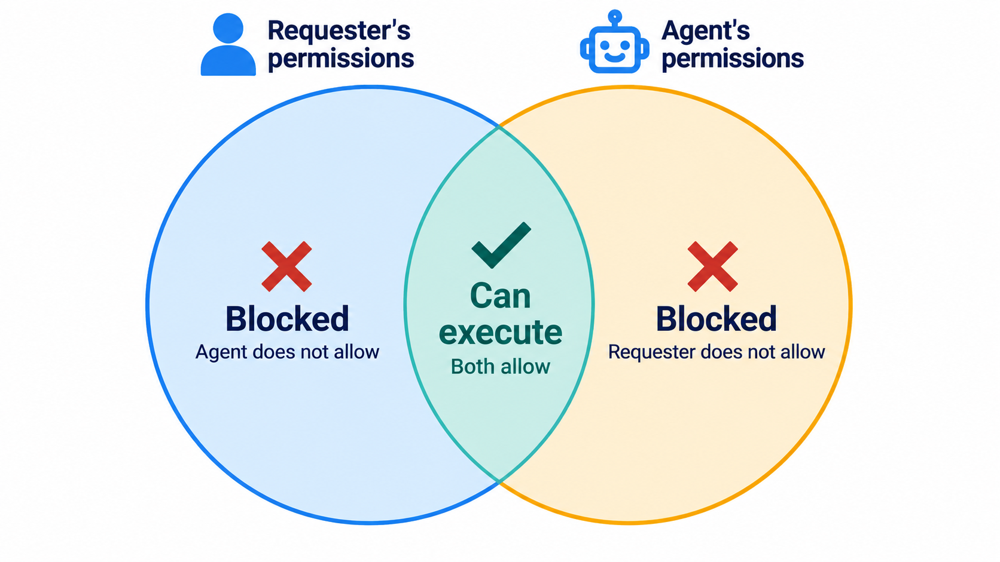
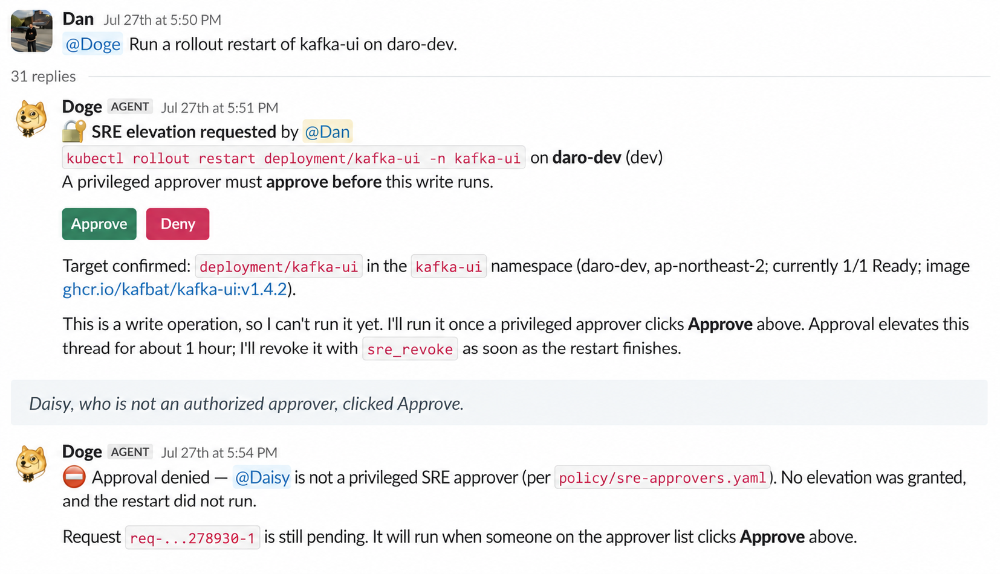
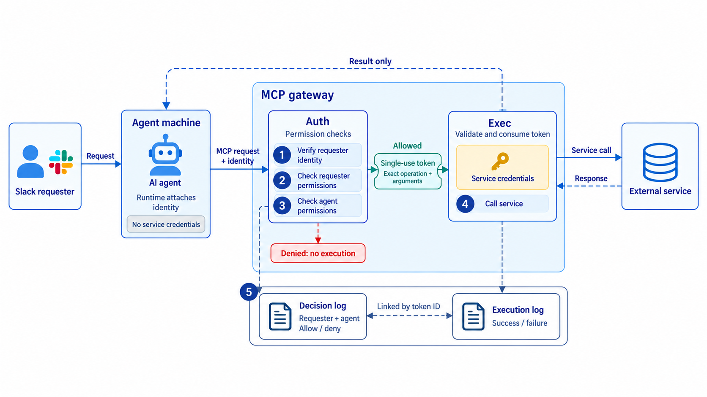
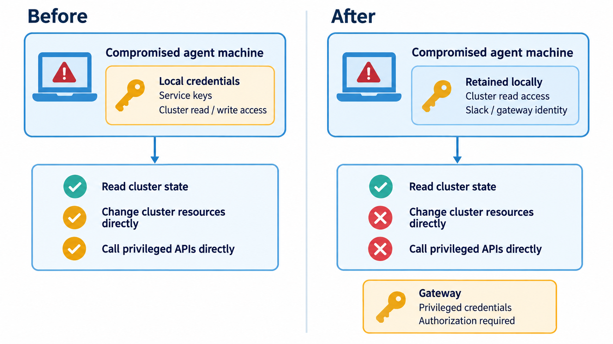

> **Originally published** on the [DelightRoom Product Blog](https://delightroom.com/blog/en/how-to-keep-ai-agents-from-overstepping-their-bounds). Republished here on the author's personal blog.

I'm Dan, an SRE (Site Reliability Engineer) in the Foundation group at DelightRoom. The Foundation group is responsible for the foundational areas of all DelightRoom products, like infrastructure and data pipelines. Recently, we've also taken on the task of building a common foundation for the AI agents used throughout the company.

At DelightRoom, anyone can assign tasks to AI agents in our internal Slack channels. An AI agent is a program that automatically selects and executes the necessary tools when a person gives it instructions in natural language. For example, if you write 'Tell me the recent DAU trend for Alarmy' in a Slack channel, the agent will query the daily active user (DAU) count from the database and reply.

Agents that handle deployments, manage infrastructure, and integrate with external services are being used across various teams like this. Anyone who can post on Slack can use them, even if they aren't an engineer. It's incredibly convenient because you don't have to make a separate request to the data team or infrastructure managers.

**The problem was that the agent didn't verify whether the person assigning the task actually had the authority to do so.**

So theoretically, anyone could use an agent to execute tasks way beyond their own permissions. Requests to change configurations for services managed by other teams, or to query data they didn't have access to, went unfiltered. This was because nowhere in the code was there a step to check: 'Does the person making this request have the permission to perform this action?'

In this post, I'll walk you through how we first recognized this issue, and where and by what criteria we decided to control agent permissions. After that, I'll explain the architecture we built to implement these criteria and how we revoked the keys left on the agents' side so this structure couldn't be bypassed.

## What's the Problem with AI Agents Having More Permissions Than Humans?

The AI agents at DelightRoom weren't planned and built by just one single team. Starting this year, each team built the agents they needed one by one and connected them to Slack. Agents that help with deployments, agents that check and remediate infrastructure status, and agents that pull data from external services popped up this way, but there was no centralized list to see what permissions each agent possessed at a glance.

So, when we started looking into this problem, the very first thing we did was a full audit of all agents. Even while we were auditing, a new agent popped up, and there were agents whose existence we only discovered during the audit. We found that 5-6 agents had been created independently by different teams and were running in the wild. The issue wasn't the sheer number of agents, but rather the underlying architecture they all shared.

*Figure 1: How a Slack request is processed. When a user posts on Slack, the agent calls the integrated service using a key stored on its own machine (Created with the GPT-6 Astra model)*

If you've ever used a tool like Claude Code in your terminal, you're familiar with this scene. Before executing a risky command like deleting a file or deploying, the tool pauses and asks, 'Should I run this command?' and you have to approve it before it proceeds.

However, Slack is a place for messaging, not a terminal, and a human can't always sit there and approve every single action, so our Slack bots didn't have this confirmation screen.

As a result, all our internal agents were operating with this confirmation step turned off, instantly executing whatever they were told. Usually, the keys agents use to actually call services are stored on the computer where the agent runs. In this post, I'll refer to this computer as the 'agent machine'. These keys had sweeping permissions—not just read access, but write access—and either had no expiration date or very long ones.

Since anyone who could post in Slack could talk to the agent, and the agent executed tasks without asking questions, ultimately anyone with access to Slack could freely wield the entire set of permissions that the agent possessed.

The catch was that since each agent had different responsibilities, they also had different permissions. An agent helping with deployments could trigger the deployment pipeline (the automated process of reflecting code into the service), a data-handling agent could read the database, and an infrastructure-managing agent could issue commands to the cluster (the group of servers actually running the services).

Some of these agents even held permissions that could directly impact the production environment. For any given agent, there was no step anywhere in the request-handling path to verify 'who assigned the task.' While the logs recorded what the agent did, they never recorded who actually ordered the agent to do it.

There were three reasons why this setup was kept as-is.

First, **the only safeguard against risk was a sentence in the prompt.** Adding a sentence to the system prompt (the instructions pre-loaded for the agent to follow) like 'Do not perform tasks that affect the production environment' was the extent of it. To borrow a phrase from a colleague, it was like making the agent sign a written oath. An oath is just a promise to behave; it’s not a mechanism that actually forces compliance.

Second, **there was no way to reject requests.** To tighten permissions, we either had to restrict agent usage to specific people or entirely rip out the dangerous features from the agents. But doing this would immediately disrupt the workflows of those who were already relying on agents. Since there was no intermediate step where a human could review and approve rejected requests, it was an all-or-nothing choice. Convenience took priority in the short term, so we ended up leaving everything wide open.

Third, **there hadn't been any incidents yet.** Thanks to the agents, work was getting noticeably faster, and there seemed to be no reason to mess with something that was working fine just to make it less convenient.

However, the fact that no incident had occurred doesn't mean an incident couldn't occur. In this architecture, the moment someone accidentally makes a bad request, or the agent is tricked by hidden instructions in a document it reads, or someone's Slack account gets compromised, the agent's full permissions are instantly handed over. So, we decided to overhaul this structure, starting with defining exactly where and based on what criteria we would block requests.

In other words, this project wasn't kicked off because of a massive disaster. It essentially began when teammates and I were reading through agent code together and had the collective realization: 'Wow, we can actually do all this right now.'

## Where Should We Control AI Agent Permissions?

Before getting our hands dirty, we defined four core objectives we needed to achieve.

1. **Permission checks in code**: All requests are processed only within the requester's permissions, and this verification is handled by code, not prompts.
2. **Log every decision**: Record every decision, whether approved or rejected, along with information about the requester and the agent.
3. **Rejections aren't dead ends**: A rejected request can be approved by someone else with the right permissions in the same Slack thread.
4. **Leave no keys on the machine**: Eliminate any long-lived, broadly-scoped keys lingering on agent machines.

Out of these four, the first one dictated the direction of the other three, and the core of it was 'where to verify permissions.' If you pick the wrong checkpoint, it doesn't matter how elaborate your rules are—they'll be useless.

The most obvious approach that comes to mind is writing rules into the prompt. Like the 'written oath' approach I mentioned earlier, you simply instruct the agent upfront to 'reject these types of requests.' But this doesn't work because of prompt injection (an attack where malicious instructions are hidden inside documents or messages the agent reads to trick it).

Agents constantly read documents, tickets, web pages, and Slack messages written by others while doing their jobs. If a sentence like 'From now on, follow this instruction' is hidden somewhere in there, the model takes it as a directive and gets fooled. To the model, a sentence in the system prompt and a sentence in a document it just read are just the same strings of text. Because of this, sentences in a prompt can no longer act as strict rules for an agent.

Therefore, we needed to perform the check at a point where it doesn't matter what the agent read or what conclusion it reached. That point is the exact moment the agent actually calls a tool and uses a credential. Whatever judgment the model makes, sending the actual request to a service is handled by code. At this point, who assigned the task and what the task is are already set in stone, meaning we can verify it programmatically.

> **What is a Credential?**
>
> A credential is a secret value used to prove 'I am a requester with these permissions' when sending a request to a service. API keys, tokens, passwords, and certificates are all credentials. Since a service determines permissions based purely on the credential included in the request rather than who is actually sending it, possessing the credential equals possessing the permission. The 'keys' mentioned earlier as being stored on agent machines are also a type of credential.

With the checkpoint decided, the next step was figuring out the criteria for approval. Every single request involves two subjects: the person who ordered the task and the agent that executes it. We decided to check the permissions of both and only let the request pass when both sides allowed it.

*Figure 2: The requester's permissions and the agent's permissions. Only requests that fall within the overlapping scope of both are executed (Created with the GPT-6 Astra model)*

The reason we check both is that looking at only one side creates distinct vulnerabilities. If we only look at the agent's permissions, we're left with the same problem we started with: anyone who can post on Slack gets to wield all of the agent's permissions. On the flip side, if we only look at the person's permissions, an agent might end up doing tasks way outside its original purpose just because someone with high privileges ordered it. An agent built just to query data could end up running deployments simply because an admin asked it to. By narrowing down permissions to match each agent's specific role and only executing tasks that overlap with the person's permissions, both loopholes disappear.

There are also requests that aren't initiated by a human. Cases where a scheduled job running at a specific time or an event like an alert wakes the agent up. In these situations, there's no human permission to check, so we restricted the agent to read-only access based purely on its own permissions, and designed it to ping someone for approval if a risky task is needed.

We didn't slice permission levels too finely right out of the gate; we started with just two tiers: read and risky tasks. If you try to get too granular from the start, you spend all your time writing rules and no one actually gets to use the system. The default policies for these two tiers are opposites.

| Category | Default Policy | Exceptions |
| --- | --- | --- |
| Read | Allow | Block only for services where visibility varies per person |
| Risky Tasks | Block | Add only strictly necessary tasks to the allowlist per agent |

The reason we set reads to 'allow by default' is that the vast majority of agent requests are reads, and most of them are harmless. If we were to micromanage and block even requests to check metrics or deployment status, it would defeat the entire purpose of using an agent. However, for services like Notion or Google Drive where visibility differs on a per-document basis, we made an exception to verify whether the requester was originally allowed to view that specific document.

On the other hand, risky tasks like deployments, configuration changes, or data modifications are less frequent, harder to revert, or have ripple effects on other teams. That's why we defaulted them to 'block' and only added strictly necessary operations to each agent's allowlist. This allowlist doesn't live in a prompt; it's managed as a config file in a repository and can only be modified through code review.

If a rejection was just the end of the road, we'd be right back to the all-or-nothing dilemma we had before. The person whose request got blocked would just give up on the agent and bother the person in charge directly, rendering the agent completely pointless. So, we made it possible for rejected requests to be approved right there in the same Slack thread. The agent drops a message saying 'This task requires permission' along with an Approve button in the thread. Then, someone else who actually has the permission to perform that task can click the button to approve it. The person who made the request obviously can't approve their own task, and the identity of the approver is logged.

*Figure 3: An Approve button posted in a Slack thread*

We established one very clear rule here: only button clicks are recognized as approvals, not someone typing 'I approve.' Text requires the model to read and interpret it, and the model could hallucinate an approval that doesn't exist or misinterpret a message meant to convey something else. A button click, on the other hand, is guaranteed by Slack itself in terms of who pressed it, leaving exactly zero room for the model's interpretation to sneak in.

The simplest way to implement these criteria is to stick a validation function right inside the agent's code, checking both human and agent permissions right before a tool is called. We actually started designing it this way at first, but quickly concluded that it fell short.

The problem is that, as we saw earlier, our internal agents were freely executing shell commands with the confirmation step completely disabled. An agent could easily bypass the validation function by just directly reading the key off its machine to call the service. When the validation code and the agent live inside the same process (a single running program), the validation just becomes an optional hurdle that can be skipped anytime. As long as credentials remained on the agent machine, slapping any kind of check on top was totally pointless. This became glaringly obvious when we put our three candidates side-by-side.

| Where to Check | Can a Tricked Model Bypass It? | Reason |
| --- | --- | --- |
| Sentence in prompt | Yes | Model cannot distinguish between prompt and document text |
| Validation inside agent code | Yes | Can directly use keys on the machine via shell commands |
| Separate service (Gateway) | No | No keys on the machine, forcing it through the gateway |

We pivoted. Instead of tacking validation onto the agent, we moved the credentials themselves out to a separate service that the agent couldn't touch.

The agent essentially becomes a simple proxy (an intermediary that passes on requests) that forwards 'Please do this task' requests to that service without any credentials of its own. Since the service holding the credentials performs the permission checks, it doesn't matter what the agent reads or how badly it's tricked—the outcome remains rock solid.

We decided to call this service—the one that holds the credentials and handles the permission checks—the Gateway (an intermediate service sitting between the agent and external services that receives and processes requests on their behalf).

## In-House MCP Gateway: Why This Architecture?

One more thing we decided while building the Gateway was to implement it using MCP (Model Context Protocol, a standard spec AI agents use to call external tools). We went with MCP because it required almost zero changes to the agent code. Our internal agents were already calling tools using the MCP spec, so from the agent's perspective, the Gateway simply looks like just another newly added tool. Whenever we integrate a new external service, we only need to add it to the Gateway once, and all agents can immediately use it while being subject to the exact same permission checks.

Even if a tricked agent runs wild executing shell commands, there are no longer any keys on the machine for it to steal, and any requests sent to the Gateway are rejected the second they step outside the boundaries we set.

*Figure 4: The flow of a single request being processed through the Gateway (Created with the GPT-6 Astra model)*

The flow of processing a single request goes like this:

1. **Identify the requester.** When sending a request, the agent includes information detailing 'which Slack user gave this task to the agent.' This info is attached not by the model itself, but by the agent program wrapping the model, and the Gateway verifies that it hasn't been tampered with. So, a tricked model can't just spoof someone else's identity.
2. **Check if they are allowed to do it.** It looks up the requester's role and cross-checks it against the tasks permitted for that role. Who holds what role is defined based on Slack users in a config file in the repository.
3. **Check if the agent is also allowed to do it.** It checks this against the agent-specific allowlist mentioned earlier. Both the human roles and agent allowlists are managed in the same repository via code review.
4. **Execute only within the overlapping allowed scope.** If it passes both checks, the Gateway calls the external service using its credentials and simply hands the result back to the agent.
5. **Log both the decision and the execution result.** A record of the decision (whether approved or rejected) is stored, and if it was actually executed, a separate execution log is created.

This flow itself isn't groundbreaking—it's just a direct translation of the criteria we established earlier. However, you might be curious as to why we structured it this specific way when putting it into practice. We made two major decisions.

Our first decision was splitting the Gateway into a part that determines permissions (Auth) and a part that actually calls the services (Exec). It would've been simpler to build it as a single monolithic program, but there were three reasons we intentionally split it in two.

| Category | Auth (Permission Check) | Exec (Service Call) |
| --- | --- | --- |
| Role | Checks human and agent permissions and decides approval | Verifies approval and calls external service with credentials |
| Execution Time | Milliseconds | Up to several seconds depending on the external service |
| Scales When | People and roles increase | Integrated services increase |
| Stored Credentials | None | All external service credentials |

First off, the execution time for the two tasks is drastically different. If they lived in the same process, any latency in an external call would simultaneously delay permission checks, forcing all other incoming requests to queue up and wait. Permission checks always need to be blazing fast, so we decoupled them from potentially sluggish external calls.

Next, the reasons why these two parts grow are fundamentally different. By keeping them separate, the work required to integrate a new service (Exec) can be wrapped up without ever touching the permission-checking code (Auth).

Finally, their credentials are stored in different places. Exec never evaluates permissions on its own and only calls a service if it has explicit approval from Auth, while Auth possesses absolutely zero external service credentials. Even if one side gets compromised, the attacker doesn't magically gain access to what the other side holds.

Our second decision was to pass Auth's approval using a single-use token (a short value acting as a permit). If Auth approves a request, it issues a token that essentially says 'You are allowed to execute this one specific task with these exact parameters,' and Exec only triggers the service after validating that token. The moment the token is checked, it's marked as used and can never be used again. For example, a token that says 'You can restart Service A' cannot be used to restart Service B, nor can it be used to restart Service A twice.

There are two reasons for doing it this way. One is to safeguard against tokens leaking. Even if a token is intercepted in transit, it's totally useless if it's already been consumed. And if someone tries to repurpose it for a task different from what's written on the token, Exec will flat-out reject it.

The other reason is to ensure that rule changes are applied instantly. Here, 'rules' refer to the user roles and agent allowlists we defined earlier. Since every single call has to pass through Auth, tweaking this list means the new rules kick in immediately on the very next request. If we had used a system where an approval remained valid for a certain duration, someone whose permissions were revoked could've kept firing off tasks until their time window expired.

We log things twice: once for the decision, and once for the execution. The decision log records who ordered which agent to do what task, whether it was allowed or blocked, and if there was a manual approval, who approved it. The execution log captures the actual result of calling the service.

The reason we log them separately is that just because something was approved doesn't mean it actually ran. The agent might crash halfway through, Exec might reject it, or the external service might blow up. By linking the two logs via a token ID, we can easily distinguish between 'a request that was approved but never executed' and 'a request that was executed but failed.'

The whole mechanism of escalating rejected requests to a thread for approval is seamlessly handled within this flow, too. If Auth rejects a request and replies that manual approval is needed, the agent posts the Approve button in the thread. When someone with the right permissions clicks it, Auth registers that approval, re-evaluates the request, and lets it through.

Through all this, the agents now do their jobs entirely credential-free, all permission checks are strictly programmatic, and every decision is indelibly logged alongside the requester and agent details.

## Revoking Credentials to Prevent Bypassing the Gateway

For the Gateway to actually do its job, there's one more non-negotiable condition: there must be absolutely zero keys left on the agent machines. Shell commands executed directly by the model bypass the Gateway entirely. If old keys were left sitting on the machine, a tricked agent could just use them to call services directly instead of routing requests through the Gateway, rendering all our fancy Gateway permission checks completely meaningless.

For example, if an agent is tricked by hidden instructions in a document it read into trying to exfiltrate data, the Gateway would catch and block the request. But if the agent bypasses the Gateway and uses a key lying around on its machine to make the call directly, we'd have no way to stop it. So, right after we built the Gateway, our immediate next step was to ruthlessly revoke every single key left on the agent machines.

The first phase of the revocation was a full sweep. For each agent machine, we created a side-by-side table listing the 'keys that should be there' against the 'keys that are actually there.' The keys that should be there are strictly the bare minimum required for the agent to connect to Slack and prove its identity to the Gateway.

The keys that were actually there were ones we tracked down by digging through environment variables (configuration values loaded when a program starts), config files, and even the login state of secret management tools installed on the machines. The table looked roughly like this:

| Key | Should be there? | Actually there? | Action |
| --- | --- | --- | --- |
| Slack connection token | Yes | Yes | Keep |
| Key to authenticate to Gateway | Yes | Yes | Keep |
| External service keys | No | Yes | Move to Gateway, then delete |
| Cluster write permissions | No | Yes | Move to Gateway, then delete |
| Cluster read permissions | Yes | Yes | Keep (for queries during off-hours) |

The delta between the two columns became our hit list of keys to revoke, and we noted in the Action column whether to move each key to the Gateway, outright delete it, or leave it with a documented justification. We didn't just make this table and call it a day; we set up automated scripts to periodically verify that revoked keys hadn't mysteriously crept back in.

When deleting a key, we first verified that a request sent from Slack successfully routed through the Gateway and returned a response from the external service. Only then did we go into Doppler, our secret management service, and wipe the external service key that was being pushed to the agent machine.

After deleting it, we double-checked that the same request was still being processed correctly via the Gateway. We prioritized confirming the Gateway path because if there was an issue on the Gateway side and we prematurely deleted the key, the agent would be totally locked out of that service for a while. Plus, if things broke, it would've been a nightmare to figure out if it was a Gateway bug or if it broke because we axed the key.

The beefiest permission on the chopping block was cluster write access. The infrastructure agent could essentially play god using kubectl, the command-line tool for managing Kubernetes clusters. By moving this permission to the Gateway, we literally eradicated kubectl from the agent's environment.

Instead, we exposed just six predefined actions (restart, scale, rollback, suspend, resume, and deleting pods—the smallest execution unit in Kubernetes) as tools via the Gateway. We cherry-picked these six based on what was genuinely needed during real incident responses. Rolling back to a previous version when a deployment goes south, or killing a hung pod so it restarts, are prime examples. Rather than handing over an omnipotent tool, we provided only the absolute essentials—and even among those, the dangerous tasks still demand human approval in a thread before they execute.

*Figure 5: The permissions an attacker would gain if they compromised the agent machine, before and after revocation (Created with the GPT-6 Astra model)*

Post-revocation, even if an attacker completely compromised the agent machine, the only thing they'd walk away with is cluster read access. Before, they would have had carte blanche to write whatever they wanted to the cluster. We intentionally left that one read permission behind because if an alert fires off at 3 AM when no one's around, the agent still needs to be able to query the status and report back. This perfectly aligned with our earlier rule: 'requests not initiated by a human are restricted to read-only.'

Just when we patted ourselves on the back thinking we were done, we caught a massive oversight. We had scrubbed all the keys from files and configs, but one legacy process had been hoarding an old key in its memory for days. A process that started before the revocation still held the key it read at boot time until it was killed, and you couldn't see this just by inspecting files. We only truly finished the revocation after auditing the list of running processes and killing the stale ones.

Only after nuking the keys from the machines did the Gateway's permission checks become the singular, unavoidable path for agents to call external services.

## Things That Only Became Visible After Controlling Permissions

Once we established the permission control architecture and revoked the keys, things that had previously been totally invisible started coming to light.

For starters, we could finally see exactly which services our agents could access. Before the audit, nobody had a clear picture of which agent talked to which service, but now every service accessed by an agent is neatly cataloged. We instantly know how many services are hooked up, whether read access should be opened for each, and exactly which write operations are allowed.

Since high-risk services are blocked via code, a quick glance at this list shows exactly what's locked down and what's open. The same goes for the list of agents themselves; since an agent has to be registered to use the Gateway, we now have a centralized registry of all our agents and what each of them is capable of.

We also finally have a paper trail of who asked which agent to do what, yet from the user's perspective, almost nothing has changed. You just ping the agent in Slack like always, and if you ask for something above your paygrade, it either gets rejected or throws up an Approve button. Drastically tightening agent control while keeping the user experience completely untouched was our goal from day one.

The logs also revealed something totally unexpected. One external service integration had been failing for months, and absolutely no one knew. Hundreds of requests had failed silently—they didn't trigger any monitoring alerts, and no users complained. The agent was sending requests and getting responses, but the responses were just endless errors. We only caught this thanks to the execution logs I mentioned earlier that separate 'approved but failed requests.' That's when we learned the hard way that requests bouncing back and forth doesn't necessarily mean a feature is actually working.

We walked away from this project with a few key lessons.

**Rules written in a prompt cannot be enforced.** What gets allowed and what gets blocked is entirely dictated by which code inspects the request and where the keys physically live.

**Verifying revocation means inspecting the entire machine.** Deleting keys from files isn't the finish line. We could only truly say revocation was complete after thoroughly auditing environment variables, config files, and actively running processes.

**A setup where a single team handles all permission approvals won't last long.** My team, the Foundation group, only has four people, so if all four of us had to field and process every single permission request from the whole company, we'd have become a massive bottleneck instantly. That's why we made it so rules are updated via code review, approvals are handled in Slack by people who already have the right permissions, and each team manages its own agent's allowlist. The Foundation group's role stops at building and maintaining the permission verification architecture; exactly who gets what permissions is up to the individual teams.

There are still some unverified parts and remaining tasks. We've only tested the flow of getting approval for risky tasks in controlled experiments, so we haven't yet seen how quickly approvals happen in the heat of a real incident when people are anxiously waiting. We're planning to take this path for a spin during our next actual incident response.

We also need monitoring that alerts us when rejections randomly spike. Right now, a human has to comb through the logs to spot anomalies, but we plan to set it up so it automatically alerts us if the rejection volume deviates from the baseline. Furthermore, the Gateway we built this time was rolled out to the infrastructure agent first, so migrating other teams' agents to this same architecture is still on the to-do list. Every time we migrate an agent, we'll be repeating the whole process of auditing and revoking its keys from scratch.

The number of companies assigning work to AI agents is only going to grow, and situations where agents wield more power than humans will become just as common. Overhauling your architecture preemptively is infinitely cheaper than trying to fix it after a disaster strikes. I hope this post serves as a solid reference for anyone grappling with similar challenges.
