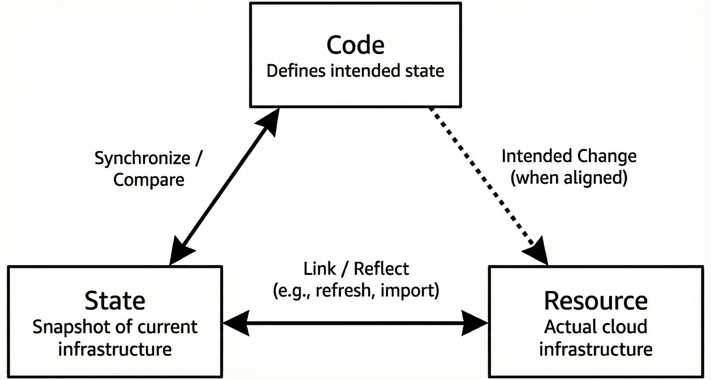
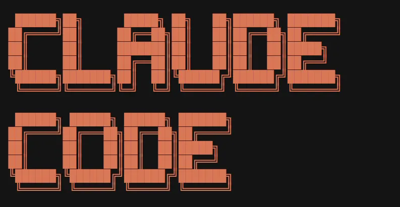
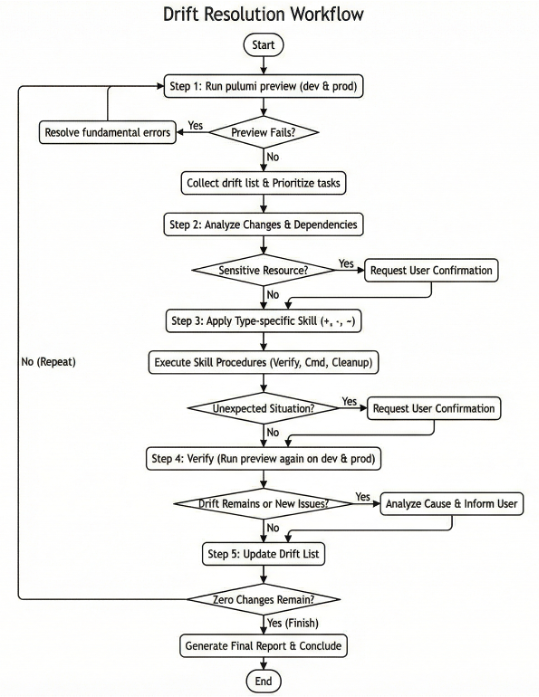
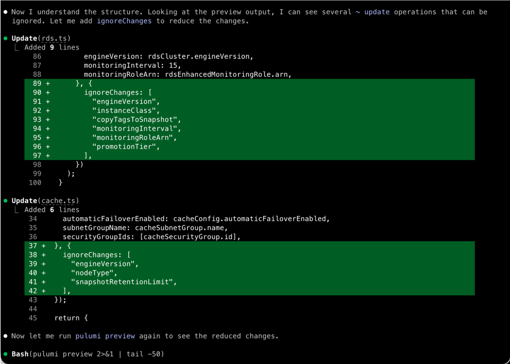
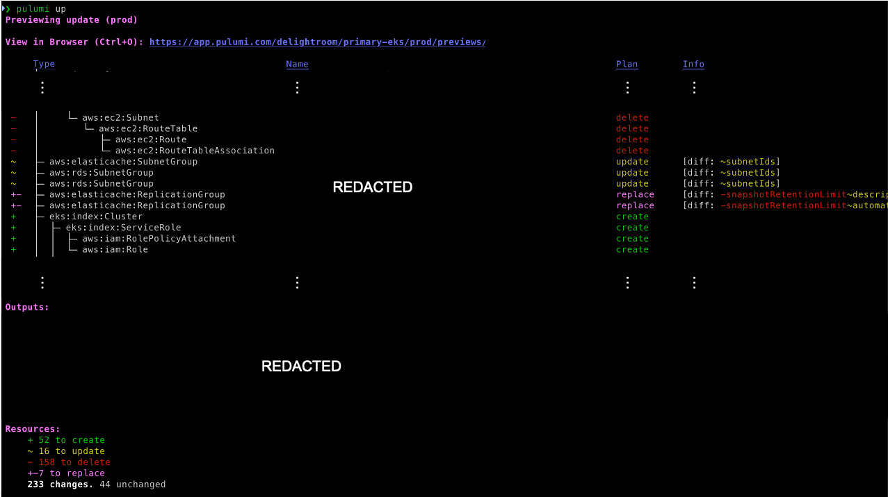
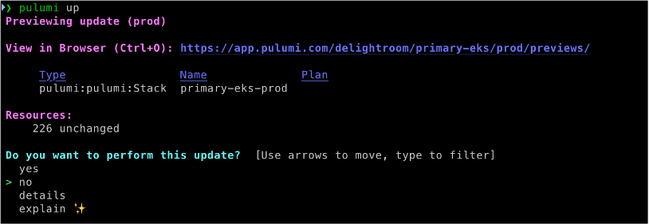
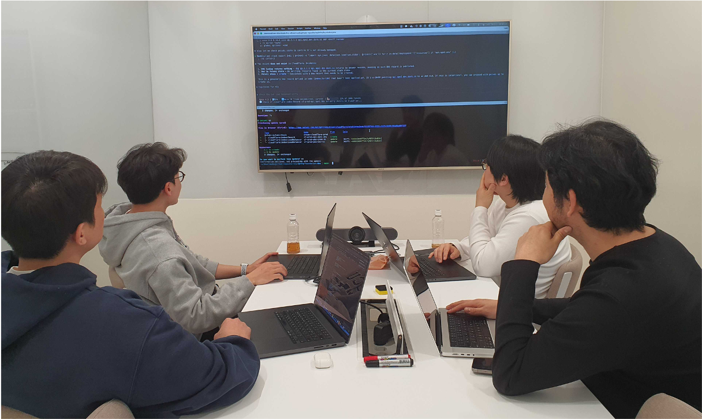

> **Originally published** on the [DelightRoom Product Blog](https://delightroom.com/blog/en/perfect-infrastructure-code-management-with-ai). Republished here on the author's personal blog.

I work as a Site Reliability Engineer (SRE) in the Foundation group at DelightRoom. The Foundation group is responsible for the foundational areas of all DelightRoom products, from infrastructure to data pipelines and frontends. We use **Pulumi** to manage our infrastructure as code. The reason we chose Pulumi over other IaC (Infrastructure as Code) tools like Terraform or Ansible is that it allows us to define our infrastructure using general-purpose programming languages like TypeScript and Python.


*Photo 1: Pulumi logo*

One of my main responsibilities is maintaining and improving a stable infrastructure environment. To do this, it's essential to understand how our current infrastructure is defined in code. One day, I ran `pulumi preview` to get a grasp of our infrastructure code. This command compares the current code with actual cloud resources and shows a preview of what changes will happen if the code is applied. I was expecting a message saying there was nothing to update, but what filled my terminal screen were dozens of changes and warning messages.

```
+ aws:s3:Bucket ........... create
- aws:lambda:Function ..... delete
~ aws:ec2:SecurityGroup ... update
...
```

This was a state where the existence of resources or their configuration values differed between our code and AWS (Amazon Web Services)—what we call "**Drift**." Drift means the code and the actual resources are out of sync, sometimes referred to as "broken IaC."

Nobody knew exactly when or why this drift had started. It was the result of quick configuration tweaks made directly in the console and changes applied without updating the code, accumulating over a long period.

The moment I discovered the drift, I had two major concerns.

The first was **concerns about stability**. `pulumi up` is the command that applies the state defined in code to the actual cloud environment. If I were to execute this recklessly, running resources could be deleted or altered, leading to a service outage.

The second was **awareness of tech debt**. If left in this state, the infrastructure code would no longer serve as a blueprint. Since we couldn't trust the code, we would end up working directly in the AWS console, and because console operations aren't recorded in the code, the drift would just grow—a vicious cycle.

At the same time, manually checking dozens of instances of drift, modifying the code, and re-verifying everything was a daunting task that I couldn't even guess how many weeks it would take.

After much thought, I decided to tackle this problem head-on. However, I established the following clear principles:

1. **Protect the production environment**: Absolutely no impact on actual resources.
2. **Code-resource synchronization**: Ensure the code accurately reflects the current state of the infrastructure.
3. `preview` **zero changes achieved**: Aim for a state where running `pulumi preview` yields no changes.

However, manually analyzing dozens of drifts one by one, taking appropriate actions for each type, and verifying them again clearly posed limits on human time and focus. To solve this efficiently, we decided to use an "AI Agent," and among various options, we introduced "Claude Code," which specializes in coding tasks. In this post, I want to share the small insights we gained during the implementation process and the improved results.

## The Core Value of IaC: The Trinity of Code, State, and Resource

The essential value of IaC isn't simply "building infrastructure with scripts." The core lies in the commitment to treating infrastructure like code. When everyone agrees to manage infrastructure as code, you can track change history through version control and prevent mistakes through code reviews. You can also reliably reproduce the same environment at any time using identical code, which I believe is the true value IaC provides.

For this value to be maintained, the following three elements must always be synchronized:


*Photo 2: Relationship between Code, State, and Resource (Generated directly using Google Gemini 3 Pro)*

- **Code**: Defines the intended state of the infrastructure.
- **State**: A snapshot of the current infrastructure managed by Pulumi.
- **Resource**: The actual infrastructure existing in the cloud.

The important point here is that code cannot directly affect resources. Looking at <Photo 2>, there's only a dotted arrow between code and resource, meaning that code must pass through the state to be reflected in the resources.

When an engineer defines the intended state of the infrastructure with code, Pulumi first compares this with the state file (Synchronize/Compare) to calculate what changes are necessary. Only then, because the state is connected to the resources (Link/Reflect), can actual infrastructure changes be made.

Because of this structure, state acts as an essential bridge between code and resources. If the state doesn't accurately reflect the current shape of the resources, no matter how well you write the code, it won't behave as intended.

That's why operations like using `pulumi refresh` to reflect the current resource status in the state file, `pulumi import` to add existing resources to the state, or `pulumi state delete` to remove specific resources from the state are necessary.

Only when these three elements align does the code truly serve as a "blueprint." You can grasp the current infrastructure state just by looking at the code, and modifying the code alters resources exactly as intended. However, when drift occurs, this balance is broken. If someone directly modifies resources in the console, the state and resources fall out of sync, and manipulating only the state without changing the code misaligns the code and the state.

Once the connection between these three elements is broken, you can no longer figure out the actual infrastructure state by looking at the code. Recklessly running `pulumi up` can then cause unintended changes. Ultimately, the code stops functioning as a reliable document.

## Why was this problem neglected?

So why was this issue left unresolved for so long? Drift is easy to fix if you handle it the moment you discover it, but as time passes and the amount of drift piles up, the situation becomes increasingly complex.

First, above all else, **identifying the cause** is a massive hassle. Even if a resource was modified in the AWS console, you can track the change history using services like CloudTrail, but it's not in an easily readable format like code and commits on GitHub. Consequently, verifying it every time takes a considerable amount of time. Moreover, if you can't figure out the intention behind a change, it's hard to judge how the code should be updated.

Second, the **risk of forced synchronization** is high. If you force the current code state onto the resources with `pulumi up`, active production resources might be deleted or altered. For a service used by tens of millions of people every month, we simply can't take that risk.

Third, the **burden of manual recovery** is immense. You have to analyze each drift, determine the appropriate action, modify the code, and verify it—repeating this process for dozens of resources. It's practically impossible to dedicate weeks to this task while juggling day-to-day work.

In our team as well, since the production resources themselves were operating normally despite the drift, the mindset of "let's not touch it right now and cause problems" naturally spread. We knew the code didn't match the actual resources, but the service was running fine, so we didn't want to mess with it and take on unnecessary risk. As this decision was repeated, the drift kept piling up, and over time, the scope of what needed fixing grew larger and larger.

## The Core Principle of Solution Design: Protecting the Production Environment

There are roughly two ways to resolve drift:

1. Change the resources to match the code: Run `pulumi up`
2. **Modify the code to match the resources**: Adjust code and state to match current resources

"**Source of Truth**" means "when multiple sources of data exist, which one should be the standard?" I chose the second method, making the actual resources the standard.

The fact that the currently running resources are keeping the service operating normally proves they are already in a verified state. On the other hand, we couldn't be certain if the state intended by outdated code was still valid. Since protecting the production environment is an uncompromising top priority for a service used by tens of millions of people monthly, all tasks in this project proceeded under the principle of modifying only the code and Pulumi state, without altering any actual cloud resources.

## Why We Chose an AI Agent

Drift recovery is essentially a repetition of the following loop:

1. Check the current drift list with `pulumi preview`
2. Analyze the type of each drift (create/delete/update)
3. Take the appropriate action for the type (`import`, `state delete`, code modification)
4. Verify again with `pulumi preview`
5. If changes remain, go back to step 1 and repeat

It looks simple, but executing this manually for dozens of drifts causes several problems. When repeating similar tasks, it's easy to make mistakes, like mistyping the resource ID for an `import` command or making a typo while modifying code.

Moreover, context switching between checking the actual resource state in the AWS console, running Pulumi commands in the terminal, and modifying code in the editor severely drops work efficiency. Also, if multiple people process the same type of drift in their own ways without a clear standard, code styles get jumbled, and inconsistent patterns can cause confusion when maintaining the code later.

We concluded that this repetitive "check → analyze → modify → verify" loop was exactly the kind of task perfectly suited for delegating to an AI Agent. Granted, there is undeniably a risk that entrusting IaC tasks to an AI could unintentionally impact live production resources.

However, we figured that if we could manage this risk by clearly defining core principles—like protecting production resources—as rules and strictly controlling the agent to operate only within set boundaries, we could safely leverage the AI Agent's strength of performing repetitive tasks tirelessly and with consistent quality.

## Claude Code: Maximizing Agent Utility While Ensuring Safety


*Photo 3: Claude Code logo*

Our team chose "**Claude Code**" among various AI tools for this task, for the following reasons.

First of all, Claude Code is highly specialized in coding tasks. The Claude model itself has strong capabilities in understanding and generating code, and Claude Code leverages this to handle file system navigation, code modification, and terminal command execution all in a single, seamless flow. We felt it was perfectly suited for this project, where reading infrastructure code, making edits, and running commands are the core activities.

Also, Claude Code offers a terminal-based UI. There was no need to switch to a separate Web Interface, meaning we could use it right in the same terminal environment where we normally code, blending seamlessly into our existing workflow.

Above all, Claude Code lets you customize workflows using its Rules, Skills, and Agents features. Thanks to this, we could explicitly define rules to protect production resources—like "never run `pulumi up`"—and template frequently used commands and procedures to handle repetitive tasks efficiently. The structure that allowed us to maximize the agent's utility while securing safety was the decisive factor for choosing it for this project.

## The Process of Implementing Drift Recovery with an AI Agent

The final directory structure we configured using Claude Code's Rules, Skills, and Agents looks like this:

```
.claude/
├── agents/
│   └── drift-resolver.md
├── rules/
│   ├── pulumi-safety.md
│   ├── code-conventions.md
│   └── drift-resolution.md
└── skills/
    ├── drift-status/SKILL.md
    ├── drift-import/SKILL.md
    ├── drift-remove/SKILL.md
    └── drift-fix/SKILL.md
```

Now, let's take a closer look at how we actually configured and utilized these features, exploring some excerpts of the code we used.

### Rules: Defining Safety Measures

Rules are where you define the guidelines the Agent must follow. We explicitly declared our most critical principle—protecting production resources—as Rules to ensure the Agent strictly adhered to it.

In each Rule file, we set up a `paths` frontmatter to designate the directories where the rule applies. This way, the rule is loaded only when the Agent works on files in the relevant paths, allowing for efficient context usage.

```yaml
---
paths:
  - "clusters/*/pulumi/**"
  - "external-services/*/pulumi/**"
  - "modules/**"
---
```

We created and used three rule files for this project: `pulumi-safety.md`, which enforces safe command use; `drift-resolution.md`, which defines how to respond to each type of drift; and `code-conventions.md`, to maintain consistent code styling.

#### pulumi-safety.md

As the most critical safety rule, we specified three core principles.

First is the prohibition of running `pulumi up`. Since `pulumi up` applies code states to the actual cloud, we banned its use for this project and restricted verification to only `pulumi preview`.

Second is the principle of treating the actual resources as the Source of Truth. We explicitly instructed the Agent not to change resources to match the code, but to modify the code to align with the current running state of the resources. As emphasized earlier, this was to ensure we didn't touch a production environment that was already operating stably.

Third is the isolation between stacks (independent deployment units of the same infrastructure code, e.g., Dev, Prod). Under the principle that the dev and prod environments must never affect each other, we mandated that a `preview` must be run on both stacks after any code change, guaranteeing that a tweak in one doesn't unintentionally blow up the other.

```markdown
# Pulumi Safety Rules

## Core Principles

1. **Never run `pulumi up`** - Only `pulumi preview` is allowed
2. **Actual resources are Source of Truth** - Modify code to match resources, not vice versa
3. **Bidirectional stack isolation** - Dev and Prod must never affect each other

| Command | Allowed | Notes |
|---------|---------|-------|
| `pulumi preview` | Yes | Always safe |
| `pulumi import` | Yes | No infrastructure impact |
| `pulumi state delete` | Caution | Verify resource deleted in AWS first |
| `pulumi up` | No | Requires explicit user confirmation |
| `pulumi destroy` | No | Forbidden |
```

#### drift-resolution.md

Next, we defined clear standards on how to handle each type of drift. When the Agent detects drift, rather than letting it guess and act arbitrarily, we provided guidelines so it would process them consistently according to predetermined strategies.

If a `+` symbol appears in the `preview` results, the resource is defined in the code but doesn't exist in AWS. In this case, we check if the resource actually exists in AWS first, and if it does, we sync the state with `pulumi import`.

If a `-` symbol appears, the resource exists in AWS but is missing from the code. Here, we confirm whether the resource has genuinely been deleted from AWS; if so, we remove it from the state with `pulumi state delete`.

If a `~` symbol appears, the configuration values differ between the code and AWS. We consider the current AWS value as the correct one and modify the code to match it.

```markdown
# Drift Resolution Rules

## Drift Types and Resolution

| Symbol | Type | Resolution |
|--------|------|------------|
| `+` create | Code exists, AWS doesn't | `pulumi import` or remove code |
| `-` delete | AWS exists, code doesn't | `pulumi state delete` or add code |
| `~` update | Values differ | Modify code to match AWS |

## Verification Checklist

- `+ create`: Does resource exist in AWS? If yes, import it
- `- delete`: Is resource deleted from AWS? If yes, remove from state
- `~ update`: Is AWS value correct? If yes, update code to match
```

#### code-conventions.md

Finally, we laid down code convention rules to ensure the code generated or modified by the Agent stayed consistent with the existing codebase. We explicitly stated that stack-specific settings should use environment configuration files rather than being hardcoded. Variable names had to follow `camelCase`, constants `UPPER_SNAKE_CASE`, and when generating resource names, it was guided to utilize helper functions commonly used across the project to handle repetitive tasks easily.

```markdown
## Stack Configuration

Use environment-specific config files instead of hardcoding:

// Correct
const config = new pulumi.Config();
const instanceType = config.get("instanceType") || "t3.medium";

// Wrong
const instanceType = pulumi.getStack() === "prod" ? "t3.large" : "t3.medium";

## Naming

- Use `autoname`, `pfname` from `modules/helper.ts`
- Variables: camelCase
- Constants: UPPER_SNAKE_CASE
```

There was one more universal principle applied across all Rules. In ambiguous situations or when extra verification was needed, the Agent was never to decide and proceed on its own, but strictly halt and ask the user for confirmation.

Utilizing Claude Code's `AskUserQuestion` tool, we set it up so that when changing sensitive security settings like Security Groups or IAM (Identity and Access Management), the Agent would pause its work and seek the user's judgment. Also, if there were multiple ways to solve a problem or if the AWS state differed from expectations, it had to go through a user confirmation step to ensure safety.

### Skills: Templating Repetitive Tasks

Skills define frequently used workflows as templates, helping the Agent perform tasks consistently. By leveraging Skills effectively, you can guide the Agent to execute even complex operations step by step according to a set procedure.

For this project, we created four Skills corresponding to the drift types: `drift-status` to analyze the current state, `drift-import` to import resources, `drift-remove` to eliminate resources from state, and `drift-fix` to update the code.

#### drift-status

This is the starting point for all tasks. It runs `pulumi preview` on both dev and prod stacks, analyzes the results, and summarizes the current drift status in a report.

The report outlines the drift types (`+ create`, `- delete`, `~ update`) and the corresponding list of resources for each stack. It also offers recommendations on which Skill should be applied for each type. Based on this report, the Agent prioritizes which drift to process first and maps out an action plan.

If a TypeScript compilation error occurs while running the `preview`, it notifies the user that the code error must be fixed before resolving the drift.

```markdown
## Output Format

## Drift Status Report

### Dev Stack
| Type | Count | Resources |
|------|-------|-----------|
| + create | N | resource1, resource2 |
| - delete | N | resource3 |
| ~ update | N | resource4 |

### Recommended Actions
+ create → drift-import skill
- delete → drift-remove skill
~ update → drift-fix skill
```

#### drift-import

This Skill resolves `+ create` drifts. When a resource is defined in code but missing from Pulumi's state, it triggers a workflow to bring the resource that actually exists in AWS into the Pulumi state.

First, it uses the AWS CLI to confirm if the resource genuinely exists in AWS. It uses commands tailored to the resource type, like `aws s3api head-bucket` for S3 buckets, `aws ec2 describe-instances` for EC2 instances, and `aws lambda get-function` for Lambda functions.

Once the resource's existence is confirmed, it runs the `pulumi import` command. Since resource types and ID formats vary by resource, the Skill includes examples of `import` commands for frequently used resource types. For example, S3 buckets use the bucket name as the ID, while EC2 instances use an instance ID in the `i-xxxxxxxxx` format.

After the `import` is complete, it integrates the auto-generated code into the existing codebase and finally runs a `preview` on both stacks to verify if they synced properly. If changes still pop up in the `preview` after the `import`, it utilizes the `drift-fix` Skill to make further code adjustments.

```markdown
## Common Resource Types

| Resource | Pulumi Type | ID Format |
|----------|-------------|-----------|
| S3 Bucket | `aws:s3/bucket:Bucket` | bucket-name |
| EC2 Instance | `aws:ec2/instance:Instance` | i-xxxxxxxxx |
| Security Group | `aws:ec2/securityGroup:SecurityGroup` | sg-xxxxxxxx |
| IAM Role | `aws:iam/role:Role` | role-name |
| Lambda | `aws:lambda/function:Function` | function-name |
```

#### drift-remove

This Skill resolves `- delete` drifts. It's a workflow that synchronizes the actual environment and state by excluding resources that have already been deleted from AWS from the Pulumi state information as well.

The most crucial part is strictly verifying whether the resource has actually been deleted in AWS first. Yanking it from the state without confirmation can sever the connection to an existing resource, sparking much bigger headaches. It's only considered deleted if checking via the AWS CLI returns a 404 response or a "not found" error.

Once it's confirmed deleted, it first finds the resource's URN (Uniform Resource Name, a unique identifier in Pulumi) using the `pulumi stack --show-urns` command. The URN follows the format `urn:pulumi:<stack>::<project>::<type>::<name>`. Then, it removes it from the state using the `pulumi state delete "<URN>"` command.

After removing it from the state, it deletes the code that defined the resource and runs a `preview` on both stacks to ensure the cleanup is complete.

```markdown
## Workflow

1. Find URN: `pulumi stack --show-urns | grep "resource-name"`
2. Verify resource is deleted in AWS (CLI should return not found)
3. Remove from state: `pulumi state delete "<urn>"`
4. Remove corresponding code
5. Verify with `pulumi preview` on both stacks
```

#### drift-fix

This Skill handles `~ update` drifts. It's a workflow to modify the code to match the current state in AWS when configuration values clash between the code and AWS.

First, it uses the `pulumi preview --diff` command to pinpoint exactly which attributes differ. Then, it queries the actual configuration value of the resource via the AWS CLI to figure out what value should be reflected in the code.

There are common drift patterns. If tags are missing, it adds the tags set in AWS to the code; if values like timeout or memory settings differ, it updates the code with the current AWS value.

Fields managed by external systems like autoscalers can keep generating drift even if you fix the code. In these cases, it uses the `ignoreChanges` option to ignore modifications to those fields. However, we mandated that this option be strictly reserved for externally managed fields and that the reason for its use must be documented with a comment.

After modifying the code, it runs a `preview` on both stacks to confirm the drift is resolved and no other resources were affected.

```markdown
## Decision Guide

| Scenario | Action |
|----------|--------|
| AWS value is intentional | Update code to match |
| Externally managed field | Use ignoreChanges with comment |
| Unclear which is correct | Escalate to user |
```

The final step of every Skill is exactly the same: after any change, it is mandatory to run a `preview` on both dev and prod stacks to verify that there are no unintended side effects.

### Agents: Task Separation and Context Management

Agents are a feature that defines autonomous units of work with specific goals. When tackling complex tasks, you can preset what tools and Skills to use, in what order to proceed, and when to ask the user for confirmation.

Since there were dozens of drifts, trying to handle everything in a single session hit a context limit. As the conversation dragged on, the Agent would sometimes lose track of the context of earlier tasks or drop its consistency. To solve this, we configured a dedicated drift resolution Agent and designed a structure that processed tasks by dividing them into manageable chunks.

#### drift-resolver.md

This Agent's goal is crystal clear and simple: analyze and resolve drift until running `pulumi preview` shows zero changes. The Agent's configuration spells out the tools it can use (Bash, Grep, Read, Edit, Write, etc.) alongside the four previously defined Skills (`drift-status`, `drift-import`, `drift-remove`, `drift-fix`).

We defined the Agent's workflow as follows: First, it grasps the current drift list with the `drift-status` Skill. Then, it creates a todo list to track the drifts it needs to handle. For each drift, it applies the matching Skill (`drift-import` for `+ create`, `drift-remove` for `- delete`, and `drift-fix` for `~ update`), verifying on both stacks after every modification. It repeats this loop until there are zero changes and generates a final report once finished.

```markdown
## Workflow

1. drift-status skill → Get current drift list
2. Create todo list for tracking
3. For each drift:
   + create → drift-import skill
   - delete → drift-remove skill
   ~ update → drift-fix skill
4. Verify both stacks after each fix
5. Repeat until 0 changes
6. Generate final report
```

We also specified scenarios where the Agent shouldn't make its own calls but instead ask the user for confirmation. When changes to sensitive resources like Security Groups or IAM policies are detected, or when decision-making is required to choose among multiple solutions, it stops working and requests the user's judgment first. The same applies if the actual AWS state differs from expectations or unexpected fluctuations pop up in the prod stack.

```markdown
## Escalation Triggers

Stop and ask user when:
- Security group or IAM changes detected
- Multiple valid approaches exist
- AWS state doesn't match expectations
- Prod stack shows unexpected changes
```

Termination conditions were also divided into three states. If both stacks hit zero changes, it finishes as `SUCCESS`. If some drifts are resolved but the rest require a user decision, it ends in a `PARTIAL` state and reports what's left. If it absolutely cannot proceed without user input, it halts as `BLOCKED` and explains what it needs.

```markdown
## Termination

| Status | Condition |
|--------|-----------|
| SUCCESS | Both stacks show 0 changes |
| PARTIAL | Some drifts resolved, others need user decision |
| BLOCKED | Cannot proceed without user input |
```

When multiple drifts existed within the same directory, we set it up so Subagents (child agents that the main Agent delegates tasks to, working in independent contexts) would divide and conquer them. For example, within a single directory, Subagent 1 might handle `+ create` type drifts while Subagent 2 tackles `~ update` type drifts.

However, since tweaking the same code simultaneously could trigger conflicts, we forced the Subagents to execute sequentially. Only after one Subagent entirely finishes its task and completes verification does the next Subagent begin its work.

The main Agent oversees this entire process and coordinates among the Subagents. This is because even if each Subagent works independently, they can still step on each other's toes. For instance, after Subagent 1 resolves drift A, Subagent 2 resolving drift B might accidentally cause drift A to reappear. The main Agent double-checks the overall state after each Subagent finishes its task. If a new drift has surfaced or a previously resolved drift has returned, it detects this and orders additional work.

## The Actual Workflow Loop Perfected with Claude Code


*Photo 4: Drift Resolution Workflow Flowchart (Generated directly using Google Gemini 3 Pro)*

### Step 1: Running `pulumi preview`

It uses the `drift-status` Skill to check the current state of both the dev and prod stacks. In this step, the full list of drifts is gathered, and each is classified as either `+ create`, `- delete`, or `~ update`.

Sometimes, however, the `preview` execution itself fails. This could be due to various reasons like TypeScript compilation errors, missing environment variables, or module dependency issues. If these errors pop up, classifying drift is impossible. Therefore, the Agent first sorts out these foundational errors to get `preview` running normally before diving into the actual drift resolution.

Once the `preview` runs smoothly, the Agent generates a to-do list based on the collected info and sets priorities. Generally, it processes independent resources with no dependencies first and saves complex resources that reference other resources for later.

### Step 2: Analyzing Changes

The Agent analyzes the details of each drift. Going beyond mere type classification, it figures out what role the resource plays, its dependency relationships with other resources, and exactly which values differ between the code and the actual AWS state. Based on this analysis, it decides which Skill to apply and whether any extra checks are needed. For highly impactful, sensitive resources, it prompts the user for confirmation at this stage.

### Step 3: Taking Action by Type

Depending on the classified type, it deploys the previously defined Skills. For `+ create` drifts, it pulls the resource existing in AWS into the Pulumi state using the `drift-import` Skill; for `- delete` drifts, it purges already-deleted resources from the state with `drift-remove`; and for `~ update` drifts, it tweaks the code to match the AWS state via `drift-fix`.

Each Skill isn't just firing off a single command; it encompasses a whole sequence: verifying the actual state with the AWS CLI, executing the appropriate Pulumi command, and then cleaning up the code. The Agent follows this procedure to handle each drift, and if it bumps into an unexpected situation midway, it asks the user for confirmation.

### Step 4: Verification

After taking action, it runs `pulumi preview` again to check if the drift was resolved. Here, it absolutely must verify both the dev and prod stacks. Skipping a stack and running `preview` on only one side could inadvertently mess up the other stack if a shared module was modified. The task is only considered done when it's confirmed that the drift is gone from both stacks and no new ones have spawned. If an unexpected change is detected in either stack, the Agent analyzes the cause and reports it to the user.

### Step 5: Iteration

It loops through steps 1-4 until changes hit zero. During each iteration cycle, the Agent updates the list of remaining drifts and checks if any new drifts sprang up from the previous task. Once all drifts are resolved and the `pulumi preview` results on both dev and prod stacks say there's nothing left to update, it generates the final report and wraps up.

## No Agent is Perfect: Growing Pains After Live Operations

Not everything went smoothly from the get-go. As we actually handed tasks over to the Agent and reviewed the results, unexpected issues inevitably cropped up. To resolve them, we continually tweaked our Rules and dialed in our working methods.

The most frequent issue we faced was **cross-stack interference**. Initially, we instructed it to fix dev stack drifts first, followed by the prod stack. But after finishing the prod stack, drifts would constantly respawn in the already-fixed dev stack. This happened because altering the code in a shared module impacts both stacks simultaneously.

To solve this, we added a rule to `pulumi-safety.md` stating, "After modifying code, you must run `preview` on both stacks, and if cross-stack interference is detected, halt immediately and fix it." Afterward, the Agent started verifying both simultaneously without making the mistake of checking just one stack and moving on.

While resolving complex drifts, the Agent occasionally exhibited unexpected behavior patterns. At first, it was properly modifying the code and resolving drifts, but at some point, it **indiscriminately began adding** `ignoreChanges` to the code. `ignoreChanges` is an option that tells Pulumi to ignore tweaks to specific attributes. Slapping it on makes drift disappear from the `preview`, but it's just sweeping the issue under the rug, not actually solving it.


*Photo 5: Agent indiscriminately adding ignoreChanges*

To prevent this, we specified in `code-conventions.md` that `ignoreChanges` should only be used for externally managed fields (e.g., `desiredCapacity` managed by an autoscaler) and that the reason must be documented with a comment. After explicitly adding the line "`ignoreChanges` must not be used to hide unresolved drifts," the Agent stopped trying this shortcut.

**Module dependency issues** were also a tricky challenge. Because the codebase had been neglected for so long, the installed Pulumi modules were quite outdated, and while resolving drift, situations arose where updates to the latest versions were necessary. However, updating one module sometimes caused dependency clashes with others, forcing us to chain-update multiple modules together to resolve the mess.

There were even trickier cases where the module used in the legacy code didn't yet support the latest AWS features. Because AWS features had updated in the meantime and actual resources were already using the new features, we had to instruct the Agent to swap out the module itself and rewrite the code entirely. In these scenarios, it was crucial to have the Agent pause and ask the user for direction rather than making its own judgment call.

## Turning 8 Weeks of Homework into a Few Days: Overwhelming Productivity Innovation

Before starting the project, running `pulumi preview` in our infrastructure repository unleashed an avalanche of dozens of changes. I recall feeling completely overwhelmed, looking at the jumbled mix of `+ create`, `- delete`, and `~ update` results, not knowing where to even begin.


*Photo 6: Before - preview showing dozens of drifts (an example from one of several stacks)*

After working alongside Claude Code, we were finally able to see the message saying there was nothing left to update across all stacks. Below is a look at one such stack, where both the dev and prod environments are perfectly synchronized between code and actual resources.


*Photo 7: After - preview indicating nothing to update (same stack)*

<Photo 6> and <Photo 7> show a typical Before-After for a single stack. In reality, we repeated this entire process across multiple stacks.

The time savings were massive, too. Fixing dozens of drifts manually means checking the state of every single resource, determining the right fix, updating the code, and verifying it—all on repeat. Even by a conservative estimate, it would have taken 20-30 minutes per resource on average, piling up to 6-8 weeks of work in total. By leveraging the Agent, we slashed this timeframe down to a matter of days.

However, the real significance goes way beyond just saving time. We managed to resolve a problem that had been neglected for at least several months (though we don't know exactly when the drift started), and more importantly, we established a convention to prevent future drift and built a system to quickly resolve it even if it does occur.

## Settling in as a New IaC Convention for the Team

The Rules and Skills forged during this project didn't end as a personal pet project; we documented them as shared team assets. The configuration files packed into the `.claude` directory are now maintained as a core part of our infrastructure repository, meaning any teammate can tap into the exact same rules and workflows.


*Photo 8: In-house seminar*

We also compiled a guide on the best ways to leverage the AI Agent when spinning up or tearing down new resources. We hosted an internal seminar to share this experience and documented a quick how-to guide in the repository's README so that any teammate handling infrastructure in the future can utilize the AI Agent following our set conventions. Thanks to this, we cut down on the chaos of everyone writing code in their own quirky styles and can now consistently churn out clean, highly maintainable code.

The reaction from our Foundation group teammates was super positive, too.

> _"It's so great that we can finally manage our infrastructure as code again without worrying. Since we now only use the console for checking and manage all infrastructure via code, reverting settings or creating backups in an emergency has become incredibly straightforward. This is something that would normally have taken a massive amount of time and felt too daunting to even start, so we really saved a ton of time and effort."_

## From Engineer to Director: How to Approach Work in the AI Era

I picked up a few lessons while navigating this project.

**The faster you fix IaC drift, the lower the cost.** Right after drift occurs, the cause is obvious, the blast radius is small, and fixing it is relatively straightforward. But as time drags on, pinpointing the cause gets muddy, it tangles up with other changes, and the complexity spikes exponentially. Making it a habit to quash even tiny drifts the moment you spot them is crucial.

**An AI Agent won't do absolutely everything for you.** Agents are phenomenal at plowing through repetitive tasks within set rules, but deciding what those rules should be and making judgment calls in edge cases is still entirely up to the humans. The key isn't dumping everything on the Agent, but designing how you're going to work alongside it.

**Clear Rules and Skills dictate an Agent's performance and stability.** We started out with simple instructions, but as we slammed into unexpected hiccups like cross-stack interference or rampant `ignoreChanges` abuse, we had to continuously beef up our Rules. I realized that even if an Agent looks like it's crushing it, without rock-solid guardrails, it can veer completely off course at any moment.

And finally, **I felt firsthand that the role of an engineer is shifting.** In the past, writing code yourself—even if it was wildly repetitive—was the main gig for an engineer. Now, the role is evolving into that of a director who reviews the AI's code and steers the direction. The time I spend manually typing out code has plunged, allowing me to laser-focus on overarching architecture and quality control.

As AI tools get even sharper in the future, I believe the ability to define what to build, evaluate the AI's output, and steer it down the right path will become incredibly vital. This project went far beyond just squashing some drift; it sparked a complete rethink of how I approach work moving forward.

## Beyond Management to Expansion: Envisioning Infrastructure Operations with AI Agents

We resolved our legacy drifts with this project, but there's no guarantee new drifts won't slip through the cracks later. To nip this in the bud, we're planning to wire up automated drift detection straight into our CI/CD (Continuous Integration/Continuous Delivery) pipeline.

Also, we plan to construct a process that automatically fires off a `pulumi preview` to check for drift whenever events trigger—like pushing code to specific directories or merging infra-related PRs.

Alongside this, setting up a flow to periodically run a `preview` will also be essential. Sometimes someone might urgently tweak a resource directly in the console and forget to backport it to the code.

Beyond that, by juggling both event-driven and scheduled runs, we'll ensure we catch and kill drifts early before they snowball. If drift is detected, we'll blast an alert to Slack, and looking further down the road, we're hoping to evolve this to where the Agent jumps in during the CI phase to analyze and squash the drift autonomously.

We're also planning to fine-tune our Agent workflows even further. The current setup is heavily hyper-focused on fixing drift, but infrastructure work spans a wild variety of tasks. We're dreaming up an Agent that automatically enforces security best practices when spinning up resources for a new service, an Agent that coaches you through migrating existing resources across regions or accounts, and even an Agent that scours our current infra configs hunting for security loopholes or cost optimization wins.

We plan to develop and roll out additional Agents packed with dedicated Rules and Skills tailored to each task type, aggressively expanding our ability to tackle a massive range of IaC tasks safely and efficiently.

IaC drift is a headache that can infect any organization, and once it starts piling up, digging yourself out gets exponentially harder. Through this project, we successfully wiped out months of neglected tech debt and armored ourselves with a rock-solid management system to ensure history doesn't repeat itself.

AI Agents aren't a silver bullet, but we proved firsthand that with crisp rules and the right collaborative setup, they transform into wildly reliable teammates. I hope this post serves as a solid reference for anyone wrestling with similar headaches.
