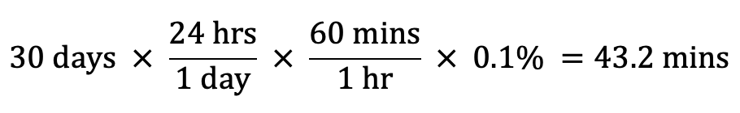
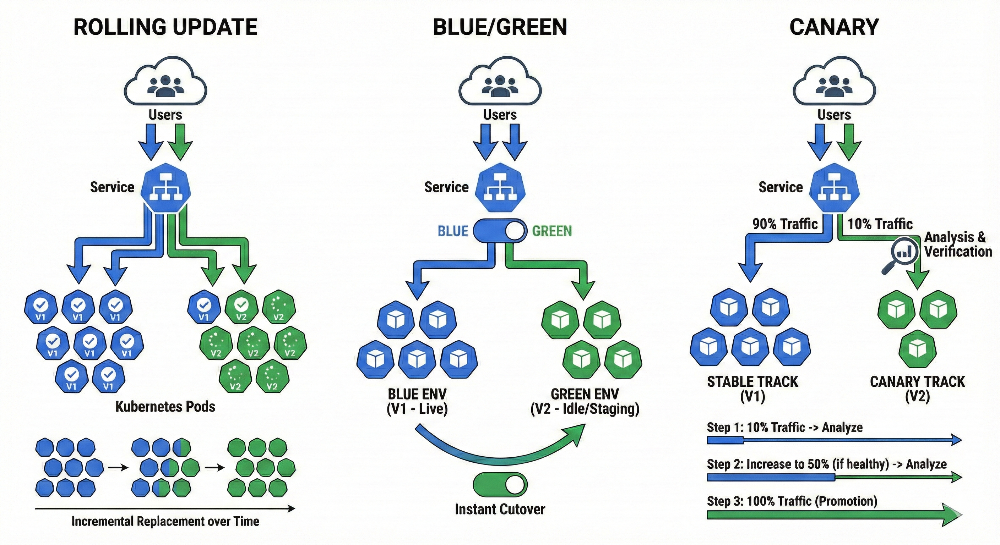
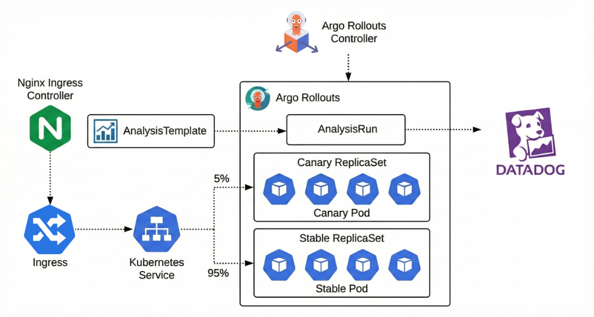
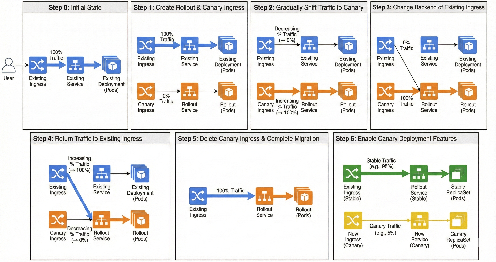
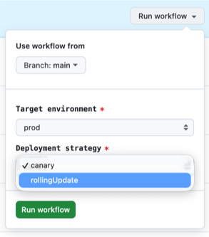
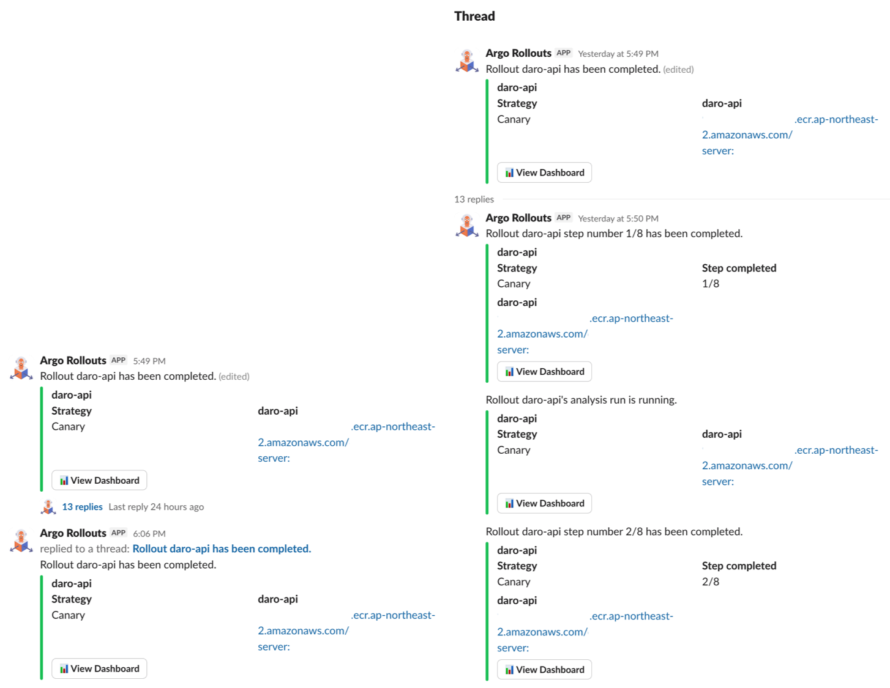
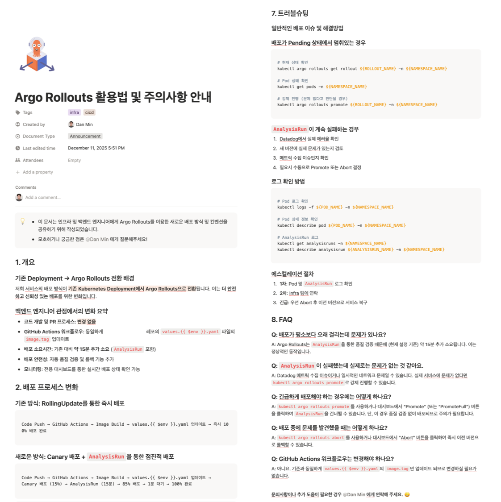

> **Originally published** on the [DelightRoom Product Blog](https://delightroom.com/blog/en/building-team-unafraid-deployments-automating-canary-release). Republished here on the author's personal blog.

## Hello, I'm Dan (Sunhong Min), an SRE at DelightRoom.

I joined DelightRoom as a Site Reliability Engineer (SRE) in August 2025. DelightRoom is a startup that operates the alarm app [Alarmy](https://alar.my/), used by 3.5 million people worldwide every day, and [DARO](https://daro.so/), a B2B ad monetization solution with over 40 million combined MAU. I decided to join the team with the expectation that I could grow while taking responsibility for service stability in an environment with such a massive user base and high traffic.

An SRE is responsible for managing the stability and availability of large-scale services using software engineering approaches. Rather than just reacting to outages, the role carries broad responsibilities, including automating operations, enhancing observability (the ability to understand a system's internal state via its external outputs), establishing protocols for incident response (handling unexpected events that cause service interruptions or quality degradation), and improving performance.

Today, I want to write about my first project after joining the company: **automating canary deployments using Argo Rollouts**. I'll candidly share the limitations we felt with our existing deployment method, why we chose canary deployments and Argo Rollouts, and how we actually implemented and applied them. I hope this helps other teams grappling with similar challenges.

## Why did we need to improve our deployment pipeline?

Every task an SRE undertakes is planned and executed under the goal of an **SLO (Service Level Objective)**. An SLO is a quantitative target for performance, availability, etc., that a service must achieve over a specific period, while the **Error Budget** represents the total amount of allowable failure under this SLO.

At DelightRoom, our SLO is set to 'service availability (the percentage of time the system is operating normally and accessible) of 99.9% or higher over the past month.' What exactly does this 99.9% figure mean? Let's calculate the error budget using the following formula.


*Formula 1: Error budget when the SLO is set to 99.9% or higher service availability for one month*

Calculated through <Formula 1>, an allowable failure rate of 0.1% per month translates to roughly 43.2 minutes. These 43.2 minutes constitute our team's error budget for an entire month. In other words, **just a 5-minute outage burns through about 4 days' worth of our error budget**. For a service used by countless users around the globe, this number carries significant weight. Just a few deployment mistakes could threaten our entire operational stability goal for the month.

When I first joined, server deployments at DelightRoom were handled via Rolling Updates (a deployment method that gradually replaces old versions with new ones without service downtime) using the default Deployment resource (a resource managing declarative deployments and updates of applications in Kubernetes) in Kubernetes (an open-source platform automating the deployment, scaling, and management of containerized applications).

This approach had several structural limitations. Because the new version would receive 100% of the traffic within one to two minutes, if problematic code was deployed, the impact would instantly spread to all users. Moreover, from the moment a spike in the error rate was spotted on the monitoring dashboard to identifying the cause, deciding to roll back, and actually executing it, the process took anywhere from a few minutes to over 10 minutes. Furthermore, since all these judgments and executions relied entirely on human intervention, responses were inevitably delayed if an issue occurred when the person in charge was away.

In this environment, deploying was always a nerve-wracking task. Especially after deployments containing major changes, engineers had to stare at the monitoring dashboard for several minutes to ensure error rates and latency (the time it takes to get a response after sending a request) metrics remained stable. Only after confirming that no unexpected edge cases or performance degradation in specific APIs had occurred could they finally move on to their next task. This anxiety repeated with every major release, inevitably leading to high fatigue for the engineers handling the deployments.

To solve this problem, I launched a deployment pipeline improvement project as my very first assignment. We defined our goal as follows:

> Build a deployment pipeline where server releases happen gradually and safely, with automatic rollbacks executing without human intervention if any anomalies are detected during the deployment.

Specifically, we wanted to achieve the following three things through this project:

(1) **Gradual traffic shifting**: Instead of sending 100% of traffic to the new version right away, we transition in stages, such as 5% → 20% → 50% → 100%.

(2) **Automated anomaly detection**: We monitor key metrics like error rates and latency in real-time, automatically detecting when thresholds are exceeded.

(3) **Unattended rollbacks**: If an anomaly is detected, the system immediately rolls back to the previous version without any human intervention.

The solution we chose to achieve these goals was automating canary deployments by integrating Argo Rollouts with Datadog (a cloud-based infrastructure monitoring and analytics platform).

## What is a canary deployment?

DelightRoom manages all its servers in a Kubernetes environment. There are several ways to deploy new versions of applications in Kubernetes, with the most common being **Rolling Update**, **Blue/Green**, and **Canary** deployments.


*Photo 1: Three typical application deployment methods in a Kubernetes environment (Generated using Google Gemini 3 Pro)*

| | Rolling Update | Blue/Green | Canary |
|---|---|---|---|
| Deployment method | Sequentially replace existing Pods with new version | Provision a separate new version environment, then switch traffic all at once | Route a small portion of traffic to the new version first, then gradually increase |
| Traffic shifting | Per Pod | Instant (0% → 100%) | Percentage-based (e.g., 10% → 50% → 100%) |
| Rollback speed | Slow (requires Pod recreation) | Fast (traffic switch only) | Fast (traffic switch only) |
| Resource usage | Low | High (requires 2x infrastructure) | Medium |
| Blast radius | Wide (all users may be affected during deployment) | Wide (all users affected after switch) | Narrow (only a subset of users affected initially) |
*Table 1: Comparison of Rolling Update, Blue/Green, and Canary deployment methods*

**Rolling Updates** are the default deployment method in Kubernetes, boasting the advantage of being ready to use without extra configuration. However, as explained earlier, the deployment speed is so fast that a problematic version can spread rapidly, and since Pods (the smallest deployable computing units in Kubernetes, consisting of one or more containers) must be recreated during a rollback, recovery time is longer.

**Blue/Green deployments** involve completely spinning up the new version's environment (Green) and then shifting all traffic at once. It has the advantage of rapid rollbacks, but because two sets of infrastructure (the foundational structure of hardware, software, and networks needed to operate systems and applications) must be maintained until the deployment is fully complete, resource costs are high. Furthermore, since traffic is switched at either 0% or 100%, if there are issues with the new version, all users are impacted immediately upon the switch.

**Canary deployments** first route only a fraction of total traffic (e.g., 10%) to the new version, gradually increasing the traffic ratio after verifying that there are no issues. The name "canary" comes from the past practice of miners taking canary birds into coal mines to detect toxic gases early. Similarly, canary deployments act as early warning systems by sending a small amount of traffic to the new version first to spot problems early.


*Photo 2: A canary bird*

The core advantage of this method is that it minimizes the blast radius. Even if there's an issue with the new version, only a small number of users are affected during the initial stages, and if any anomalies are detected, traffic can instantly be reverted to the original version.

The reason DelightRoom chose canary deployments was clear. Canary was simply the most suitable strategy for achieving the project goals we defined earlier: **gradual traffic shifting**, **automated anomaly detection**, and **unattended rollbacks**. A system where we could validate the new version with 5% of traffic, automatically roll back if errors or latency spikes were detected, and expand traffic to the next stage if everything looked good, was the key ingredient for creating the _deployment-fear-free environment_ we wanted.

## What is Argo Rollouts?


*Photo 3: Argo Rollouts*

Argo Rollouts is an open-source (software with publicly available source code that anyone can freely use, modify, and distribute) tool that enables the implementation of progressive deployment strategies in Kubernetes environments. It provides a Custom Resource (a user-defined resource type that extends the Kubernetes API) called a Rollout, which replaces the default Kubernetes Deployment resource, allowing you to declaratively define and execute canary and blue/green deployments.

The Rollout resource is a workload resource designed as a drop-in replacement for existing Deployments. It supports all the native functionalities of a Deployment while **additionally providing advanced deployment features that are difficult to achieve with Deployments alone**.

Key features include support for blue/green and canary deployment strategies, fine-grained traffic routing (directing network traffic to specific paths or target servers) by integrating with Ingress (a resource managing external HTTP/HTTPS traffic routing into internal cluster services) controllers or a Service Mesh (an infrastructure layer managing and controlling communication between microservices), deployment analysis via integration with metric providers (external systems supplying metric data needed for deployment analysis) like Datadog and Prometheus (an open-source monitoring system that collects and stores time-series metric data), and automated promotion (the process of converting a canary version into a stable version after validation) or rollback based on those analysis results.

Furthermore, because the rolling update method previously used at DelightRoom could also be executed exactly the same way through the strategy option in the Rollout resource, it was a massive advantage that we could maintain compatibility with our existing deployment methods while gradually introducing canary releases.

Besides Argo Rollouts, there are several other tools that can implement canary deployments, such as Flagger and Spinnaker. However, when evaluating other options, we found that while Flagger is easy to set up initially and migration is smooth, it lacks a UI or dashboard, making it hard to visually check the deployment status. Spinnaker offers robust features in multi-cloud environments, but it requires heavy native infrastructure, demanding significant resources for initial setup and operation.

Here's why Argo Rollouts was the optimal choice for DelightRoom's environment:

(1) DelightRoom doesn't use a service mesh but relies on the Nginx Ingress Controller (a Kubernetes Ingress controller built on top of Nginx). Argo Rollouts **enables fine-grained traffic splitting down to percentage increments using just the Nginx Ingress Controller**, without needing a service mesh.

(2) DelightRoom uses Datadog as its monitoring tool. Argo Rollouts allowed us to **flexibly configure automatic rollback logic based on Datadog metrics (measurable numerical data indicating system health or performance)** via a resource called AnalysisTemplate.

(3) It was also highly appealing that **installation and operation are relatively simple**, and it offers a dedicated dashboard UI, allowing us to **visually monitor deployment status**.

For these reasons, we selected Argo Rollouts as our tool for implementing canary deployments.

## Exploring the overall architecture

Let's look at the overall structure and key components of DelightRoom's canary deployment architecture using Argo Rollouts through <Photo 4>.


*Photo 4: DelightRoom's Argo Rollouts architecture (Generated using Google Gemini 3 Pro)*

(1) **Argo Rollouts Controller**: It detects changes to Rollout resources within the cluster and automatically adjusts the cluster state according to the defined deployment strategy. Since DelightRoom runs multiple EKS clusters and the Argo Rollouts controller doesn't support multi-cluster setups natively, we install and operate independent controllers for each cluster.

(2) **Stable/Canary ReplicaSets**: When a Rollout resource is created, the controller manages two ReplicaSets (a Kubernetes resource ensuring a specified number of pod replicas are always running). These are the Stable ReplicaSet (the set of pods for the version currently operating reliably) handling the old version, and the Canary ReplicaSet (a small set of newly deployed pods to test the new version) for the new version. During a canary deployment, both ReplicaSets coexist, and requests are distributed to their respective Pods based on the traffic ratio.

(3) **Nginx Ingress Controller**: This handles traffic routing. While the Nginx Ingress Controller isn't a mandatory component of Argo Rollouts, integrating with either an Ingress controller or a service mesh is required to split traffic by percentage. Since DelightRoom already used the Nginx Ingress Controller, we leveraged it.

External traffic coming into the Ingress passes through a Service (an abstraction layer providing stable network access to a set of pods in Kubernetes) and is distributed to the Stable and Canary ReplicaSets. Argo Rollouts utilizes the canary annotations of Nginx Ingress to split traffic by percentage. For example, in the early stages of deployment, it might send only 5% of total traffic to the Canary ReplicaSet while keeping the remaining 95% directed to the Stable ReplicaSet.

(4) **AnalysisTemplate and AnalysisRun**: These components handle metric-based automatic analysis and rollbacks. The AnalysisTemplate defines which metrics to query and under what conditions to judge success or failure. Once a deployment starts, an AnalysisRun is generated based on this template to perform actual metric analysis. DelightRoom integrated Datadog as our metric provider to analyze metrics like error rate and latency in real time. If the analysis results are normal, the deployment is automatically promoted to the next stage; if a threshold is breached, an immediate rollback is triggered.

## Argo Rollouts implementation process

As mentioned earlier, DelightRoom previously used Kubernetes Deployments to deploy and manage applications. The safest way to introduce Argo Rollouts into this environment was to first set up all components, including the Argo Rollouts controller, and then safely migrate the traffic heading to the existing Deployment over to the Rollout.

DelightRoom manages its applications using a GitOps strategy with Argo CD, and we adhered to this strategy during the Argo Rollouts build process. GitOps is an operational model that uses a Git repository (a storage space for managing a project's source code and its revision history) as a Single Source of Truth (the one reliable source for all data or configuration info), automatically synchronizing the declared state in the repository with the actual cluster state.

Simply put, if you commit (the act of recording and saving code changes to a version control system) the YAML files of the resources you want to deploy to the Git repository, Argo CD detects it and automatically reflects it in the cluster.

**The Argo Rollouts controller and dashboard were deployed using the** [**official Helm Chart (a collection of templates for packaging and deploying Kubernetes applications)**](https://github.com/argoproj/argo-helm). Because the official Helm Chart is well-structured, we could use most settings out of the box, customizing only a few for our environment. This included setting up a PDB (PodDisruptionBudget) for high availability, configuring Ingress for dashboard access, and tweaking Slack notifications. We set up Notification Templates for Slack alerts by referencing the [official documentation](https://argo-rollouts.readthedocs.io/en/stable/generated/notification-services/slack/). Since sending alerts for every state change can become noisy, we configured it so that we only receive notifications for critical events like `analysis-run-error`, `analysis-run-failed`, `rollout-aborted`, and `rollout-completed`.

After wrapping up the controller installation, we **wrote the Rollout and AnalysisTemplate to be applied to actual applications**. We templated these resources so we could apply Argo Rollouts to the various applications we manage. Through this, by simply entering values in `values.yaml`, we can apply the same structure to multiple apps with minimal effort. Let's look at some key excerpts from the Rollout and AnalysisTemplate actually applied to our B2B product, the ad monetization solution 'DARO'.

First, here is the Rollout resource.

```yaml
apiVersion: argoproj.io/v1alpha1
kind: Rollout
metadata:
  name: daro-api
  namespace: daro
spec:
  strategy:
    canary:
      canaryService: daro-api-canary-svc
      stableService: daro-api-stable-svc
      steps:
      - setWeight: 1
      - analysis:
          templates:
          - templateName: daro-api-step1-analysistemplate
      - setWeight: 5
      - analysis:
          templates:
          - templateName: daro-api-step2-analysistemplate
      - setWeight: 15
      - analysis:
          templates:
          - templateName: daro-api-step3-analysistemplate
      - setWeight: 85
      - pause:
          duration: 1m
      trafficRouting:
        nginx:
          stableIngress: daro-api-ingress-nginx
  template:
    # Same as a standard Deployment's pod template
```

The core of the Rollout resource is the `strategy.canary` section. This is where all the operational mechanics of the canary deployment are defined.

- `canaryService` and `stableService` specify the Services that will route traffic to the pods for the new (canary) and old (stable) versions, respectively. Because both versions coexist during a canary release, these two Services allow Argo Rollouts to properly distribute traffic between each version.
- `steps` sequentially outlines the stages the canary deployment will go through. `setWeight` configures the percentage of traffic to route to the new version. For instance, `setWeight: 1` means only 1% of total traffic goes to the new version, leaving the remaining 99% to be handled by the old version. `analysis` designates the AnalysisTemplate to run at that specific stage. This analysis must succeed to proceed to the next step. According to the setup above, deployments shift traffic in the order of 1% → 5% → 15% → 85% → 100%, validating the new version's health via an AnalysisTemplate at each step. Lastly, `pause.duration: 1m` configures a one-minute pause before the final promotion, allowing us some buffer to check the status even after all verifications are complete.
- `trafficRouting.nginx.stableIngress` designates the Nginx Ingress resource to use for splitting traffic. While the code snippet above shows the final post-migration Ingress (`daro-api-ingress-nginx`), during the actual build phase, the Deployment was already taking live traffic, making it crucial to test the Rollout environment first. Therefore, initially, we created and connected a temporary test Ingress instead of the one handling live traffic.

The `template` section shares the exact same structure as a traditional Deployment's pod template. This area defines the pod's specifications—like container images, environment variables, and resource limits—meaning you can copy over whatever you were using in the existing Deployment.

Next up is the AnalysisTemplate resource. It defines the analysis logic executed at each step of the Rollout. As seen in the Rollout configuration above, we use a total of three AnalysisTemplates—from `daro-api-step1-analysistemplate` to `daro-api-step3-analysistemplate`—but since they have a similar structure, we'll just look at the first-stage template as a representative example.

```yaml
apiVersion: argoproj.io/v1alpha1
kind: AnalysisTemplate
metadata:
  name: daro-api-step1-analysistemplate
  namespace: daro
spec:
  metrics:
  - initialDelay: 3m
    count: 2
    interval: 3m
    failureLimit: 0
    name: datadog-error-rate-metric
    provider:
      datadog:
        apiVersion: v2
        formula: a / max(b, 1)
        interval: 3m
        queries:
          a: sum:trace.http.request.errors.by_http_status{service:daro-api, env:prod, http.status_class:5xx}.as_count().rollup(sum, 60).fill(zero)
          b: sum:trace.http.request.hits.by_http_status{service:daro-api, env:prod}.as_count().rollup(sum, 60).fill(zero)
    successCondition: default(result, 0) <= 0.001
```

An AnalysisTemplate defines 'which metrics to query and what conditions must be met to judge it a success.'

- `initialDelay` is the wait time before beginning the analysis. Right after a new version's pod is spun up, analysis might not run smoothly due to initialization processes and the like. We instituted a 3-minute delay so the analysis starts after the pod has stabilized.
- `count` and `interval` define how many times and at what intervals the metrics should be measured. In the setup above, it measures twice (`count: 2`) at 3-minute intervals (`interval: 3m`).
- `failureLimit` is the number of permissible failures. Setting it to 0 triggers an immediate rollback on a single failure. We strictly set ours to 0 to minimize the spread of outages.
- The `provider.datadog` block outlines how to query metrics from Datadog. It fetches two metrics under queries. Query `a` retrieves the number of 5xx error responses, while query `b` fetches total HTTP requests. In `formula`, it calculates the error rate as `a / max(b, 1)`. The reason for using `max(b, 1)` is to prevent a divide-by-zero error if there are no requests (`b = 0`).
- `successCondition` determines the success criteria for the analysis. `default(result, 0) <= 0.001` implies that an error rate of 0.1% or lower is deemed a success. `default(result, 0)` means that if there's no result (i.e., no requests), it treats the result as 0 and counts it as a success. If this condition is not met, a rollback is executed based on the `failureLimit`.

Once setup is complete up to this point, pods deployed via the existing Deployment and pods deployed by the newly created Rollout exist concurrently. However, since the backend service of the Ingress currently handling actual traffic points to the Deployment's pods, live user traffic isn't yet reaching the pods deployed via the Rollout.

## Zero-downtime migration from an existing Deployment to a Rollout

With the Rollout environment constructed, we now needed to shift the traffic bound for the old Deployment to the Rollout. The most critical part of this process was achieving a **zero-downtime migration**. Because a massive amount of user traffic flows through our production environment, even a moment of downtime was unacceptable.

The Argo Rollouts [official documentation](https://argo-rollouts.readthedocs.io/en/stable/migrating/) details several ways to handle migrations. Following their recommendation that **"when migrating a Deployment taking active production traffic, you must run the Rollout in parallel alongside the Deployment prior to scaling down or deleting the Deployment,"** we opted to create a separate Rollout with the same specs while keeping the existing Deployment intact. We then finalized the migration by gradually shifting traffic at the Ingress level.

The full migration process is as follows:


*Photo 5: DelightRoom's migration process from Deployment to Rollout (Source: Author)*

**Phase 0: Initial State**

This is the initial state prior to starting the migration. Only the legacy Deployment and its connected Ingress (hereafter "legacy Ingress"), Service, and Pods exist, and all traffic flows through this path.

**Phase 1: Creating the Rollout and Canary Ingress**

We create a Rollout with specs identical to the existing Deployment. The critical thing here is that we do not yet activate the sub-fields of the Rollout's `spec.strategy.canary` (`canaryService`, `stableService`, `steps`, `trafficRouting`). Right now, the focus is purely on transferring traffic from the Deployment to the Rollout, not on leveraging the Rollout's canary deployment features. To keep complexity low, we took a "solve one problem at a time" approach.

Simultaneously, we create an Ingress for the Rollout (hereafter "canary Ingress"). This Ingress shares the same Host Address (the domain name or IP address used to access a specific server or service on a network) as the legacy Ingress but makes use of the [Nginx Ingress Controller's canary Annotation](https://kubernetes.github.io/ingress-nginx/examples/canary/) feature (key-value pairs attached as metadata to Kubernetes resources, typically used by external tools or libraries). By setting `nginx.ingress.kubernetes.io/canary: "true"` and `nginx.ingress.kubernetes.io/canary-weight: "0"`, we guarantee that 0% of traffic coming to that host address gets routed to the canary Ingress. At this point, 100% of the traffic still flows through the legacy Ingress to the Deployment.

**Phase 2: Gradually shifting traffic to the Canary Ingress**

We progressively increase the `canary-weight` value of the canary Ingress. Changing it in stages from 0% → 5% → 15% → … → 100%, we monitor key metrics like error rates and latency at each step. If everything looks good, we proceed to the next stage; if issues arise, we immediately revert the weight back to 0%. Once the weight eventually hits 100%, all traffic for that host address flows entirely through the canary Ingress to the Rollout pods instead of the legacy Ingress.

**Phase 3: Changing the backend service of the legacy Ingress**

With all traffic now routing to the canary Ingress, we update the backend service (a server-side application that processes client requests and executes business logic) of the legacy Ingress to point to the Service for the Rollout. At this juncture, the legacy Ingress isn't receiving any traffic, so this swap causes zero impact to users.

**Phase 4: Returning traffic to the legacy Ingress**

We then slowly decrease the `canary-weight` of the canary Ingress back down. Stepping down 100% → … → 15% → 5% → 0%, traffic starts flowing through the legacy Ingress once again. Since we updated the backend service in Phase 3, traffic via the legacy Ingress now also routes to the Rollout's pods.

**Phase 5: Deleting the Canary Ingress and completing migration**

Once the canary Ingress weight hits 0%, we delete the canary Ingress. Now, the final traffic path mapping Legacy Ingress → Rollout Service → Rollout Pod is complete. By cleaning up the legacy Deployment and its associated resources (like the Deployment's Service, ReplicaSet, etc.), the migration from Deployment to Rollout is officially finished.

**Phase 6: Activating Canary deployment features**

Though the migration is complete, we aren't yet in a state to use the Rollout's core canary deployment features. We now activate the `spec.strategy.canary` sub-fields (`canaryService`, `stableService`, `steps`, `trafficRouting`) that were kept dormant in Phase 1. You can reference the Rollout code snippet from the previous section for this.

When these configurations are applied, the existing Service and Ingress are recognized as belonging to the stable version, while a new Service and Ingress are automatically generated for the canary version. From now on, whenever a deployment is triggered (e.g., by an image update), traffic will progressively shift to the canary version according to the steps defined in `steps`. Validations are executed via the AnalysisTemplate at each step, and once all checks pass and traffic fully hits 100% on the canary version, promotion occurs. Promotion means the canary version officially becomes the new stable version.

In other words, the Canary ReplicaSet that was the "new version" just moments ago now serves as the Stable ReplicaSet backing the stable version, and the old Stable ReplicaSet is scaled down and cleaned up. Thus, a single deployment cycle is completed.

A secure, zero-downtime migration like this requires meticulous, step-by-step execution. We **continually pumped traffic through our development environment, verifying each phase multiple times before applying it to production**.

## What happened after applying Argo Rollouts?

Through the process outlined above, we began rolling out Argo Rollouts to all production environments starting in early September 2025. The most frequent feedback I received post-launch was that **the psychological burden surrounding deployments had decreased**. Hearing this firsthand from engineers who regularly run deployments made me feel incredibly fulfilled and glad I took on this project. Of course, testing in the dev environment remains as rigorous as ever, but there's no longer a need to hit the deploy button and nervously stare at a monitoring dashboard.

**There was even an instance where the automated rollback successfully kicked in**. An error that couldn't be reproduced in dev appeared in production, but the anomaly in the error rate was immediately flagged when just a small slice of traffic was routed to the new version during the early stages of the canary deployment. As soon as the error rate breached the threshold, an automatic rollback executed just as defined in the AnalysisTemplate, resolving the issue entirely without human intervention. Had we proceeded with our old batch deployment method, it could have easily cascaded into a massive outage impacting all users.

Post-adoption, we continued to make improvements based on feedback from our teammates.

First, we **added an option to select the deployment strategy**. Initially, we configured everything to use a canary deployment, but we got feedback that deployments took too long for very simple fixes since they still had to go through all validation stages. While it's possible to instantly promote a canary release mid-flight via the dashboard or CLI (Command Line Interface, a text-based interface for interacting with programs or systems) using the `kubectl argo rollouts promote --full` command, we concluded that an option to deploy via rolling update straight out of the gate was necessary.

We traditionally build our CI/CD pipelines (Continuous Integration/Continuous Deployment Pipeline, automated workflows from code changes to testing, building, and deploying) using GitHub Actions (a CI/CD and workflow automation platform provided by GitHub), so we improved it so that when a workflow (a defined sequence of automated tasks designed to achieve a specific goal) runs, the engineer can choose between rolling update or canary for their deployment strategy, as seen in <Photo 6> below. We also configured the Rollout template to render differently depending on the chosen option.


*Photo 6: Screen to select a deployment strategy when running a GitHub workflow (Source: Author)*

Second, we **improved Slack notifications**. Early on, we merely sent alerts for major events, but leveraging teammate feedback, we polished it into something much more useful. As shown in <Photo 7>, we appended a direct link to the dashboard right inside the notification message and organized the progress of each deployment stage into threads to reduce alert fatigue. Only critical updates, like deployment completions or rollbacks, get pushed to the channel as main posts.


*Photo 7: DelightRoom's Argo Rollouts Slack notification screen (Source: Author)*

Following these iterations, our engineers have quickly adapted to the new deployment pipeline and are rolling out releases with confidence. Because the Rollout resource is fully compatible with our legacy Deployments, engineers doing the deploying didn't have to learn much that was radically new, which was a massive driving force behind our rapid adoption.

## Lessons learned and future challenges from adopting Argo Rollouts

Shortly after joining, I was tasked with a major project that would change the team's entire deployment methodology. Because a deployment process is something the entire team uses daily, I approached it with a hefty sense of responsibility.

While executing this project, I prioritized two main things. First, **handling massive traffic stably**, and second, **reducing fatigue and enhancing convenience for the engineers who actually run deployments**. No matter how technologically excellent a system you build is, if the people using it find it cumbersome, you can't exactly call it a successful adoption.

To that end, I poured a lot of effort into **documentation for the engineers**. As seen in <Photo 8> below, I wrote and shared a Notion document titled 'Guide to Argo Rollouts Usage & Precautions' detailing the context behind switching from Deployments to Argo Rollouts, how the deployment process changes, differences in deployment monitoring and control, along with a troubleshooting guide and FAQ.


*Photo 8: Documentation guiding engineers on how to use Argo Rollouts (Excerpt) (Source: Author)*

**At DelightRoom, we highly value communication among members.** Perhaps for this reason, I got the impression that there is a culture of paying close attention to documentation and mutual alignment, so I too wanted to thoroughly prepare my documentation to match.

Furthermore, as mentioned in an earlier paragraph, even after going live in production, we continually iterated based on engineers' feedback. While the production launch wrapped up in early September, various improvement tasks stretched on for weeks afterward. And I suspect areas for improvement will keep popping up in the future.

There were some regrets, too. Traffic in the dev environment is too low to adequately verify if the AnalysisTemplate's thresholds actually behave well under pressure. It would have been better if we had prepared a way to simulate production-like traffic in dev beforehand.

I also realized that initial onboarding for the engineers would have been much smoother had we provided the rolling update option alongside canary right from the start. I originally believed applying a canary strategy to all deployments was ideal, but in a real-world production environment, forcing long deployment times for trivial fixes just breeds frustration. It was a solid lesson that I should have more closely scrutinized users' actual workflows during the design phase.

For future improvement plans, we're considering a few things. First, to address the regrets mentioned above, we want to **create a way to simulate production-like traffic in the development environment**. This will let us fully validate the AnalysisTemplate thresholds before promoting them to production. We also plan to further optimize our current thresholds based on live production data.

Second, we currently lean on error rate as our primary metric, but we're **evaluating adding other effective metrics like latency to boost validation accuracy**. Finally, we plan to **template more variables within the deployment pipeline** so that engineers executing releases can manually tweak things like traffic shift ratios. Currently, they can only toggle the deployment strategy (canary/rolling update), but we intend to expand this to allow for more granular control.

Through this project, I believe we've moved one step closer to becoming a **'team unafraid of deployments.'** Sure, there are still kinks to iron out, but instead of white-knuckling the dashboard after hitting deploy, we can now trust the system to detect and respond to issues on its own. I hope this post provides at least a little help to teams wrestling with similar dilemmas. Thanks for reading this long post.
