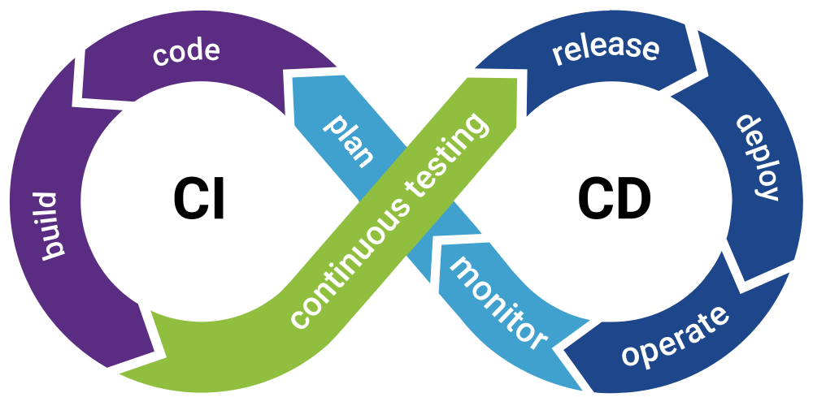
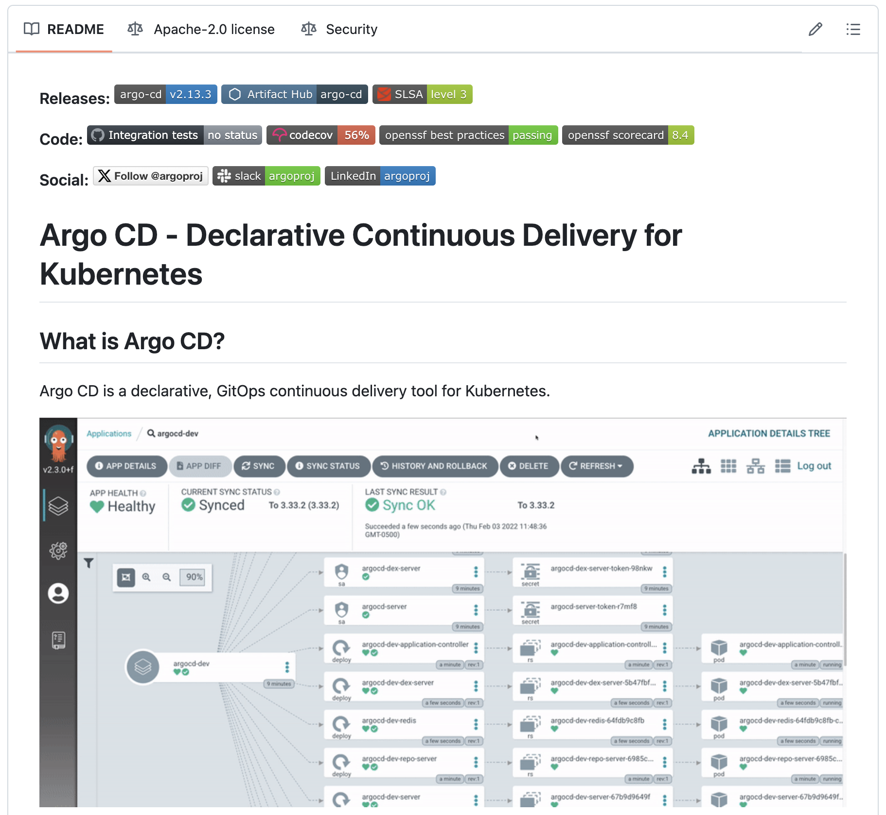
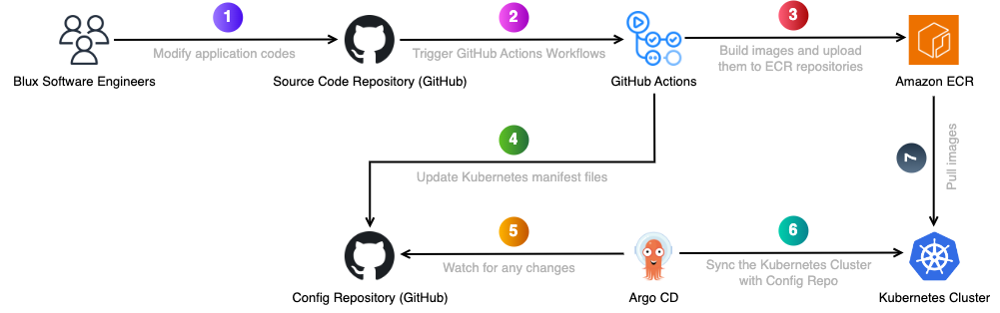
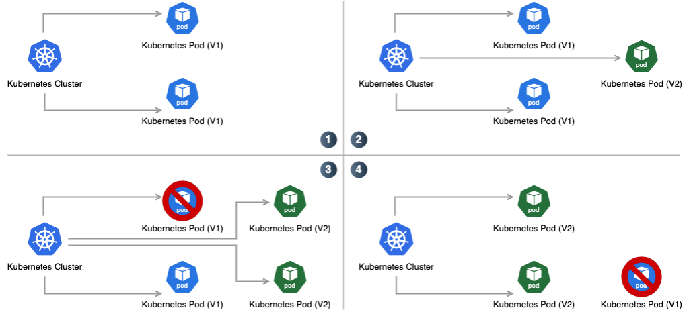
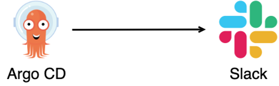

> **Originally published** on the [blux Tech Blog](https://blog.blux.ai/argo-cd%EC%99%80-%EA%B9%83%EC%98%B5%EC%8A%A4%EB%A5%BC-%ED%99%9C%EC%9A%A9%ED%95%9C-%EB%B8%94%EB%9F%AD%EC%8A%A4%EC%9D%98-%EC%BF%A0%EB%B2%84%EB%84%A4%ED%8B%B0%EC%8A%A4-%EC%9E%90%EC%9B%90-%EA%B4%80%EB%A6%AC-%EB%85%B8%ED%95%98%EC%9A%B0-41764). Republished here on the author's personal blog.

## How Did Blux Come to Adopt Argo CD?

In May 2023, Blux began running its core product recommendation services on Kubernetes. As an open-source container orchestration platform that automates deployment, scaling, and operations, Kubernetes provided the flexibility to respond to rapidly changing business requirements.

From the very beginning of setting up the Kubernetes environment, Blux invested heavily in building a CI/CD system — an automated pipeline that enables efficient and rapid delivery of applications from development through deployment.



### (1) Faster Development Velocity

- Automated pipelines were needed to deploy application code quickly and reliably
- Minimizing manual deployment tasks allowed developers to focus on actual development

### (2) Improved Operational Stability

- Automated testing and deployment processes enabled early detection of potential errors during deployment
- Simplified rollback procedures increased service availability and ensured operational environment stability

### (3) Better Cross-Team Collaboration

- CI/CD pipelines facilitated smooth collaboration between development and operations teams while tracking changes
- Greater transparency and reliability in the deployment process improved overall team productivity

Blux chose Argo CD for efficient, automated management of Kubernetes resources because it automatically syncs Git and Kubernetes cluster state, reduces manual deployment errors, and supports various deployment strategies.

## What Are Argo CD and GitOps?


Argo CD is a declarative application management tool for Kubernetes that automatically syncs and manages cluster state based on a Git repository.

### (1) Automatic Synchronization

- Ensures management consistency by synchronizing the Kubernetes resource state defined in a Git repository with the actual cluster state

### (2) User-Friendly UI and CLI

- Enables visual inspection and management of application deployment status through a web-based UI and CLI

### (3) Support for Various Deployment Strategies

- Easily configure blue-green deployments, canary deployments, and more

### (4) Helm Chart and Kustomize Integration

- Integrates with tools like Helm charts and Kustomize for more flexible Kubernetes resource management



Argo CD is the most widely used CD tool in Kubernetes environments worldwide and is maintained as an open-source project.

### Core Principles of GitOps

GitOps is a declarative methodology for managing applications and infrastructure through Git repositories — a configuration and management approach focused on the desired end state.

#### (1) Git as the Single Source of Truth

- Stores the current state and change history of all resources in a Git repository, improving traceability and reliability

#### (2) Automated Deployment and Synchronization

- Automatically reflects changes committed to Git onto the cluster, reducing manual work

#### (3) Declarative Configuration

- Defines all configurations declaratively for predictable outcomes

Blux chose GitHub as its SSOT (Single Source of Truth) because GitHub's powerful version control and collaboration tools perfectly aligned with the requirements for Kubernetes resource management.

By storing Kubernetes resource definition files (YAML) in GitHub, all change history is automatically recorded, and each change can be tracked through a unique commit hash. The PR feature ensures that all resource changes go through review and approval before being applied, enabling systematic collaboration management.

Integration with CI/CD pipelines was straightforward using workflow automation tools like GitHub Actions, and the natural integration with Argo CD simplified the workflow of automatically reflecting Git changes onto the Kubernetes cluster.

## Blux's Kubernetes Architecture with Argo CD and GitOps



Blux's deployment architecture follows these 7 stages:

**Stage 1: Source Code Push**
Engineers develop the Collector API application and push it to the GitHub source code repository using PRs. When code changes are merged into a specific branch, the build and deployment process is automatically triggered through GitHub Actions.

**Stage 2: GitHub Actions Workflow Execution**
When code is pushed to a specific branch in GitHub, GitHub Actions runs automatically. At this stage, the application is built into a container image, necessary tests are performed, and if all tests pass, the process moves to the next stage. If tests fail, the entire process is halted and engineers are notified.

```yaml
name: Build and push image to Amazon ECR

on:
  push:
    branches:
      - <REDACTED>
      - ...
    paths:
      - <REDACTED>
      - ...

env:
  AWS_ACCOUNT_ID: <REDACTED>
  AWS_REGION: <REDACTED>
  AWS_ECR_REPOSITORY: <REDACTED>
  AWS_IAM_ROLE_TO_ASSUME: <REDACTED>

jobs:
  build_and_push_image:
    runs-on: ubuntu-22.04
    permissions:
      id-token: write
      contents: read
    steps:
      - name: Checkout
        uses: actions/checkout@v4
      - name: Configure AWS credentials
        uses: aws-actions/configure-aws-credentials@v4
        id: aws-credentials
        with:
          disable-retry: true
          aws-region: ${{ env.AWS_REGION }}
          role-to-assume: arn:aws:iam::${{ env.AWS_ACCOUNT_ID }}:role/${{ env.AWS_IAM_ROLE_TO_ASSUME }}
          inline-session-policy: >-
            {
              "Version": "2012-10-17",
              "Statement": [
                {
                  "Sid": "WriteImage",
                  "Effect": "Allow",
                  "Action": [
                      "ecr:CompleteLayerUpload",
                      "ecr:UploadLayerPart",
                      "ecr:InitiateLayerUpload",
                      "ecr:BatchCheckLayerAvailability",
                      "ecr:PutImage"
                  ],
                  "Resource": "arn:aws:ecr:${{ env.AWS_REGION }}:${{ env.AWS_ACCOUNT_ID }}:repository/${{ env.AWS_ECR_REPOSITORY }}"
                },
                {
                  "Sid": "ReadImage",
                  "Effect": "Allow",
                  "Action": [
                      "ecr:DescribeImages"
                  ],
                  "Resource": "arn:aws:ecr:${{ env.AWS_REGION }}:${{ env.AWS_ACCOUNT_ID }}:repository/${{ env.AWS_ECR_REPOSITORY }}"
                },
                {
                  "Sid": "AuthOnly",
                  "Effect": "Allow",
                  "Action": [
                      "ecr:GetAuthorizationToken"
                  ],
                  "Resource": [
                      "*"
                  ]
                }
              ]
            }
      - name: Login to Amazon ECR
        id: login-ecr
        uses: aws-actions/amazon-ecr-login@v2
      - name: Read Version
        run: |
          echo "VERSION=$(cat VERSION | tr -d '\n')" >> $GITHUB_ENV
      - name: Build image
        run: |
          docker build -t ${{ env.AWS_ACCOUNT_ID }}.dkr.ecr.${{ env.AWS_REGION }}.amazonaws.com/${{ env.AWS_ECR_REPOSITORY }}:${{ env.VERSION }} .
      - name: Push image to Amazon ECR
        run: |
          docker push ${{ env.AWS_ACCOUNT_ID }}.dkr.ecr.${{ env.AWS_REGION }}.amazonaws.com/${{ env.AWS_ECR_REPOSITORY }}:${{ env.VERSION }}
```

**Stage 3: Store Container Image in Amazon ECR**
After GitHub Actions builds the Collector API container image, it uploads it to Amazon ECR. Amazon ECR serves as Blux's container image registry, where container images with specific tags (e.g., 0.1.2) are stored.

**Stage 4: GitHub Actions Updates the Config Repository**
Once a new Collector API container image is uploaded to ECR, GitHub Actions updates the Kubernetes manifests (in YAML format) in the application manifest repository. It updates fields like `image: ${AWS_ACCOUNT_ID}.dkr.ecr.ap-northeast-2.amazonaws.com/${ECR_REPOSITORY_NAME}:0.1.1` to point to the new container image.

Changes can either be committed directly or submitted as a PR for human review. Blux uses the PR approach for safer deployments.

**Stage 5: Argo CD Detects Changes**
When an engineer reviews the PR created by GitHub Actions and merges the changes into the final codebase, the config repository state changes. Since Argo CD periodically monitors the config repository, it automatically detects changes without any manual action.

Argo CD uses a declarative deployment approach to synchronize the config repository's settings with the actual Kubernetes cluster state. Engineers don't need to manually run `kubectl apply` — changes are automatically applied to the cluster.

**Stages 6-7: Argo CD Deployment and Pod Rolling Update**
Argo CD deploys the new Collector API version to the Kubernetes cluster based on the updated manifests. The Deployment resource is updated, and existing pods undergo a rolling update to the new image.



New pods in the cluster pull the updated container image from Amazon ECR and start running. Once the deployment completes successfully, the latest version of the Collector API is running in the Kubernetes cluster, ready to handle external requests.

Through this process, Blux operates an automated CI/CD system where engineers simply push application code changes to GitHub and new versions are automatically deployed to the Kubernetes cluster.

## Key Features of Blux's Management Process

### (1) Linking GitHub Repositories to Kubernetes Resources

Blux manages application code and Kubernetes manifests in separate GitHub repositories.

- Applications are managed in a source code repository, and container images are built and deployed through GitHub Actions when code changes are made.
- Kubernetes resource manifests (YAML) are stored in a config repository, and Argo CD monitors this repository to automatically apply changes to the cluster.
- Declarative Kubernetes configuration is now possible, and infrastructure changes are clearly recorded and tracked through Git.

### (2) PR-Based Change Management

Blux manages all Kubernetes resource changes through PRs to improve safety.

- When engineers deploy new features or modify configurations, they create PRs in the config repository rather than making direct changes, going through review and approval processes.
- Code review, approval processes, and change history tracking are now possible, preventing the risk of incorrect configuration changes being immediately reflected in the production environment.
- The PR-based management approach makes the deployment process more transparent and systematic.

### (3) Automated Deployment Pipeline

Blux built deployment automation using Argo CD based on a GitOps workflow.

- When engineers push new code to GitHub, GitHub Actions builds it and uploads the container image to Amazon ECR.
- When the config repository manifests are updated, Argo CD detects the changes and automatically syncs with the Kubernetes cluster to reflect them.
- Deployments can be configured for Fully Automatic Sync or Manual Sync (deployed after a specific PR is approved).
- Blux is able to maintain a consistent deployment process while increasing development velocity and strengthening deployment reliability.

### (4) Repeatable Resource Management with Helm Charts

Blux actively uses Helm charts to efficiently manage Kubernetes resource definitions.

- All application and infrastructure configurations are composed as Helm charts, allowing easy adjustment of environment variables or deployment parameters without code changes.
- Helm charts enable templated YAML configurations, making it possible to deploy and maintain multiple applications in a consistent manner.
- Combining Helm charts with Argo CD simplifies repetitive deployment tasks and enables effective management of environment-specific configurations.

By building a GitOps-based automated Kubernetes management process using GitHub, Argo CD, and Helm charts, Blux increased deployment velocity and significantly improved operational reliability.

## Future Improvements for Blux's Architecture

Since adopting Argo CD and GitOps, Blux has seen benefits across multiple areas including faster deployment velocity, higher operational reliability, and stronger team collaboration.

### (1) Enhanced Real-Time Monitoring with Argo CD Notifications



Currently, Argo CD deployment status is often checked manually through the dashboard or kubectl commands. The plan is to leverage the Argo CD Notifications feature to receive real-time alerts through collaboration tools like Slack. This will enable rapid response when deployment failures or sync errors occur.

### (2) Automated Deployment Approval and Strengthened Testing Processes

Currently, changes are approved through PRs and then manually merged into the final codebase. The plan is to improve the CI/CD pipeline so that changes can be automatically approved and deployed when certain conditions are met.

For example, when automated E2E tests pass, Argo CD will be configured to automatically reflect the changes. This is expected to increase deployment velocity while maintaining a more stable deployment process.
