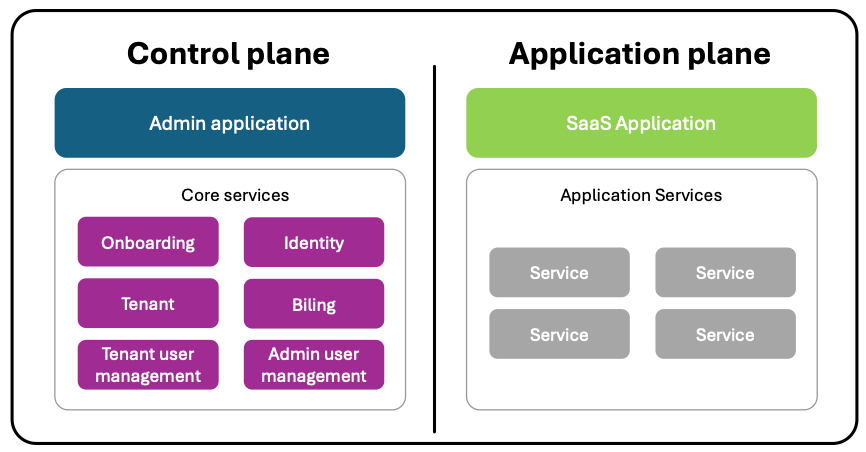
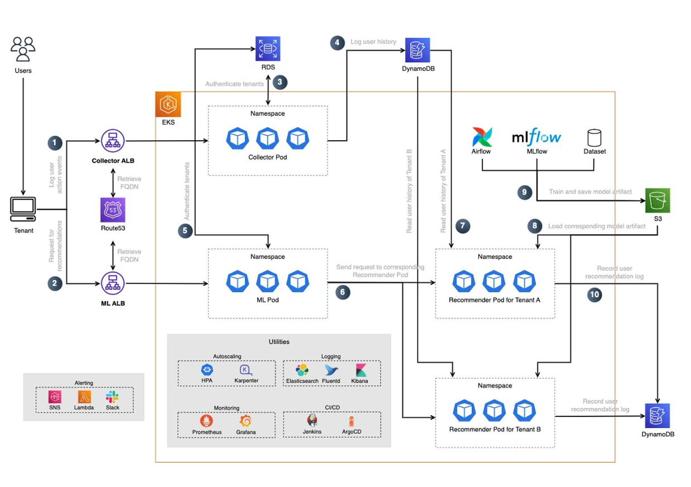
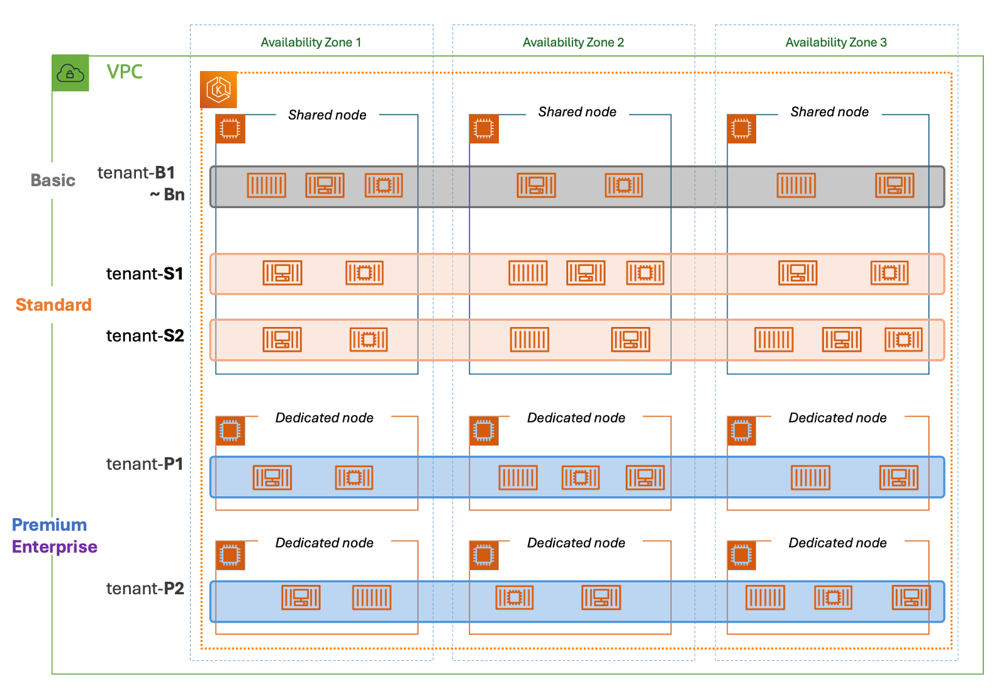
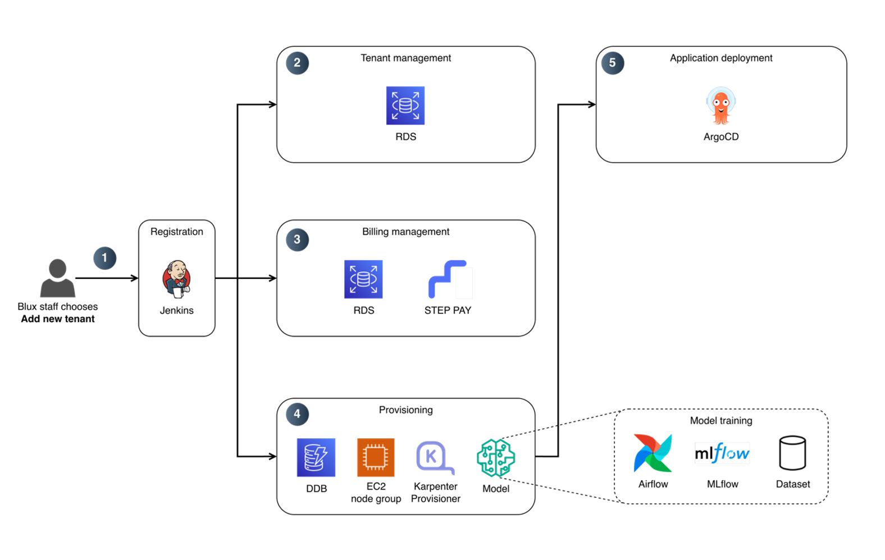
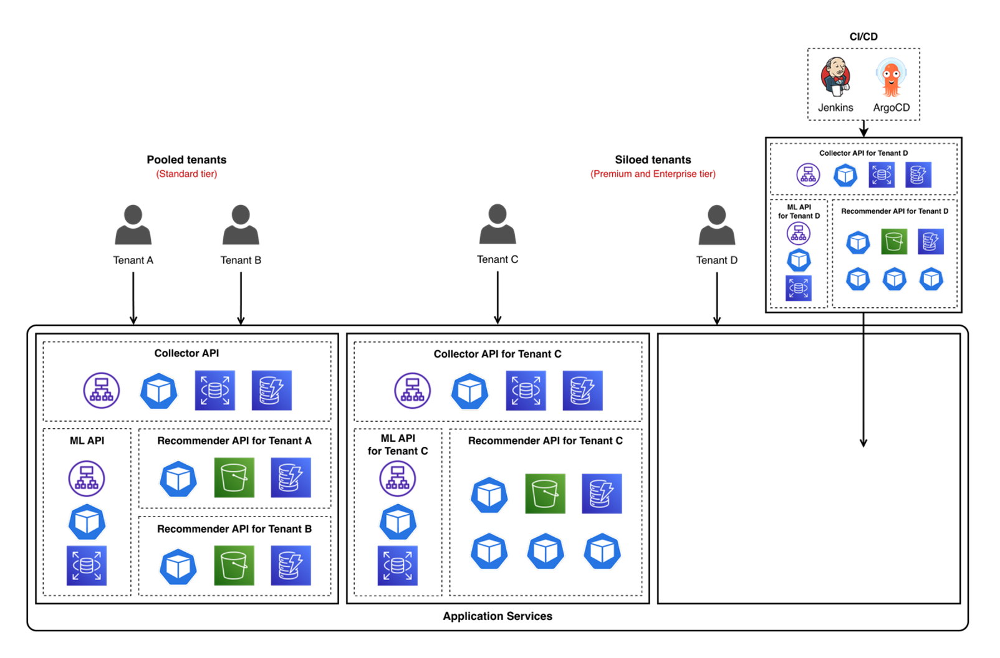

> **Originally published** on the [AWS Partner Network (APN) Blog](https://aws.amazon.com/blogs/apn/aws-saas-architecture-patterns-implementation-on-amazon-eks-blux-a-korean-startup/). Republished here on the author's personal blog. This post was co-authored by Jinah Kim (AWS), Hoseong Seo (AWS), and SunHong Min (blux).

Blux (legal entity: Z.ai), a Korean B2B software as a service (SaaS) startup, provides subscription-based personalized product recommendation solutions to businesses. They deliver real-time recommendations to over 10 million end users monthly, helping e-commerce companies achieve up to 7x improvement in conversion efficiency. Blux handles the entire process from custom AI model development to personalized recommendation system implementation, enabling businesses to deploy recommendation solutions in just 2–3 hours—a process that typically takes over six months when built in-house. This blog shares how Blux successfully enhanced its SaaS solution by implementing AWS SaaS architecture patterns in an [Amazon Elastic Kubernetes Service (Amazon EKS)](https://aws.amazon.com/ko/eks/) environment.

## Introduction to AWS SaaS architecture patterns

SaaS is a cloud-based software delivery model where customers access applications without managing infrastructure, paying through usage-based or subscription models. All tenants operate the same application version and are managed through a unified SaaS Control Plane, enabling efficient feature deployment and seamless scaling.

*SaaS architecture – Control plane and application plane*

As shown in Figure 1, SaaS architecture consists of the control plane and application plane.

The control plane comprises services necessary for managing and operating all tenants, including tenant onboarding and resource management. By automating these processes, SaaS providers can scale while maintaining operational efficiency.

The application plane is where the business logic and functional elements of the SaaS solution are implemented. Dedicated silos and shared pools express the resource deployment method, and isolation between tenants must be considered in all distribution methods.

For comprehensive details about SaaS architecture, we recommend consulting the [AWS SaaS Architecture whitepaper](https://docs.aws.amazon.com/ko_kr/whitepapers/latest/saas-architecture-fundamentals/saas-architecture-fundamentals.html).

## Evolution of Blux's SaaS solution

In its early stages, Blux chose [Amazon Elastic Container Service (Amazon ECS)](https://aws.amazon.com/ecs) as a fully managed container orchestration service, prioritizing reliable and rapid service delivery.

Because Blux served multiple customers (tenants), they initially provided a dedicated (silo) ECS cluster for each tenant. As their business grew, Kubernetes emerged as the optimal choice for multi-tenancy architecture, efficiently managing multiple workloads while maintaining strong isolation between tenants.

While Kubernetes offered flexibility, it came with inherent management complexity. This led them to adopt [Amazon Elastic Kubernetes Service (Amazon EKS)](https://aws.amazon.com/eks/) a managed Kubernetes service. By delegating control plane management to Amazon EKS, Blux maintained flexibility while significantly reducing operational overhead.

Blux decided to use the advantages of Kubernetes, and they focused their issues as follows:

- First, they needed to expand beyond their single-tier structure to accommodate multiple tenants' requirements. While a shared resource (pool) deployment model provided a performant, cost effective solution, some tenants needed higher performance or performance isolation guarantees, requiring a transition to a multi-tier architecture.
- The shift to a multi-tier structure required different performance levels and cost measurement methods for each tier. Tenants with high monthly active users (MAU) or demanding performance requirements needed dedicated (silo) resources.
- Finally, automating the previously manual onboarding process became important to improve agility and reduce potential human errors.

For these reasons, Blux decided to enhance their SaaS solution. This blog post introduces how Blux implemented AWS SaaS architecture patterns based on Amazon EKS.

## Case study: Implementing SaaS architecture on Amazon EKS – The Blux story

Blux provides 100% real-time personalized recommendations. Consider an e-commerce website with dedicated recommendation spaces. When a user views products A, B, and C before returning to the homepage, Blux's system immediately processes this browsing history and displays the most relevant products.

### SaaS architecture on Amazon EKS

*Blux's architecture*

Figure 2 illustrates Blux's enhanced high-level architecture implemented using AWS SaaS architecture patterns.

The solution runs entirely on Amazon EKS clusters, providing high availability and reliability. For automatic scaling, the architecture uses [Horizontal Pod Autoscaler (HPA)](https://kubernetes.io/docs/tasks/run-application/horizontal-pod-autoscale/) and [Karpenter](https://karpenter.sh/) for pod and node scaling. The infrastructure uses the EFK stack for logging, Prometheus/Grafana for monitoring, and Jenkins/ArgoCD for CI/CD pipelines.

Following the system flow shown in Figure 2:

(1) Tenants interact with Blux's system through an SDK providing access to the Collector API for gathering user behavior data and the ML API for serving recommendations

(2) All requests flow through an application load balancer (ALB) before reaching the appropriate Pods in the Amazon EKS cluster

(3) The system validates authentication against RDS data

(4) The Collector workload stores user behavior data in [Amazon DynamoDB](https://aws.amazon.com/dynamodb) tables, serving dual purposes: training recommendation models and powering real-time recommendations

(5) For ML API calls, the request follows a similar authentication process

(6) The request is routed to tenant-specific Recommender workloads. Unlike shared Collector and ML workloads, each tenant has their own dedicated Recommender workload

(7) The Recommender workload retrieves recent user behavior data from DynamoDB

(8) The Recommender workload loads the tenant-specific recommendation model from [Amazon Simple Storage Service (Amazon S3)](https://aws.amazon.com/s3) and generates real-time recommendations by processing the behavior data through the model

(9) The recommendation models are regularly updated through a pipeline powered by Airflow and MLflow

(10) The Recommender workload records which recommendations were provided to which users in the DynamoDB tables

### Tenant tiers

Blux offers different service experiences which influence how tenants can consume resources. The following table describes the allocation of key resources across Blux's tenant tiers and whether resources are shared or dedicated.

|  | Standard | Premium | Enterprise |
| --- | --- | --- | --- |
| Real-time recommendation provided | Yes | Yes | Yes |
| Custom endpoint provided | No (shares endpoint) | Yes | Yes |
| Tenant separation method | Namespace | Node group | Node group |
| Exclusive node provisioned | N/A | Yes | Yes (with more resources) |

Figure 3 illustrates how to provide tenants' node based on tier. Blux offers three tiers: Standard (shared resources), Premium (dedicated resources), and Enterprise (dedicated resources with higher performance).

*Node architecture based on tier*

Tenant computing resources are isolated through Kubernetes namespaces, providing logical separation within the cluster. This aligns with [AWS EKS SaaS reference architecture](https://github.com/aws-samples/aws-saas-factory-eks-reference-architecture). Premium and Enterprise workloads run on dedicated node groups, preventing noisy neighbor issues.

### Automated onboarding

*Automated onboarding process*

Figure 4 shows the automated tenant onboarding process:

(1) Jenkins orchestrates the process upon tenant registration request.

(2) The process creates and stores new tenant's unique information.

(3) Billing service processes subscription details and registers payment methods with STEP PAY.

(4) The system provisions resources – DynamoDB tables for all tiers, while dedicated node groups, Karpenter Provisioners are created for Premium and Enterprise tiers, providing them with separate Collector API and ML API access.

(5) ArgoCD creates the Recommender API, Blux's specialized API for recommendation model inference.

### Deployment model

*Tier-based deployment model*

Figure 5 shows tier-based provisioning for tenant onboarding. Blux offers three tiers: Standard, Premium, and Enterprise. Standard tier tenants share Collector and ML APIs, while Premium and Enterprise tenants receive dedicated Collector and ML APIs with their own endpoints to handle high-volume traffic. The Recommender API is provided exclusively to all tenants, enabling each tenant's Recommender workload to download dedicated models from Amazon S3.

For Standard tier onboarding (Tenant A and B in Figure 5), tenants share existing Collector and ML APIs while receiving a new Recommender API. Premium and Enterprise tenants receive both a new Recommender API and dedicated Collector and ML APIs with separate endpoints. This deployment process is automated through Jenkins and ArgoCD in the Amazon EKS cluster.

### Tenant isolation

Blux uses AWS IAM roles for service accounts (IRSA) to isolate tenant resources. Pods accessing AWS resources use IAM roles with necessary permissions as service account annotations.

Blux configures tenant-specific IAM roles for pods like Recommender workload, with policies restricting access to tenant's AWS resources. Premium and Enterprise tiers have dedicated Collector and ML pods with exclusive endpoints.

### Results of Blux's SaaS solution enhancement

AWS SaaS architecture patterns enabled Blux to build a scalable, efficient, and secure solution. Results of Blux's SaaS solution enhancement:

- **Automated tenant onboarding and resource deployment**
  - Significantly reduced onboarding timeline from several days to approximately 2-3 hours through automation
  - Reduced human errors that previously occurred during manual processes (model paths, resource allocation, task dependencies)
  - Decreased operational team workload

- **Benefits of multiple service tiers**
  - Enabled flexible pricing and packaging strategies for different customer needs
  - Expanded market coverage by serving both cost-sensitive and enterprise tenants through tiered offerings
  - Delivered comprehensive solution with tier-based resource isolation

- **Implementation of multi-tenant performance isolation**
  - Eliminated noisy neighbor issues using separate node groups
  - Increased satisfaction with dedicated resources in higher tiers
  - Ensured robust isolation for higher-tier tenants

## Conclusion

SaaS vendors need to continuously improve their architecture to scale and grow their business. Blux continues to evolve its SaaS architecture while implementing the structure described above. Currently, they are incorporating Istio to achieve more sophisticated traffic management and higher tenant isolation.

For those considering building a SaaS architecture based on Amazon EKS, we recommend consulting the [SaaS Architecture whitepaper](https://docs.aws.amazon.com/whitepapers/latest/saas-architecture-fundamentals/saas-architecture-fundamentals.html) for comprehensive details about SaaS architecture. Additionally, you can refer to the [Amazon EKS SaaS Reference Architecture](https://github.com/aws-samples/aws-saas-factory-eks-reference-architecture) for sample architectures and code examples that can guide you in building SaaS solutions in an Amazon EKS environment.
