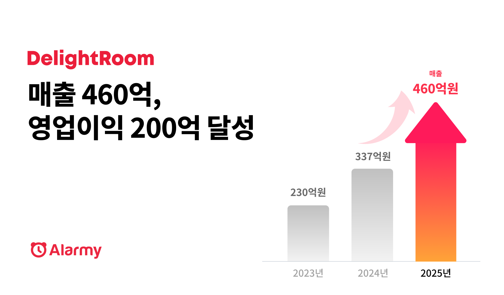
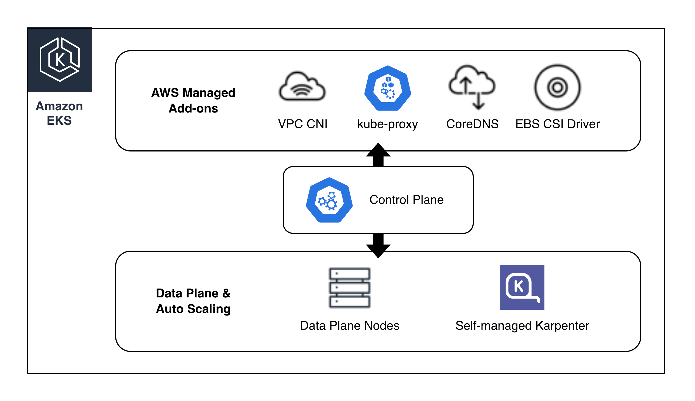
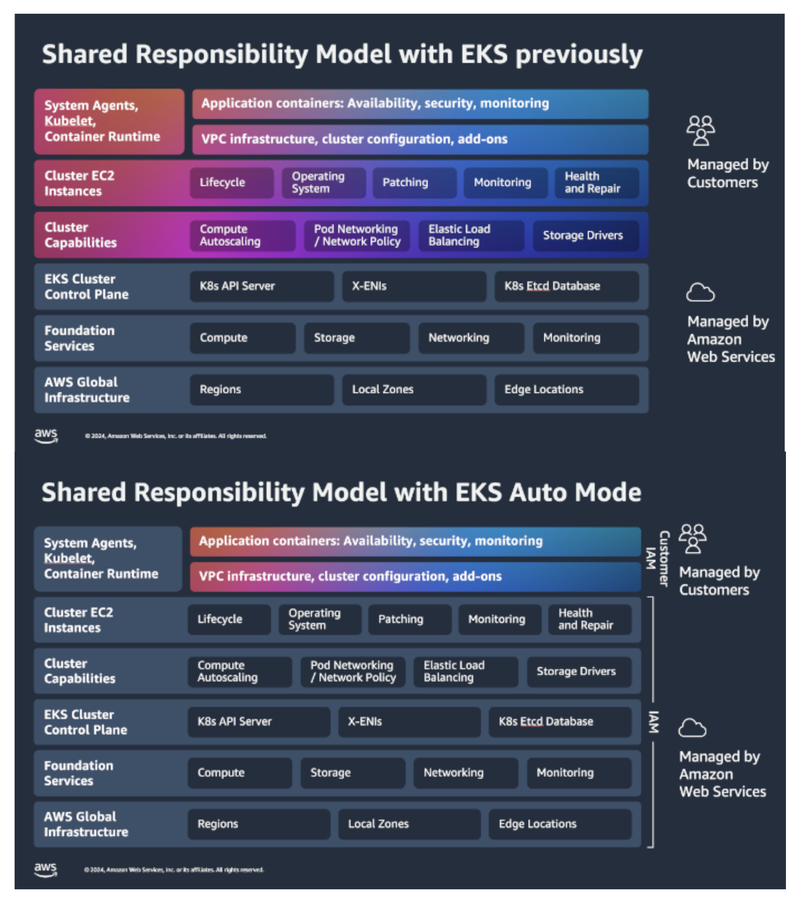
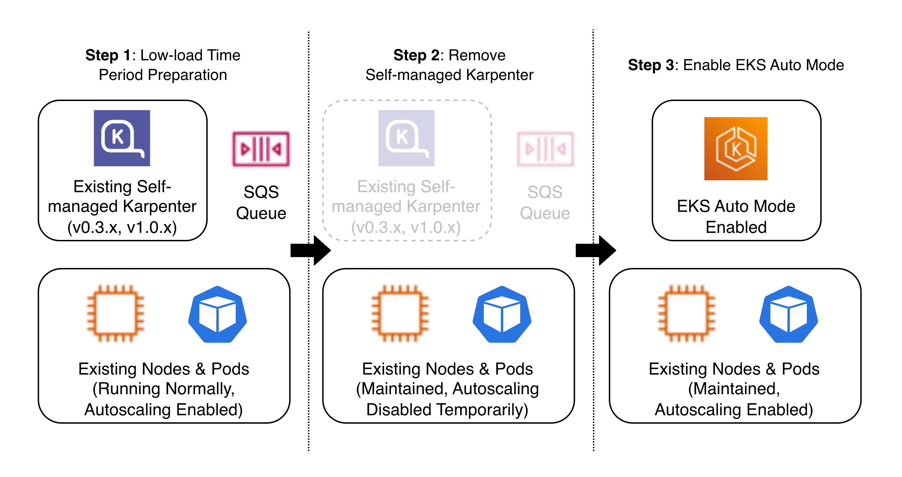
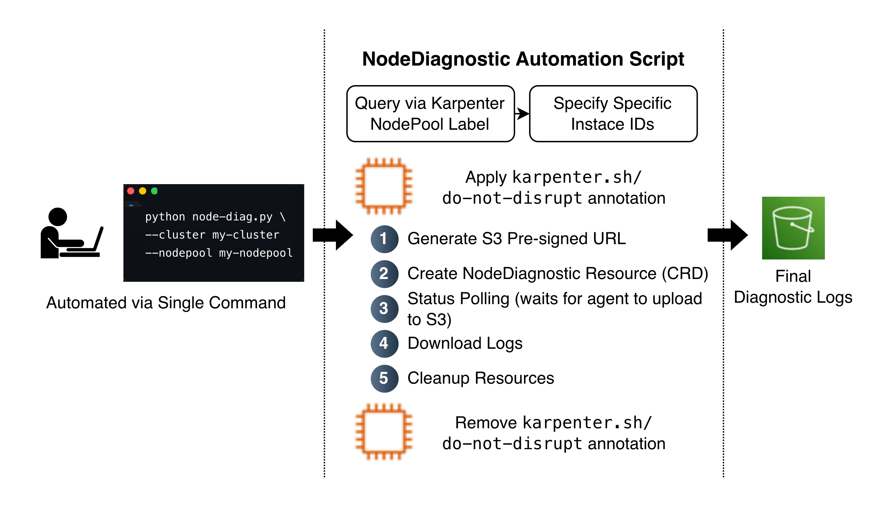
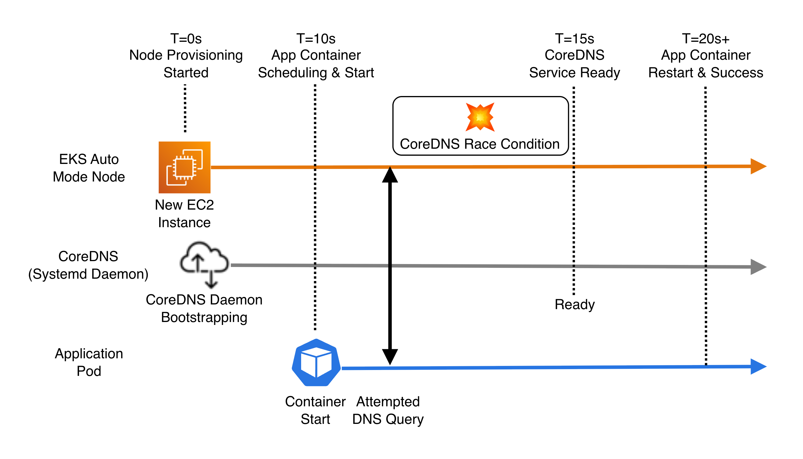
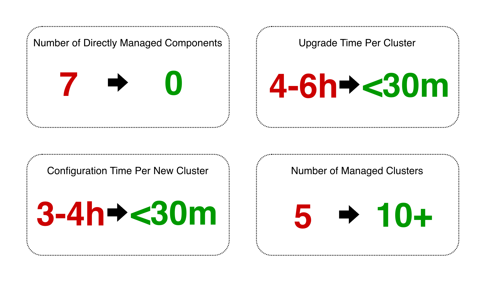

> **Originally published** on the [AWS Tech Blog](https://aws.amazon.com/ko/blogs/tech/delightroom-eks-auto-mode-with-efficiency-operation/). Republished here on the author's personal blog.

[DelightRoom](https://team.alar.my/) operates [Alarmy](https://alar.my/), a sleep and wake-up solution that has surpassed 100 million cumulative downloads worldwide, and [DARO](https://daro.so/), a B2B ad-monetization platform. Recently, it has been expanding its business through app acquisitions. With KRW 46 billion in revenue and KRW 20 billion in operating profit in 2025, DelightRoom is a globally focused company that generates most of its revenue overseas.


*Figure 1: About DelightRoom*

Business expansion through app acquisitions directly means the expansion of infrastructure. Each time a new app or service is added, the number of [Amazon EKS](https://aws.amazon.com/ko/eks/) clusters (hereafter EKS clusters) and surrounding infrastructure to manage grows, and so does the operational scope that a small infrastructure team has to handle.

In November 2025, DelightRoom migrated the five EKS clusters it had been operating to [Amazon EKS Auto Mode](https://docs.aws.amazon.com/ko_kr/eks/latest/userguide/automode.html) (hereafter EKS Auto Mode), and today it operates all of its 10-plus clusters on EKS Auto Mode.

This post shares the background behind choosing EKS Auto Mode, the decisions and troubleshooting during the migration, how we established observability in an EKS Auto Mode environment, and the results of the adoption.

## Why DelightRoom Chose EKS Auto Mode

### The complexity of the upgrade process

Upgrading an EKS cluster to a new Kubernetes version does not end with just bumping the Control Plane version. Because Amazon EKS does not automatically upgrade [Add-ons](https://docs.aws.amazon.com/ko_kr/eks/latest/userguide/workloads-add-ons-available-eks.html) when the Control Plane is upgraded, after the Control Plane upgrade you have to individually upgrade Add-ons such as Amazon VPC CNI plugin for Kubernetes (hereafter VPC CNI), kube-proxy, CoreDNS, and Amazon EBS CSI driver (hereafter EBS CSI driver), refresh the Data Plane nodes, and separately upgrade Self-managed Karpenter as well. DelightRoom was managing a total of seven such components individually, and had to repeat this process across five clusters.


*Figure 2: Diagram of the seven components that must be managed individually during upgrades*

Managing the compatibility matrix was a particular burden. [Karpenter](https://karpenter.sh/) has a different minimum compatible version for each EKS minor version, so we always had to check the [official compatibility matrix](https://karpenter.sh/docs/upgrading/compatibility/). Chained dependencies also exist among VPC CNI, kube-proxy, and the EKS version, and matching the versions incorrectly can directly lead to operational failures such as Pod IP allocation failures or nodes going NotReady.

Self-managed Karpenter was also a considerable operational burden. We had to perform Helm Chart deployments and upgrades ourselves, and manage ancillary infrastructure such as the [SQS Interruption Queue](https://karpenter.sh/docs/concepts/disruption/#interruption). Karpenter v0.32.0 completely changed its CRDs (Provisioner → NodePool, AWSNodeTemplate → EC2NodeClass), and v1.0.0 brought further schema changes, so every major upgrade entailed migration work. Because of this upgrade complexity and downtime concerns, we adopted a blue-green approach of building a new cluster in parallel, and with the cost of running duplicate infrastructure plus DNS and traffic cutover work added on top, the time and cost of a single upgrade increased even further.

### The core value of EKS Auto Mode

EKS Auto Mode shifts components that customers previously managed individually — Networking (VPC CNI, kube-proxy, CoreDNS), Storage (EBS CSI driver), and Compute (Managed Karpenter) — to a model managed by AWS. As a result, the upgrade process is simplified from individually managing seven components to a single Control Plane upgrade.

When you run a Control Plane upgrade, the components managed by EKS Auto Mode are updated automatically, and the Data Plane nodes are also replaced sequentially while respecting [PodDisruptionBudget](https://kubernetes.io/ko/docs/concepts/workloads/pods/disruptions/#%ED%8C%8C%EB%93%9C-disruption-budgets). For details on EKS Auto Mode's managed components and upgrade process, please refer to the official documentation.

Migrating to EKS Auto Mode also represents a change in the Shared Responsibility Model. The Data Plane infrastructure management area that customers previously handled directly is largely transferred to AWS, freeing you from repetitive operational tasks such as tracking Add-on versions, patching node AMIs, and managing Karpenter Helm Charts.

Especially in an environment like DelightRoom's, where a small team operates many clusters, this helps team members focus more on business workloads. For details on the changes to the Shared Responsibility Model, please refer to the [official documentation](https://docs.aws.amazon.com/whitepapers/latest/security-overview-amazon-eks-auto-mode/aws-shared-security-responsibility-model.html).


*Figure 3: Shared Responsibility Model before/after comparison ([source](https://docs.aws.amazon.com/eks/latest/userguide/automode.html))*

## DelightRoom's EKS Auto Mode Migration

DelightRoom migrated its five existing EKS clusters to EKS Auto Mode in place, in a phased manner. We managed the migration declaratively through the IaC tool [Pulumi](https://www.pulumi.com/), tracking changes as code and maintaining consistency across clusters. In this process, we had to solve both a migration strategy that works around Karpenter version requirements and workload scheduling issues caused by EKS Auto Mode's change in labeling scheme.

### Karpenter: a 'remove-then-migrate' strategy

The [official migration guide](https://docs.aws.amazon.com/eks/latest/userguide/auto-migrate-karpenter.html) from Karpenter to EKS Auto Mode requires Karpenter v1.1 or higher as a prerequisite. However, the Karpenter versions installed on DelightRoom's existing clusters differed from cluster to cluster, with a mix of v0.3x and v1.0x.

In particular, reaching v1.1 from a v0.3x cluster requires going through at least three sequential major migrations: the CRD changes in v0.32.0 (Provisioner → NodePool, AWSNodeTemplate → EC2NodeClass), the schema changes in v1.0.0, and the upgrade to v1.1.

Each step entails CRD conversion, IAM policy modifications, manifest rewrites, and so on, and there is also a risk of version compatibility issues arising during this process. After reviewing the cost-effectiveness of this upgrade process, instead of upgrading every cluster's Karpenter version to v1.1, we chose a workaround strategy of temporarily removing Karpenter and then enabling EKS Auto Mode.


*Figure 4: Migration strategy diagram (3-step)*

The key rationale that made this strategy possible was that even if Karpenter is removed, the already-provisioned nodes and the Pods running on them are not affected — only new node scaling stops. Accordingly, we executed this strategy during the low-traffic early-morning hours to minimize the risk during the window in which scaling was stopped.

In the execution process, we first removed the Self-managed Karpenter Helm release, its related CRDs, and ancillary infrastructure such as the SQS Interruption Queue, and then enabled EKS Auto Mode. The moment it was enabled, Managed Karpenter was automatically configured and node provisioning based on the new NodePool resumed; the entire process completed within one hour. There was no impact on existing workloads, and as a result we were able to completely skip the most cumbersome Karpenter upgrade steps.

### Handling nodeSelector/toleration mismatches

A problem was discovered while migrating the development-environment cluster first. After the migration, we observed that some workloads were not being scheduled, and using the `kubectl describe pod` command we saw a `FailedScheduling` event along with a message indicating that the node's label conditions were not being met.

Next, comparing the label list of the EKS Auto Mode nodes with the nodeSelector of the existing workloads, we were able to identify that the mismatch arose because `karpenter.k8s.aws/` prefixed labels do not exist on EKS Auto Mode nodes.

This is because EKS Auto Mode's Managed Karpenter uses a different labeling scheme than Self-managed Karpenter. Whereas the instance-attribute labels on Self-managed Karpenter nodes use the `karpenter.k8s.aws/` prefix, Auto Mode nodes use labels with the `eks.amazonaws.com/` prefix.

For example, in the case of instance category, what was previously referenced as `karpenter.k8s.aws/instance-category` changes to `eks.amazonaws.com/instance-category` in Auto Mode. If a workload's nodeSelector references the existing labeling scheme, it will not be scheduled onto Auto Mode nodes and the Pod ends up stuck in a Pending state.

Before migrating the production-environment cluster, we took proactive measures based on this experience. We manually inspected the nodeSelector and toleration of all workloads, while in parallel writing a script to automatically identify workloads that reference the existing `karpenter.k8s.aws/` prefixed labels. We fixed the identified workloads in advance to match EKS Auto Mode's labeling scheme and then executed the production migration, and as a result not a single scheduling failure due to a label mismatch occurred in production.


*Table 1: Label mapping table (karpenter.k8s.aws/\* → eks.amazonaws.com/\*)*

Through this process, we once again felt the importance of migrating sequentially from development to production. Thanks to discovering the problem and understanding the pattern in the development cluster first, we were able to preemptively prevent the same problem in production. This experience became the standard for applying the same pre-check process when onboarding new clusters to EKS Auto Mode later on.

## Establishing Observability in an Auto Mode Environment

EKS Auto Mode nodes have direct access via SSH or SSM blocked, and core components such as Karpenter and VPC CNI run as systemd daemons rather than Pods, so you cannot check their status with the kubectl logs command either. To compensate for these constraints, we built an observability system that combines two approaches: continuous monitoring and post-hoc diagnosis.

### Continuous monitoring: CloudWatch Vended Logs

EKS Auto Mode can send the logs of AWS-managed components externally through [CloudWatch Vended Logs](https://docs.aws.amazon.com/eks/latest/userguide/auto-managed-component-logs.html). The four supported log types are as follows.

1. `AUTO_MODE_COMPUTE_LOGS` (Karpenter)
2. `AUTO_MODE_IPAM_LOGS` (VPC CNI IP Address Management)
3. `AUTO_MODE_BLOCK_STORAGE_LOGS` (EBS CSI)
4. `AUTO_MODE_LOAD_BALANCING_LOGS` (AWS Load Balancer Controller)

Among these, we made securing visibility into Karpenter's node-provisioning behavior and VPC CNI's IP-allocation behavior our top priority, so we first enabled two of them: `AUTO_MODE_COMPUTE_LOGS` and `AUTO_MODE_IPAM_LOGS`. Since DelightRoom actively uses NLB, we also plan to add `AUTO_MODE_LOAD_BALANCING_LOGS` later, but for now there are no significant load-balancer-related issues or improvement needs, so at this stage we focused on enabling the first two logs first.

The logs are delivered to CloudWatch Logs, and we set the retention period to 30 days. We implemented the entire configuration as a Pulumi module, managing it through code (i.e., Infrastructure as Code) so that the same observability settings are applied declaratively per cluster.

### Post-hoc diagnosis: NodeDiagnostic CRD

When a node-level issue occurs whose cause is difficult to trace with continuous monitoring alone, we use the NodeDiagnostic CRD. NodeDiagnostic is the official mechanism for collecting a specific node's system logs in EKS Auto Mode; when a user creates a [NodeDiagnostic](https://docs.aws.amazon.com/eks/latest/userguide/auto-get-logs.html) resource, the node's Node Monitoring Agent collects the logs and uploads them to a user-specified S3 pre-signed URL.


*Figure 5: NodeDiagnostic workflow diagram*

The basic workflow consists of five steps: generating an S3 pre-signed URL, creating the NodeDiagnostic resource, polling status, downloading logs, and cleaning up resources. When a NodeDiagnostic resource is created, the Node Monitoring Agent begins uploading the node's logs to S3, and the status-polling step periodically checks whether this upload has completed. Performing this process manually every time is cumbersome.

We built our own Python script that automates this entire flow so that node diagnostic logs can be collected with a single command. The script supports two modes: querying nodes by the Karpenter NodePool label (`karpenter.sh/nodepool`) to collect logs in bulk per NodePool, or specifying a particular instance ID to collect only an individual node.

In addition, to prevent target nodes from being terminated early by Karpenter consolidation during log collection, it also includes a step that applies the `karpenter.sh/do-not-disrupt` annotation to the target nodes right before collection starts to temporarily block consolidation, and removes the annotation after collection completes. The collected logs are stored in an S3 path organized by cluster, environment, and timestamp, and automatically expire after 30 days.

```python
def main():
    # ... setup: parse args, list target nodes, build S3 prefix ...

    # Block Karpenter consolidation during capture
    for node in nodes:
        apply_do_not_disrupt(node)

    for node in nodes:
        # 1. Generate S3 Pre-signed URL
        key = f"{s3_prefix}/{node}.tar.gz"
        url = generate_presigned_url(args.bucket, key, bucket_region)

        # 2. Create NodeDiagnostic Resource (CRD)
        apply_manifest(create_node_diagnostic(node, url))

    # 3. Status Polling (wait for the agent to finish uploading logs to S3)
    while pending_nodes and elapsed < max_wait:
        time.sleep(check_interval)
        for node in list(pending_nodes):
            if check_diagnostic_status(node) in ("Success", "SuccessWithErrors", "Failure"):
                pending_nodes.remove(node)

    # Release nodes back to Karpenter
    for node in nodes:
        remove_do_not_disrupt(node)

    # 4. Download Logs
    for node in completed_nodes:
        download_logs(args.bucket, f"{s3_prefix}/{node}.tar.gz", f"{output_dir}/{node}.tar.gz")

    # 5. Cleanup Resources
    for node in nodes:
        delete_node_diagnostic(node)
```

### Debugging a real issue: CoreDNS Race Condition

The CloudWatch Vended Logs setup and NodeDiagnostic automation script introduced above were built because of one issue we encountered in the early days of adopting EKS Auto Mode. Not long after migrating to EKS Auto Mode, we intermittently found that when a new node was provisioned in a cluster, Pods scheduled onto that node would fail DNS lookups for external service calls. The occurrence frequency was on the order of once or twice a week, but because it was a problem where application containers terminated right after starting and repeatedly restarted, we needed to identify the root cause.

In the app container logs, a pattern repeatedly appeared in which DNS lookups sent to the CoreDNS Service ClusterIP failed with `read: connection refused`. After reconstructing the timeline together with the control plane audit logs, we confirmed that failures were concentrated around 10–15 seconds after the node started, and we surmised that CoreDNS on the new node was not yet ready to handle requests.


*Figure 6: Timeline diagram – the gap between node start → CoreDNS bootstrap → app container start*

However, more precise analysis than this was not easy. In EKS Auto Mode, CoreDNS does not come up as a Pod like in a typical EKS cluster but runs as a systemd daemon on the node, so we could not check its status with `kubectl logs`. Since this was a time before the aforementioned CloudWatch Vended Logs collection and NodeDiagnostic automation script had been built, we had no means to directly confirm when CoreDNS bootstrap actually completed or how large the gap was relative to the app container start time.

Even when we tried to manually run NodeDiagnostic after finding a problematic node, we repeatedly ran into situations where the node happened to be terminated by Karpenter consolidation, making it hard to secure the logs. This contention problem is solved by the `do-not-disrupt` step of the automation script introduced above, but at the time such a system was not in place.

In this situation, we were able to identify the root cause through collaboration with AWS Support. As a result of being shared past cases with the same symptoms, we received an answer that the cause was a race condition in which CoreDNS bootstrap was delayed on a specific AMI, and that the AMI had already been fixed and a new version was being distributed. Because EKS Auto Mode is structured to release new AMIs every week and propagate them to nodes automatically, the fix was gradually reflected on our cluster nodes as well and the issue resolved itself naturally. From the perspective of the Shared Responsibility Model, this was an experience in which we actually felt Auto Mode's division of responsibility, in that fixing and distributing the AMI-level defect was handled within AWS's area of responsibility and we did not need to patch the nodes ourselves.

In parallel, to put in place an application-level defensive layer, we applied a `wait-for-dns` init container to our core workloads. We configured it to check CoreDNS readiness before the main container starts, designing it so that the workload can recover on its own even if a similar timing issue recurs in the future.

```yaml
initContainers:
  - name: wait-for-dns
    image: public.ecr.aws/docker/library/busybox:1.36
    command:
      - sh
      - -c
      - |
        echo "Waiting for CoreDNS to be ready..."
        RETRIES=0
        MAX_RETRIES=30
        until nslookup kubernetes.default.svc.cluster.local > /dev/null 2>&1; do
          RETRIES=$((RETRIES + 1))
          if [ $RETRIES -ge $MAX_RETRIES ]; then
            echo "DNS check failed after $MAX_RETRIES attempts"
            exit 1
          fi
          echo "DNS not ready, retry $RETRIES/$MAX_RETRIES..."
          sleep 2
        done
        echo "CoreDNS is ready!"
```

Since applying it, intermittent DNS-related errors have been recording zero occurrences. This incident went beyond resolving a single issue and became an important turning point for our observability system, serving as a direct catalyst for establishing the CloudWatch Vended Logs collection and NodeDiagnostic automation script introduced above and building a foundation for reliably securing diagnostic logs even if similar issues recur in the future.

## The Results of DelightRoom's EKS Auto Mode Adoption

After adopting EKS Auto Mode, the most notable change in cluster operations is the simplification of the upgrade process. Previously, we managed a total of seven components — VPC CNI, kube-proxy, CoreDNS, EBS CSI driver, Self-managed Karpenter, and so on — individually, which entailed checking the compatibility matrix and setting up blue-green parallel configurations, taking about 4–6 hours per cluster. After migrating to EKS Auto Mode, however, a single Control Plane upgrade automatically updates all managed components and completes within about 30 minutes. The number of components we have to manage directly went from seven to zero.


*Figure 7: Key metrics infographic (Before→After)*

Along with this, the ancillary infrastructure needed for cluster operations was also removed. Ancillary resources that we maintained in order to operate Self-managed Karpenter — the Helm release, SQS Interruption Queue, EventBridge Rule, IAM Role, and so on — were all absorbed into AWS's management area.

This simplification led directly to cluster scaling capability. Before and after the EKS Auto Mode migration, the number of clusters under management expanded from five to more than ten, and thanks to standardizing EKS Auto Mode cluster provisioning and onboarding with Pulumi-based IaC, the new-cluster setup work that previously took about 3–4 hours has now been shortened to within about 30 minutes, enabling fast and consistent provisioning whenever a new cluster is needed due to an app acquisition or the like.

Improvements were also made on the security side. EKS Auto Mode's default Node Role uses the [AmazonEKSWorkerNodeMinimalPolicy](https://docs.aws.amazon.com/aws-managed-policy/latest/reference/AmazonEKSWorkerNodeMinimalPolicy.html), which follows the principle of least privilege, removing unnecessary permissions compared to the existing AmazonEKSWorkerNodePolicy, and all EKS Auto Mode nodes are automatically replaced within a [maximum lifetime cap of 21 days](https://docs.aws.amazon.com/eks/latest/userguide/automode.html#_features), establishing a system in which CVEs and security patches are reflected quickly.

## Next Steps with EKS Auto Mode

In this post, we shared DelightRoom's case of streamlining multi-cluster operations while migrating from standard EKS clusters to EKS Auto Mode. From the background behind the choice, through the migration process, establishing observability, and the actual results of adoption, we confirmed that EKS Auto Mode is a practical option that helps a small infrastructure team operate multiple clusters efficiently and scale quickly.

The core value of EKS Auto Mode that DelightRoom experienced is as follows:

- Upgrade automation: A single Control Plane upgrade updates the major managed components together, greatly reducing the complexity of upgrade work.
- Managed Karpenter: Karpenter itself and ancillary infrastructure such as the SQS Interruption Queue and EventBridge Rule are absorbed into AWS's management area, removing operational burden.
- Least-privilege Node Role and 21-day automatic node replacement: Security defaults are strengthened so that CVEs and security patches are reflected quickly.
- Responsibility model shift: The responsibility boundary of the Shared Responsibility Model moves toward AWS, so the infrastructure team can focus on supporting business workloads.

Going forward, we plan to build a pipeline in which NodeDiagnostic resource creation and log collection happen automatically, triggered by node events detected by the Node Monitoring Agent, to further automate the diagnostic system for node-level issues.

Amazon EKS Auto Mode is a solution that can be a practical alternative for organizations operating multiple clusters that want to reduce the time spent on cluster operations and focus on business workloads. For more details, please refer to the [Amazon EKS Auto Mode official documentation](https://docs.aws.amazon.com/eks/latest/userguide/automode.html), and if you have further questions about [DelightRoom](https://team.alar.my/)'s experience adopting EKS Auto Mode, please reach out to DelightRoom.
