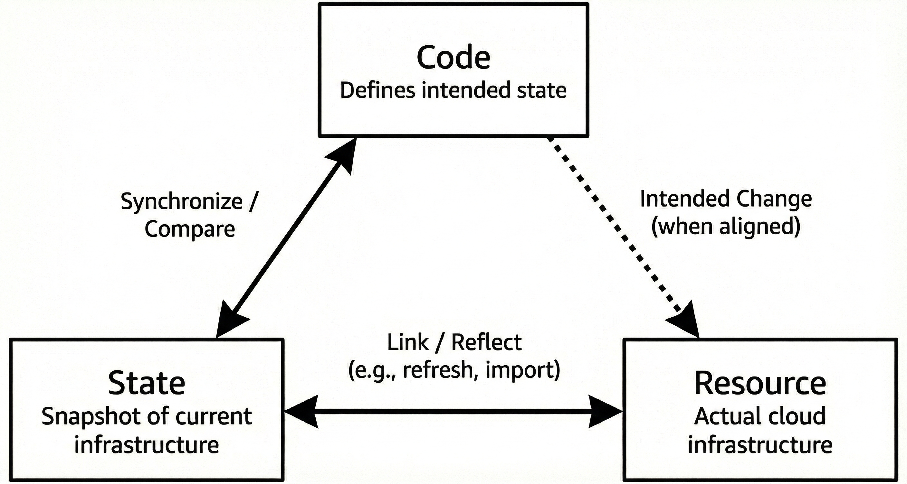
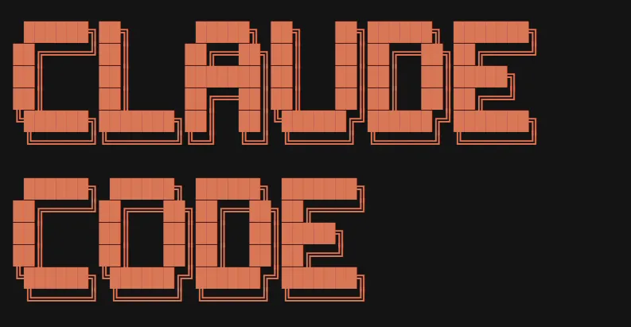
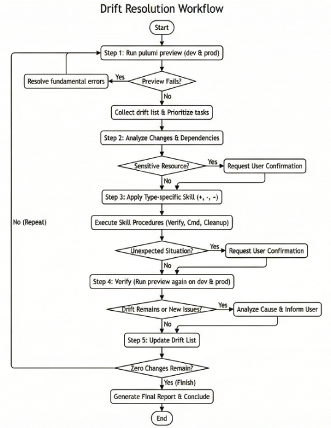
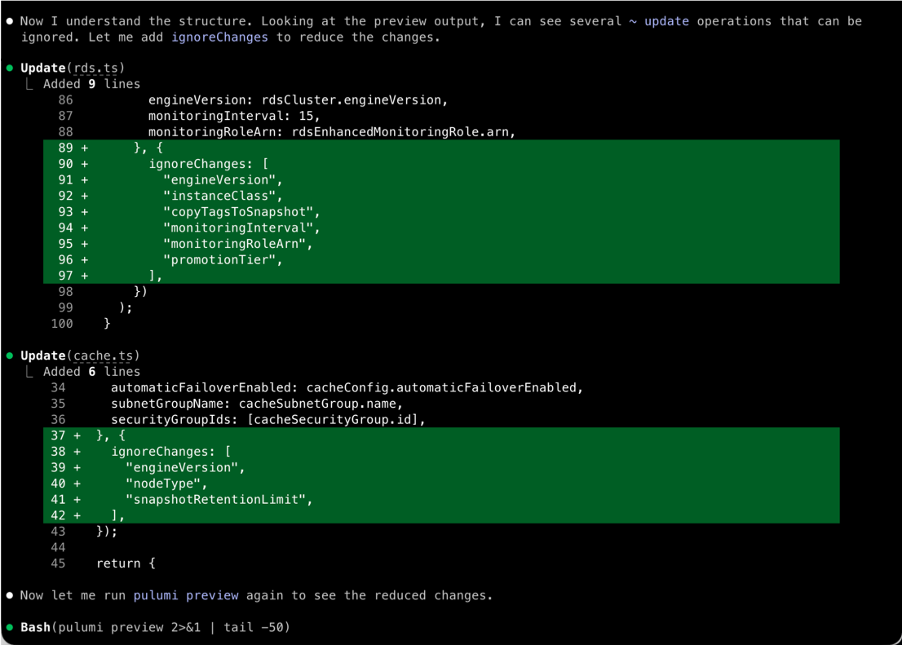
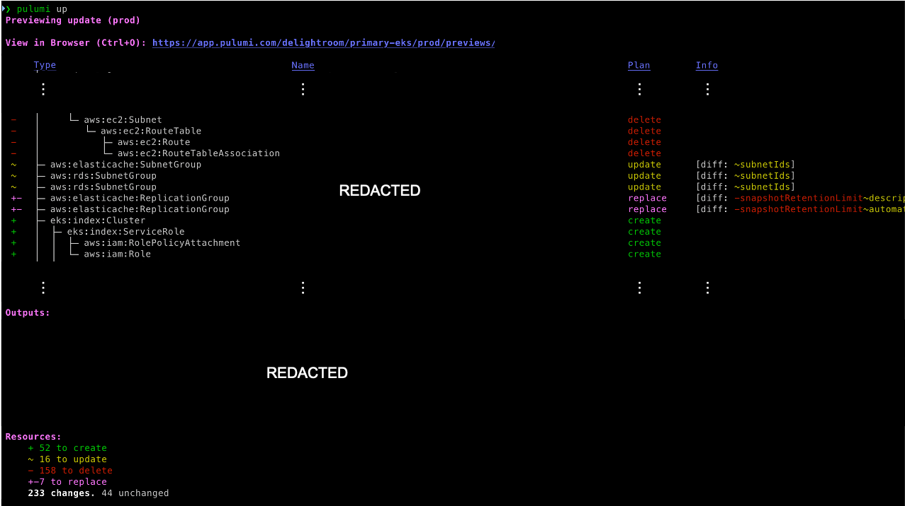
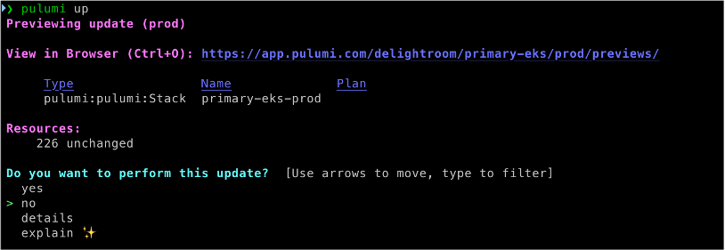
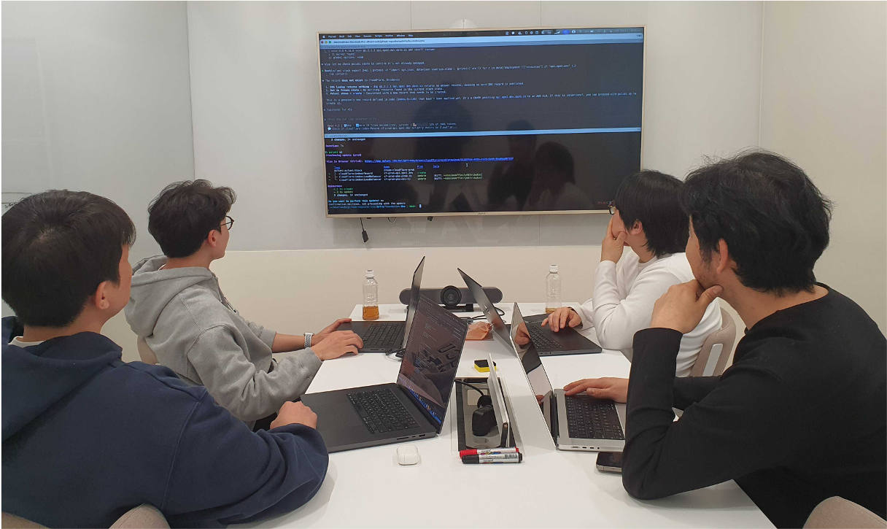

> **원문:** 이 글은 [DelightRoom 기술 블로그](https://medium.com/delightroom/ai%EB%A1%9C-%EC%9A%B0%EB%A6%AC-%ED%9A%8C%EC%82%AC-%EC%9D%B8%ED%94%84%EB%9D%BC-%EC%BD%94%EB%93%9C-%EC%99%84%EB%B2%BD-%EA%B4%80%EB%A6%AC%ED%95%98%EA%B8%B0-c9f5cb7f2ef6)에 게시된 글을 저자의 개인 블로그에 재게시한 것입니다.
저는 딜라이트룸의 파운데이션 그룹에서 SRE로 일하고 있습니다. 파운데이션 그룹은 딜라이트룸의 모든 제품의 인프라, 데이터 파이프라인, 프론트엔드까지 기초가 되는 영역을 책임지는 조직으로, 저희는 인프라를 코드로 관리하기 위해 **Pulumi**를 사용하고 있습니다. Terraform, Ansible 등 다양한 IaC 도구 중 Pulumi를 선택한 이유는 TypeScript, Python 같은 범용 프로그래밍 언어로 인프라를 정의할 수 있기 때문입니다.


제가 맡은 주요 업무 중 하나는 안정적인 인프라 환경을 유지하고 개선하는 일입니다. 이를 위해서는 현재 인프라가 코드로 어떻게 정의되어 있는지 파악하는 것이 중요한데요. 하루는 인프라 코드를 파악하기 위해 `pulumi preview`를 실행했습니다. 이 명령어는 현재 코드와 실제 클라우드 리소스를 비교해서 코드를 적용하면 어떤 변경이 일어날지 미리 보여줍니다. 기대했던 건 업데이트할 것이 없다는 메시지였지만, 화면 속 터미널을 가득 채운 건 수십 개의 변경사항과 경고 메시지였습니다.

```
+ aws:s3:Bucket ........... create
- aws:lambda:Function ..... delete
~ aws:ec2:SecurityGroup ... update
...
```

코드와 AWS 간에 리소스 존재 여부가 다르거나 설정값이 서로 다른 상태, 이른바 '**Drift**'였습니다. Drift란 코드와 실제 리소스 간의 싱크가 맞지 않는 상태를 의미하며 'IaC가 깨졌다'라고 표현하기도 합니다.

이 Drift가 언제부터, 왜 발생했는지 아무도 명확히 알지 못했습니다. 콘솔에서 급하게 수정한 설정, 코드 반영 없이 진행된 변경들이 오랜 시간 쌓여온 결과였습니다.

Drift를 발견한 순간, 두 가지 고민이 생겼습니다.

첫 번째는 **안정성에 대한 우려**였습니다. `pulumi up`은 코드에 정의된 상태를 실제 클라우드에 적용하는 명령어입니다. 이를 섣불리 실행했다가 운영 중인 리소스가 삭제되거나 변경되면 서비스 장애로 이어질 수 있습니다.

두 번째는 **기술 부채에 대한 인식**이었습니다. 이 상태로 두면 인프라 코드는 더 이상 설계도 역할을 하지 못합니다. 코드를 신뢰하지 못하니 AWS 콘솔에서 직접 작업하게 되고, 콘솔 작업은 코드에 기록이 남지 않으니 Drift는 더 커지는 악순환이 계속됩니다.

그렇다고 수작업으로 수십 개의 Drift를 일일이 확인하고, 코드를 수정하고, 다시 검증하는 작업은 몇 주가 걸릴지 가늠조차 어려웠습니다.

고민 끝에 이 문제를 정면으로 해결하기로 했습니다. 단, 아래와 같이 명확한 원칙을 세웠습니다.

1. **운영 환경 보호**: 실제 리소스에는 절대 영향을 주지 않는다.
2. **코드-리소스 동기화**: 코드가 현재 인프라 상태를 정확히 반영하도록 만든다.
3. **`preview` 변경사항 0개 달성**: `pulumi preview` 실행 시 어떤 변경사항도 나오지 않는 상태를 목표로 한다.

그러나 수십 개의 Drift를 하나씩 분석하고, 유형에 맞게 조치하고, 다시 검증하는 반복 작업을 사람이 직접 하기엔 시간과 집중력의 한계가 분명해보였습니다. 이 문제를 효율적으로 해결하기 위해 'AI Agent'를 활용하기로 했고, 여러 선택지 중 코드 작업에 특화된 'Claude Code'를 도입했습니다. 이번 글에서는 도입 과정에서 얻은 작은 깨달음과 개선된 결과를 공유하려 합니다.

## IaC의 핵심 가치: 코드-상태-리소스의 삼위일체

IaC의 본질적인 가치는 단순히 '스크립트로 인프라를 만든다'는 것이 아닙니다. 핵심은 인프라를 코드처럼 다룬다는 약속에 있습니다. 인프라를 코드로 다룬다는 데에 모두가 동의하면 버전 관리를 통해 변경 이력을 추적하고 코드 리뷰를 통해 실수를 방지할 수 있습니다. 또 동일한 코드로 언제든 같은 환경을 재현할 수 있게 되는데, 이것이 IaC가 제공하는 진정한 가치라고 생각합니다.

이 가치가 유지되려면 다음 세 가지 요소가 항상 동기화되어 있어야 합니다.



- **코드(Code)**: 인프라의 의도된 상태를 정의.
- **상태(State)**: Pulumi가 관리하는 현재 인프라의 스냅샷.
- **리소스(Resource)**: 실제 클라우드에 존재하는 인프라.

여기서 중요한 점은 코드가 리소스에 직접 영향을 미칠 수 없다는 것입니다. 위 그림을 보면 코드와 리소스 사이에는 점선 화살표만 존재하는데 이는 코드가 반드시 상태를 거쳐야만 리소스에 반영될 수 있음을 의미합니다.

개발자가 코드로 인프라의 의도된 상태를 정의하면 Pulumi는 먼저 이를 상태 파일과 비교(Synchronize/Compare)하여 어떤 변경이 필요한지 계산합니다. 그리고 상태가 리소스와 연결(Link/Reflect)되어 있기 때문에 비로소 실제 인프라 변경이 가능해집니다.

이러한 구조 때문에 상태는 코드와 리소스 사이의 필수적인 중간 다리 역할을 합니다. 만약 상태가 리소스의 현재 모습을 정확히 반영하지 못한다면 코드를 아무리 잘 작성해도 의도한대로 동작하지 않습니다.

그래서 `pulumi refresh`로 현재 리소스 상태를 상태 파일에 반영하거나 `pulumi import`로 기존 리소스를 상태에 추가하거나 `pulumi state delete`로 상태에서 특정 리소스를 제거하는 작업이 필요한 것입니다.

이 세 요소가 일치할 때 비로소 코드는 '설계도' 역할을 합니다. 코드를 보면 현재 인프라 상태를 파악할 수 있고 코드를 수정하면 의도한 대로 리소스가 변경됩니다. 하지만 Drift가 발생하면 이 균형이 깨집니다. 누군가 콘솔에서 직접 리소스를 수정하면 상태와 리소스가 어긋나고 코드 변경 없이 상태만 조작하면 코드와 상태가 어긋납니다.

이렇게 세 요소 간의 연결이 끊어지면 코드를 봐도 실제 인프라 상태를 알 수 없게 되고, 섣불리 `pulumi up`을 실행하면 의도치 않은 변경이 발생할 수 있습니다. 결국 코드는 더 이상 신뢰할 수 있는 문서로서 기능하지 못합니다.

## 왜 이 문제가 방치되었는가

그렇다면 왜 오래토록 이 문제가 해결되지 않고 방치되었던 것일까요? Drift는 발견하는 순간 해결하면 간단하지만 시간이 지나고 Drift의 양이 많아질수록 상황이 복잡해집니다.

첫째, 무엇보다도 **원인 파악**이 매우 번거롭습니다. AWS 콘솔에서 리소스를 수정하더라도 CloudTrail과 같은 서비스를 활용하면 변경 기록을 추적할 수는 있지만 GitHub에 코드와 커밋으로 남아있는 것처럼 한눈에 히스토리를 파악하기 쉬운 형태가 아니다 보니 매번 확인하는 데 상당한 시간이 소요됩니다. 그리고 변경 의도를 파악하지 못하면 코드를 어떻게 수정해야 할지 판단하기도 어렵습니다.

둘째, **강제 동기화의 리스크**가 큽니다. `pulumi up`으로 현재 코드 상태를 리소스에 강제 적용하면 운영 중인 리소스가 삭제되거나 변경될 수 있는데, 매월 수 천만 명이 사용하는 서비스에서 이런 리스크를 감수할 수는 없습니다.

셋째, **수작업 복구의 부담**이 큽니다. 각 Drift를 분석하고 적절한 조치를 판단한 뒤 코드를 수정하고 검증하는 작업을 수십 개의 리소스에 대해 반복해야 하는데, 일상 업무를 병행하면서 이 작업에 몇 주를 투자하기란 현실적으로 쉽지 않습니다.

저희 팀 역시 Drift가 있더라도 운영 중인 리소스 자체는 정상적으로 동작하고 있다 보니 '굳이 지금 건드려서 문제를 만들지 말자'는 생각이 자연스럽게 퍼졌습니다. 코드와 실제 리소스가 맞지 않는다는 사실은 알고 있지만 서비스는 잘 돌아가고 있으니 위험을 감수하면서까지 손대고 싶지 않았기 때문입니다. 이런 판단이 반복되면서 Drift는 계속 쌓여갔고, 시간이 지날수록 해결해야 할 범위는 점점 더 커져갔습니다.

## 솔루션 설계의 핵심 원칙은 운영 환경 보호

Drift를 해결하는 방법은 크게 두 가지가 있습니다.

1. 코드에 맞춰 리소스를 변경한다: `pulumi up` 실행
2. **리소스에 맞춰 코드를 수정**한다: 코드와 상태를 현재 리소스에 맞게 조정

**'Source of Truth'**란 '여러 데이터가 존재할 때 무엇을 기준으로 삼을 것인가?'를 의미하는데, 저는 두 번째 방법을 택하여 실제 리소스를 그 기준으로 삼았습니다.

현재 운영 중인 리소스는 서비스가 정상적으로 동작하고 있다는 사실 자체가 이미 검증된 상태임을 증명합니다. 반면 오래된 코드가 의도한 상태가 지금도 유효한지는 확신할 수 없습니다. 매월 수 천만 명이 사용하는 서비스에서 운영 환경 보호는 타협할 수 없는 최우선 원칙이기 때문에 이번 프로젝트의 모든 작업은 실제 클라우드 리소스는 변경하지 않고 코드와 Pulumi 상태만 수정한다는 원칙 하에서 진행되었습니다.

## 우리가 AI Agent를 선택하게 된 이유

Drift 복구 작업은 본질적으로 다음과 같은 루프의 반복입니다.

1. `pulumi preview`로 현재 Drift 목록 확인
2. 각 Drift의 유형 분석 (생성/삭제/변경)
3. 유형에 맞는 조치 수행 (`import`, `state delete`, 코드 수정)
4. 다시 `pulumi preview`로 검증
5. 변경사항이 남아있으면 1번으로 돌아가 반복

단순해 보이지만 수십 개의 Drift에 대해 이 작업을 수동으로 수행하면 몇 가지 문제가 발생합니다. 비슷한 작업을 반복하다 보면 `import` 명령어의 리소스 ID를 잘못 입력하거나 코드 수정 시 오타가 생기는 등의 실수가 발생하기 쉽습니다.

그리고 AWS 콘솔에서 실제 리소스 상태를 확인하고 터미널에서 Pulumi 명령어를 실행한 뒤 에디터에서 코드를 수정하는 과정에서 계속 컨텍스트가 전환되면서 작업 효율도 떨어집니다. 또한, 여러 사람이 명확한 기준 없이 같은 유형의 Drift를 각자의 방식으로 처리하면 코드 스타일이 뒤섞이고 나중에 이 코드를 유지보수할 때 일관성 없는 패턴들이 혼란을 야기할 수도 있습니다.

이런 반복적인 '확인 → 분석 → 수정 → 검증' 루프야말로 AI Agent에게 위임하기 적합한 작업이라고 판단했습니다. 다만 AI에게 IaC 작업을 맡길 경우 실제 운영 리소스에 의도치 않은 영향을 줄 수 있다는 리스크는 분명히 존재합니다.

이 리스크를 관리하기 위해 운영 리소스 보호와 같은 핵심 원칙을 규칙으로 명확히 정의하고 정해진 바운더리 안에서만 동작하도록 잘 컨트롤한다면, 피로 없이 일관된 품질로 반복 작업을 수행하는 AI Agent의 강점을 안전하게 활용할 수 있을 것으로 판단했습니다.

## Agent의 효용을 극대화하면서도 안전을 확보할 수 있는 Claude Code



저희 팀은 이 작업을 위해 여러 AI 도구 중 '**Claude Code**'를 선택했는데, 그 이유는 아래와 같습니다.

우선 Claude Code는 코드 작업에 특화되어 있습니다. Claude 모델 자체가 코드 이해와 생성에 강점을 가지고 있고, Claude Code는 이를 기반으로 파일 시스템 탐색, 코드 수정, 터미널 명령어 실행까지 하나의 흐름으로 처리할 수 있습니다. 인프라 코드를 읽고 수정하고 명령어를 실행하는 것이 핵심인 이번 작업에 적합하다고 생각했습니다.

또한, Claude Code는 터미널 기반 UI를 제공합니다. 별도의 웹 인터페이스로 전환할 필요 없이 평소 코드 작업을 하던 터미널 환경에서 그대로 사용할 수 있어서 자연스럽게 기존 작업 방식에 녹아들 수 있었습니다.

무엇보다 Claude Code는 Rules, Skills, Agents 기능을 통해 워크플로우를 커스터마이징할 수 있습니다. 이 기능 덕분에 '`pulumi up` 실행 금지'처럼 운영 리소스를 보호하기 위한 규칙을 명시적으로 정의할 수 있고, 자주 사용하는 명령어와 절차를 템플릿화하여 반복 작업을 효율적으로 처리할 수 있습니다. Agent의 효용을 극대화하면서도 안전을 확보할 수 있는 구조가 이번 프로젝트에 결정적인 선택 요인이었습니다.

## AI Agent로 Drift 복구 작업을 구현하는 과정

저희가 Claude Code의 Rules, Skills, Agents를 통해 구성한 최종적인 디렉토리 구조는 다음과 같습니다.

```
.claude/
├── agents/
│   └── drift-resolver.md
├── rules/
│   ├── pulumi-safety.md
│   ├── code-conventions.md
│   └── drift-resolution.md
└── skills/
    ├── drift-status/SKILL.md
    ├── drift-import/SKILL.md
    ├── drift-remove/SKILL.md
    └── drift-fix/SKILL.md
```

이제 실제로 위 기능들을 어떻게 구성하고 활용했는지, 사용한 코드 일부를 발췌하여 구체적으로 살펴보겠습니다.

### Rules: 안전장치 정의

Rules는 Agent가 반드시 따라야 하는 규칙을 정의하는 곳입니다. 이번 프로젝트에서 가장 중요한 원칙인 '운영 리소스 보호'를 Rules로 명시하여 Agent가 반드시 따르도록 했습니다.

각 Rule 파일에는 `paths` frontmatter를 설정하여 해당 규칙이 적용될 디렉토리를 지정했습니다. 이렇게 하면 Agent가 관련 경로의 파일을 작업할 때만 해당 규칙이 로드되어 컨텍스트를 효율적으로 사용할 수 있습니다.

```yaml
---
paths:
  - "clusters/*/pulumi/**"
  - "external-services/*/pulumi/**"
  - "modules/**"
---
```

이 프로젝트에서는 세 가지 규칙 파일을 만들어 사용했습니다. 안전한 명령어 사용을 강제하는 `pulumi-safety.md`, Drift 유형별 대응 방법을 정의한 `drift-resolution.md`, 코드 스타일을 일관되게 유지하기 위한 `code-conventions.md`입니다.

#### pulumi-safety.md

가장 핵심적인 안전 규칙으로 세 가지 원칙을 명시했습니다.

첫 번째는 `pulumi up` 실행 금지입니다. `pulumi up`은 코드 상태를 실제 클라우드에 적용하는 명령어이기 때문에 이번 프로젝트에서는 사용을 금지하고 `pulumi preview`로만 검증하도록 제한했습니다.

두 번째는 실제 리소스를 Source of Truth로 삼는다는 원칙입니다. 코드에 맞춰 리소스를 변경하는 것이 아니라 현재 운영 중인 리소스 상태에 맞춰 코드를 수정하도록 명시했습니다. 앞서 여러 번 강조했듯이 이미 안정적으로 동작하고 있는 운영 환경을 건드리지 않기 위한 조치입니다.

세 번째는 스택 간 격리입니다. 개발 환경과 운영 환경은 서로 영향을 주어서는 안 된다는 원칙 하에 코드 변경 후에는 반드시 양쪽 스택에서 `preview`를 실행하여 한쪽의 수정이 다른 쪽에 의도치 않은 영향을 주지 않는지 확인하도록 했습니다.

```markdown
# Pulumi Safety Rules

## Core Principles

1. **Never run `pulumi up`** - Only `pulumi preview` is allowed
2. **Actual resources are Source of Truth** - Modify code to match resources, not vice versa
3. **Bidirectional stack isolation** - Dev and Prod must never affect each other

| Command | Allowed | Notes |
|---------|---------|-------|
| `pulumi preview` | Yes | Always safe |
| `pulumi import` | Yes | No infrastructure impact |
| `pulumi state delete` | Caution | Verify resource deleted in AWS first |
| `pulumi up` | No | Requires explicit user confirmation |
| `pulumi destroy` | No | Forbidden |
```

#### drift-resolution.md

다음으로는 Drift 유형별로 어떻게 대응해야 하는지 명확한 기준을 정의했습니다. Agent가 Drift를 발견했을 때 스스로 판단하여 임의로 처리하지 않고 정해진 전략에 따라 일관되게 처리하도록 가이드라인을 제공합니다.

`preview` 결과에서 `+` 기호가 나타나면 코드에는 리소스가 정의되어 있지만, AWS에는 존재하지 않는 상태입니다. 이 경우 AWS에 해당 리소스가 실제로 있는지 먼저 확인하고, 있다면 `pulumi import`로 상태를 동기화합니다.

`-` 기호가 나타나면 AWS에는 리소스가 있지만 코드에는 없는 상태입니다. 이 경우 해당 리소스가 AWS에서 실제로 삭제되었는지 확인하고, 삭제되었다면 `pulumi state delete`로 상태에서 제거합니다.

`~` 기호가 나타나면 코드와 AWS의 설정값이 서로 다른 상태입니다. 이 경우 AWS의 현재 값이 올바른 값이라고 간주하고 코드를 AWS에 맞게 수정합니다.

```markdown
# Drift Resolution Rules

## Drift Types and Resolution

| Symbol | Type | Resolution |
|--------|------|------------|
| `+` create | Code exists, AWS doesn't | `pulumi import` or remove code |
| `-` delete | AWS exists, code doesn't | `pulumi state delete` or add code |
| `~` update | Values differ | Modify code to match AWS |

## Verification Checklist

- `+ create`: Does resource exist in AWS? If yes, import it
- `- delete`: Is resource deleted from AWS? If yes, remove from state
- `~ update`: Is AWS value correct? If yes, update code to match
```

#### code-conventions.md

마지막으로 코드 컨벤션 규칙을 정의하여 Agent가 생성하거나 수정하는 코드가 기존 코드베이스와 일관성을 유지하도록 했습니다. 스택별 설정값은 코드에 직접 하드코딩하지 않고 환경별 설정 파일을 사용하도록 명시했습니다. 변수명은 `camelCase`, 상수는 `UPPER_SNAKE_CASE`를 따르도록 했고, 리소스 이름 생성 시에는 프로젝트에서 공통으로 사용하는 헬퍼 함수를 활용하도록 가이드했습니다.

```typescript
// Stack Configuration
// Use environment-specific config files instead of hardcoding:

// Correct
const config = new pulumi.Config();
const instanceType = config.get("instanceType") || "t3.medium";

// Wrong
const instanceType = pulumi.getStack() === "prod" ? "t3.large" : "t3.medium";
```

```markdown
## Naming

- Use `autoname`, `pfname` from `modules/helper.ts`
- Variables: camelCase
- Constants: UPPER_SNAKE_CASE
```

모든 Rules에 걸쳐 공통적으로 적용한 원칙이 하나 더 있습니다. 모호한 상황이나 추가 확인이 필요한 경우 Agent가 임의로 판단하여 진행하지 않고 반드시 사용자에게 확인을 받도록 했습니다.

Claude Code의 `AskUserQuestion` Tool을 활용하여 보안 그룹이나 IAM 같은 민감한 보안 설정을 변경할 때는 Agent가 작업을 멈추고 사용자의 판단을 구하도록 했습니다. 또한, 해결 방식이 여러 가지거나 AWS 상태가 예상과 다른 경우에도 사용자의 확인 절차를 거쳐 안전성을 확보했습니다.

### Skills: 반복 작업 템플릿화

Skills는 자주 사용하는 워크플로우를 템플릿으로 정의하여 Agent가 일관된 방식으로 작업을 수행하도록 돕습니다. Skills를 잘 이용하면 복잡한 작업도 정해진 절차에 따라 단계별로 진행하도록 가이드할 수 있습니다.

이 프로젝트에서는 Drift 유형별로 네 가지 Skill을 만들어 사용했습니다. 현재 상태를 분석하는 `drift-status`, 리소스를 임포트하는 `drift-import`, 상태에서 리소스를 제거하는 `drift-remove`, 코드를 수정하는 `drift-fix`입니다.

#### drift-status

모든 작업의 시작점이 되는 Skill입니다. 개발 환경과 운영 환경 양쪽 스택에서 `pulumi preview`를 실행하고 그 결과를 분석하여 현재 Drift 현황을 요약 리포트로 정리합니다.

리포트에는 각 스택별로 Drift 유형(`+ create`, `- delete`, `~ update`)과 해당하는 리소스 목록이 정리됩니다. 또한, 각 유형별로 어떤 Skill을 적용해야 하는지 권장 사항도 함께 제시합니다. Agent는 이 리포트를 기반으로 어떤 Drift부터 처리할지 우선순위를 정하고 작업 계획을 수립합니다.

만약 `preview` 실행 중 TypeScript 컴파일 에러가 발생하면 Drift 해결 전에 먼저 코드 오류를 수정해야 한다고 안내합니다.

```markdown
## Output Format

## Drift Status Report

### Dev Stack

| Type | Count | Resources |
|------|-------|-----------|
| + create | N | resource1, resource2 |
| - delete | N | resource3 |
| ~ update | N | resource4 |

### Recommended Actions

+ create → drift-import skill
- delete → drift-remove skill
~ update → drift-fix skill
```

#### drift-import

`+ create` Drift를 해결하는 Skill입니다. 코드에는 리소스가 정의되어 있지만, Pulumi 상태에는 없을 때 AWS에 실제로 존재하는 리소스를 Pulumi 상태로 가져오는 워크플로우입니다.

먼저 AWS CLI를 사용하여 해당 리소스가 실제로 AWS에 존재하는지 확인합니다. S3 버킷이라면 `aws s3 api head-bucket`, EC2 인스턴스라면 `aws ec2 describe-instances`, Lambda 함수라면 `aws lambda get-function` 등 리소스 유형에 맞는 명령어를 사용합니다.

리소스 존재가 확인되면 `pulumi import` 명령을 실행합니다. 이때 리소스 유형과 ID 형식이 리소스마다 다르기 때문에 Skill에는 자주 사용하는 리소스 유형별 `import` 명령어 예시가 포함되어 있습니다. 예를 들어, S3 버킷은 버킷 이름을 ID로 사용하고 EC2 인스턴스는 `i-xxxxxxxxx` 형식의 인스턴스 ID를 사용합니다.

`import`가 완료되면 자동 생성된 코드를 기존 코드베이스에 통합하고 마지막으로 양쪽 스택에서 `preview`를 실행하여 정상적으로 동기화되었는지 검증합니다. `import` 후에도 `preview`에서 변경사항이 나타나면 `drift-fix` Skill을 사용하여 코드를 추가로 조정합니다.

```markdown
## Common Resource Types

| Resource | Pulumi Type | ID Format |
|----------|-------------|-----------|
| S3 Bucket | `aws:s3/bucket:Bucket` | bucket-name |
| EC2 Instance | `aws:ec2/instance:Instance` | i-xxxxxxxxx |
| Security Group | `aws:ec2/securityGroup:SecurityGroup` | sg-xxxxxxxx |
| IAM Role | `aws:iam/role:Role` | role-name |
| Lambda | `aws:lambda/function:Function` | function-name |
```

#### drift-remove

`- delete` Drift를 해결하는 Skill입니다. AWS에서 이미 삭제된 리소스를 Pulumi 상태 정보에서도 제외하여 실제 환경과 상태를 동기화하는 워크플로우입니다.

가장 중요한 것은 리소스가 AWS에서 실제로 삭제되었는지 반드시 먼저 확인하는 것입니다. 확인 없이 상태에서 제거하면 실제로 존재하는 리소스와의 연결이 끊어져 더 큰 문제가 발생할 수 있습니다. AWS CLI로 조회했을 때 404 응답이나 'not found' 에러가 반환되어야 삭제된 것으로 간주합니다.

리소스가 삭제되었음이 확인되면 먼저 `pulumi stack --show-urns` 명령으로 해당 리소스의 URN을 찾습니다. URN은 `urn:pulumi:<스택>::<프로젝트>::<타입>::<이름>` 형식으로 되어 있습니다. 그 다음 `pulumi state delete "<URN>"` 명령으로 상태에서 제거합니다.

상태에서 제거한 후에는 해당 리소스를 정의하고 있던 코드도 함께 삭제하고 양쪽 스택에서 `preview`를 실행하여 정리가 완료되었는지 확인합니다.

```markdown
## Workflow

1. Find URN: `pulumi stack --show-urns | grep "resource-name"`
2. Verify resource is deleted in AWS (CLI should return not found)
3. Remove from state: `pulumi state delete "<urn>"`
4. Remove corresponding code
5. Verify with `pulumi preview` on both stacks
```

#### drift-fix

`~ update` Drift를 해결하는 Skill입니다. 코드와 AWS의 설정값이 서로 다를 때 코드를 AWS의 현재 상태에 맞게 수정하는 워크플로우입니다.

먼저 `pulumi preview --diff` 명령으로 정확히 어떤 속성이 다른지 확인합니다. 그 다음 AWS CLI로 해당 리소스의 실제 설정값을 조회하여 코드에 어떤 값을 반영해야 하는지 파악합니다.

자주 발생하는 Drift 패턴들이 있습니다. 태그가 누락된 경우에는 AWS에 설정된 태그를 코드에 추가하고 타임아웃이나 메모리 설정 같은 값이 다른 경우에는 AWS의 현재 값으로 코드를 업데이트합니다.

오토스케일러처럼 외부 시스템이 관리하는 필드는 코드를 수정해도 계속 Drift가 발생할 수 있습니다. 이런 경우에는 `ignoreChanges` 옵션을 사용하여 해당 필드의 변경을 무시하도록 설정합니다. 단, 이 옵션은 반드시 외부에서 관리되는 필드에만 사용하고 사용 이유를 주석으로 명시하도록 하였습니다.

코드 수정 후에는 양쪽 스택에서 `preview`를 실행하여 Drift가 해결되었는지, 다른 리소스에 영향을 주지 않았는지 확인합니다.

```markdown
## Decision Guide

| Scenario | Action |
|----------|--------|
| AWS value is intentional | Update code to match |
| Externally managed field | Use ignoreChanges with comment |
| Unclear which is correct | Escalate to user |
```

모든 Skill의 마지막 단계는 동일합니다. 변경 후 반드시 개발 환경과 운영 환경 양쪽 스택에서 `preview`를 실행하여 의도치 않은 사이드 이펙트가 없는지 검증합니다.

### Agents: 작업 분리와 컨텍스트 관리

Agents는 특정 목적을 가진 자율적인 작업 단위를 정의하는 기능입니다. 복잡한 작업을 수행할 때 어떤 도구와 Skill을 사용할지, 어떤 순서로 진행할지, 언제 사용자에게 확인을 받을지 등을 미리 설정해둘 수 있습니다.

Drift가 수십 개에 달하다 보니 단일 세션에서 모든 작업을 처리하기에는 컨텍스트 한계가 있었습니다. 대화가 길어질수록 Agent가 앞서 수행한 작업의 맥락을 놓치거나 일관성이 떨어지는 경우가 발생했습니다. 이를 해결하기 위해 Drift 해결 전용 Agent를 구성하고 작업 단위를 나누어 처리하는 구조를 설계했습니다.

#### drift-resolver.md

이 Agent의 목표는 명확하고 단순합니다. `pulumi preview` 실행 결과가 0개의 변경사항을 보여줄 때까지 Drift를 분석하고 해결하는 것입니다. Agent 설정에는 사용할 수 있는 도구들(Bash, Grep, Read, Edit, Write 등)과 앞서 정의한 네 가지 Skill(`drift-status`, `drift-import`, `drift-remove`, `drift-fix`)을 명시했습니다.

Agent의 작업 흐름은 다음과 같이 정의했습니다. 먼저 `drift-status` Skill로 현재 Drift 목록을 파악합니다. 그 다음 처리해야 할 Drift들을 todo 리스트로 만들어 추적합니다. 각 Drift에 대해 유형에 맞는 Skill을 적용하고(`+ create`는 `drift-import`, `- delete`는 `drift-remove`, `~ update`는 `drift-fix`) 매번 수정 후에는 양쪽 스택에서 검증합니다. 변경사항이 0개가 될 때까지 이 과정을 반복하고 완료되면 최종 리포트를 생성합니다.

```markdown
## Workflow

1. drift-status skill → Get current drift list
2. Create todo list for tracking
3. For each drift:
   + create → drift-import skill
   - delete → drift-remove skill
   ~ update → drift-fix skill
4. Verify both stacks after each fix
5. Repeat until 0 changes
6. Generate final report
```

Agent가 스스로 판단하지 않고 사용자에게 확인을 요청해야 하는 상황도 명시했습니다. 보안 그룹이나 IAM 정책 같은 민감한 리소스의 변경이 감지되었을 때, 혹은 여러 해결 방법 중 선택이 필요하여 의사결정이 따르는 상황에서는 작업을 중단하고 사용자의 판단을 먼저 요청합니다. 또한, 실제 AWS 상태가 예상과 다르거나 운영 환경 스택에서 예기치 못한 변동이 나타날 때도 동일합니다.

```markdown
## Escalation Triggers

Stop and ask user when:

- Security group or IAM changes detected
- Multiple valid approaches exist
- AWS state doesn't match expectations
- Prod stack shows unexpected changes
```

작업 종료 조건도 세 가지로 구분했습니다. 양쪽 스택 모두 변경사항이 0개가 되면 `SUCCESS`로 완료됩니다. 일부 Drift는 해결했지만 나머지는 사용자 결정이 필요한 경우 `PARTIAL` 상태로 종료하고 어떤 항목이 남았는지 보고합니다. 사용자 입력 없이는 더 이상 진행할 수 없는 경우 `BLOCKED` 상태로 종료하고 무엇이 필요한지 안내합니다.

```markdown
## Termination

| Status | Condition |
|--------|-----------|
| SUCCESS | Both stacks show 0 changes |
| PARTIAL | Some drifts resolved, others need user decision |
| BLOCKED | Cannot proceed without user input |
```

같은 디렉토리 내에 여러 Drift가 존재할 때는 이를 Subagent들이 나누어 처리하도록 구성했습니다. 예를 들어, 한 디렉토리 내에서 Subagent 1이 `+ create` 유형의 Drift를, Subagent 2가 `~ update` 유형의 Drift를 담당하는 식입니다.

다만 동시에 같은 코드를 수정하면 충돌이 발생할 수 있기 때문에 Subagent들은 순차적으로 실행되도록 강제했습니다. 한 Subagent의 작업이 완전히 끝나고 검증까지 마친 후에야 다음 Subagent가 작업을 시작합니다.

메인 Agent는 이 전체 과정을 관장하며 Subagent 간 조율을 담당합니다. 각 Subagent가 독립적으로 작업하더라도 서로 영향을 줄 수 있기 때문입니다. 예를 들어, Subagent 1이 A라는 Drift를 해결한 후 Subagent 2가 B라는 Drift를 해결하는 과정에서 이미 해결되었던 A가 다시 발생할 수 있습니다. 메인 Agent는 각 Subagent 작업 완료 후 전체 상태를 다시 점검하고, 새로운 Drift가 발생했거나 이전에 해결한 Drift가 다시 나타난 경우 이를 감지하여 추가 작업을 지시합니다.

## Claude Code로 완성한 실제 작업 루프

위에서 정의한 Rules, Skills, Agents를 기반으로 실제 작업은 다음과 같은 루프로 진행됩니다.



### 1단계: `pulumi preview` 실행

`drift-status` Skill을 사용하여 개발 환경과 운영 환경 양쪽 스택의 현재 상태를 확인합니다. 이 단계에서 전체 Drift 목록이 수집되고 각각이 `+ create`, `- delete`, `~ update` 중 어떤 유형에 해당하는지 분류됩니다.

다만 `preview` 실행 자체가 실패하는 경우도 있습니다. TypeScript 컴파일 에러, 환경 변수 미설정, 모듈 의존성 문제 등 다양한 원인이 있을 수 있는데, 이런 에러들이 발생하면 Drift 분류 자체가 불가능합니다. 따라서 Agent는 이런 기본적인 에러들을 먼저 해결하여 `preview`가 정상적으로 실행되는 상태를 만든 다음에 본격적인 Drift 해결 작업을 시작합니다.

`preview`가 정상 실행되면 Agent는 수집된 정보를 바탕으로 처리해야 할 작업 목록을 생성하고 우선순위를 정합니다. 일반적으로 의존성이 없는 독립적인 리소스부터 처리하고 다른 리소스를 참조하는 복잡한 리소스는 나중에 처리하는 순서로 진행합니다.

### 2단계: 변경사항 분석

Agent가 각 Drift의 상세 내용을 분석합니다. 단순히 유형을 분류하는 것을 넘어서 해당 리소스가 어떤 역할을 하는지, 다른 리소스와 어떤 의존 관계를 가지는지, 코드와 실제 AWS 상태 사이에 어떤 값이 다른지를 파악합니다. 이 분석 결과에 따라 어떤 Skill을 적용할지, 추가로 확인해야 할 사항이 있는지를 결정합니다. 영향력이 큰 민감한 리소스의 경우 이 단계에서 사용자에게 확인을 요청합니다.

### 3단계: 유형별 조치

분류된 유형에 따라 앞서 정의한 Skill을 적용합니다. `+ create` Drift는 `drift-import` Skill로 AWS에 존재하는 리소스를 Pulumi 상태로 가져오고, `- delete` Drift는 `drift-remove` Skill로 이미 삭제된 리소스를 상태에서 제거하며, `~ update` Drift는 `drift-fix` Skill로 코드를 AWS 상태에 맞게 수정합니다.

각 Skill은 단순히 명령어 하나를 실행하는 것이 아니라 AWS CLI로 실제 상태를 확인하고 적절한 Pulumi 명령을 실행한 뒤 코드를 정리하는 일련의 절차를 포함합니다. Agent는 이 절차를 따라가며 각 Drift를 처리하고 중간에 예상과 다른 상황이 발생하면 사용자에게 확인을 요청합니다.

### 4단계: 검증

조치 후 다시 `pulumi preview`를 실행하여 해당 Drift가 해결되었는지 확인합니다. 이때 반드시 개발 환경과 운영 환경 양쪽 스택을 모두 검증합니다. 한쪽 스택에서만 `preview`를 실행하고 넘어가면 공유 모듈 수정 시 다른 스택에 의도치 않은 영향을 줄 수 있기 때문입니다. 양쪽 스택 모두에서 해당 Drift가 사라졌고 새로운 Drift가 발생하지 않았음을 확인해야 해당 작업이 완료된 것으로 간주합니다. 만약 한쪽 스택에서 예상치 못한 변경이 감지되면 Agent는 그 원인을 분석하여 사용자에게 제공합니다.

### 5단계: 반복

변경사항이 0개가 될 때까지 1~4단계를 반복합니다. 각 반복 사이클에서 Agent는 남은 Drift 목록을 갱신하고 이전 작업으로 인해 새롭게 발생한 Drift가 있는지 확인합니다. 모든 Drift가 해결되어 개발 환경과 운영 환경 양쪽 스택에서 `pulumi preview` 결과가 업데이트할 것이 없다고 나오면 최종 리포트를 생성하고 작업을 종료합니다.

## 완벽한 에이전트는 없다: 실제 작업 후 겪은 성장통

처음부터 모든 것이 순조롭게 진행된 것은 아니었습니다. 실제로 Agent에게 작업을 맡기고 결과를 검토하는 과정에서 예상치 못한 문제들이 발생했고, 이를 해결하기 위해 Rules를 지속적으로 보완하고 작업 방식을 조정해 나갔습니다.

가장 빈번하게 발생한 문제는 **스택 간 간섭**이었습니다. 처음에는 개발 환경 스택의 Drift를 먼저 해결하고 이어서 운영 환경 스택을 처리하도록 지시했는데, 운영 환경 스택 작업을 마치고 나면 이미 해결했던 개발 환경 스택에서 다시 Drift가 발생하는 상황이 반복되었습니다. 공유 모듈의 코드를 수정하면 양쪽 스택에 동시에 영향을 주기 때문이었습니다.

이 문제를 해결하기 위해 `pulumi-safety.md`에 '코드 변경 후 반드시 양쪽 스택에서 `preview`를 실행하고 스택 간 간섭이 감지되면 즉시 중단하고 수정한다'는 규칙을 추가했습니다. 이후 Agent는 한쪽 스택만 확인하고 넘어가는 실수 없이 양쪽을 동시에 검증하게 되었습니다.

Agent가 복잡한 Drift를 해결하는 과정에서 예상치 못한 행동 패턴이 나타나기도 했습니다. 처음에는 정상적으로 코드를 수정하며 Drift를 해결하던 Agent가 어느 순간부터 **`ignoreChanges`를 무분별하게 추가**하기 시작했습니다. `ignoreChanges`는 특정 속성의 변경을 Pulumi가 무시하도록 하는 옵션인데, 이를 사용하면 `preview`에서 Drift가 사라지긴 하지만 실제로 문제를 해결한 것이 아니라 눈에 보이지 않게 숨긴 것에 불과합니다.



이를 방지하기 위해 `code-conventions.md`에 `ignoreChanges`는 오직 외부에서 관리되는 필드(예: 오토스케일러가 관리하는 `desiredCapacity`)에만 사용하고 반드시 사용 이유를 주석으로 문서화하도록 명시했습니다. '아직 해결되지 않은 Drift를 숨기기 위해 `ignoreChanges`를 사용해서는 안 된다'는 문구를 명확히 추가한 이후 Agent는 더 이상 이런 편법을 시도하지 않게 되었습니다.

**모듈 의존성 문제**도 까다로운 도전 중 하나였습니다. 오랜 기간 방치된 코드베이스다 보니 설치된 Pulumi 모듈들이 상당히 오래된 버전이었고 Drift를 해결하는 과정에서 최신 버전으로 업데이트가 필요한 상황이 발생했습니다. 그런데 한 모듈을 업데이트하면 다른 모듈과의 의존성 충돌이 발생하는 경우가 있었고 이를 해결하기 위해 연쇄적으로 여러 모듈을 함께 업데이트해야 하는 상황이 생겼습니다.

더 복잡한 경우도 있었는데, 기존 코드에서 사용하던 모듈이 AWS의 최신 기능을 아직 지원하지 않는 경우였습니다. 그 사이에 AWS 기능이 업데이트되면서 실제 리소스에서는 이미 신규 기능을 사용하고 있었기 때문에 해당 모듈 자체를 다른 것으로 교체하고 코드를 새로 작성하도록 Agent에게 지시해야 했습니다. 이런 상황에서는 Agent가 스스로 판단하기보다 사용자에게 어떤 방향으로 진행할지 확인을 받도록 하는 것이 중요했습니다.

## 8주의 숙제를 며칠 만에: 압도적인 생산성 혁신

프로젝트를 시작하기 전 인프라 저장소에서 `pulumi preview`를 실행하면 수십 개의 변경사항이 쏟아졌습니다. `+ create`, `- delete`, `~ update`가 뒤섞인 결과를 보면서 어디서부터 손을 대야 할지 막막했던 기억이 납니다.



Claude Code와 함께 작업을 진행한 후 모든 스택에서 업데이트할 것이 없다는 메시지를 확인할 수 있었습니다. 아래는 그중 하나의 스택에서 개발 환경과 운영 환경 양쪽 모두 코드와 실제 리소스가 완벽하게 동기화된 모습입니다.



위 Before-After는 대표적인 스택 하나의 화면입니다. 실제로는 이러한 과정을 여러 스택에 걸쳐 반복 수행했습니다.

시간적인 측면에서도 효과가 컸습니다. 수십 개의 Drift를 수작업으로 해결하려면 각 리소스의 상태를 확인하고 적절한 조치를 판단하고 코드를 수정하고 검증하는 과정을 반복해야 합니다. 보수적으로 잡아도 리소스당 평균 20-30분이 소요되고 전체적으로 6-8주는 걸렸을 작업입니다. Agent를 활용하면서 이 시간을 며칠 수준으로 단축할 수 있었습니다.

하지만 단순히 시간을 단축한 것보다 더 큰 의의는 따로 있습니다. 정확히 언제부터 Drift가 발생하기 시작했는지는 알 수 없지만 최소 몇 달 이상 방치되어 있던 문제를 해결했다는 점, 그리고 앞으로는 Drift가 발생하지 않도록 하는 컨벤션을 수립하고 설령 발생하더라도 빠르게 해결할 수 있는 시스템을 구축했다는 점입니다.

## 팀 내 새로운 IaC 컨벤션으로 정착

이번 프로젝트에서 만든 Rules와 Skills는 개인 작업에서 끝나지 않고 팀 공용 자산으로 문서화했습니다. `.claude` 디렉토리에 정리된 설정 파일들은 이제 인프라 저장소의 일부로 관리되며 팀원 누구나 동일한 규칙과 워크플로우를 활용할 수 있습니다.



새로운 리소스를 생성하거나 삭제할 때 AI Agent를 어떻게 활용하면 좋은지에 대한 가이드도 정리했습니다. 사내에서 이번 경험을 공유하는 세미나를 진행했고 저장소에 README로 간단한 사용법을 문서화하여 앞으로 인프라를 다루는 모든 팀원들이 정해진 컨벤션에 따라 AI Agent를 활용할 수 있도록 했습니다. 이를 통해 개인마다 다른 스타일로 코드를 작성하던 문제가 줄어들고 깔끔하고 유지보수성 높은 코드를 일관되게 생성할 수 있게 되었습니다.

파운데이션 그룹 팀원의 반응도 긍정적이었습니다.

> _"앞으로 걱정 없이 인프라를 코드로 다시 관리할 수 있게 되어서 너무 좋습니다. 콘솔은 확인 목적으로만 쓰고 코드로 모든 인프라를 관리하다 보니 유사시에 설정을 되돌리거나 백업을 만드는 것도 훨씬 간편해졌어요. 원래 같으면 많은 시간이 걸리고 엄두가 안 났을 일인데 시간과 노력을 정말 많이 아꼈습니다."_

## 개발자에서 디렉터로: AI 시대에 일을 대하는 법

이번 프로젝트를 진행하면서 몇 가지 교훈을 얻었습니다.

**IaC Drift는 빠르게 해결할수록 비용이 적습니다.** Drift가 발생한 직후에는 원인도 명확하고 영향 범위도 작아서 비교적 해결이 간단합니다. 하지만 시간이 지나면 원인 파악이 어려워지고 다른 변경사항과 얽히면서 복잡도가 기하급수적으로 증가합니다. 작은 Drift라도 발견 즉시 해결하는 습관이 중요합니다.

**AI Agent가 모든 것을 대신해 주지는 않습니다.** Agent는 정해진 규칙 안에서 반복 작업을 수행하는 데 탁월하지만 어떤 규칙을 정할지, 예외 상황에서 어떻게 판단할지는 여전히 사람의 몫입니다. 중요한 것은 Agent에게 모든 것을 맡기는 것이 아니라 어떻게 함께 일할 것인지를 설계하는 것입니다.

**명확한 Rules와 Skills가 Agent의 성능과 안정성을 결정합니다.** 처음에는 간단한 지시만으로 시작했지만 스택 간 간섭 문제나 `ignoreChanges` 남발 같은 예상치 못한 상황들을 겪으면서 Rules를 계속 보완해 나갔습니다. Agent가 잘 동작하는 것처럼 보여도 명확한 가드레일 없이는 언제든 의도치 않은 방향으로 흘러갈 수 있다는 것을 느꼈습니다.

그리고 마지막으로 **개발자의 역할이 변화하고 있다는 것을 느꼈습니다.** 이전에는 반복적일지라도 코드를 직접 작성하는 것이 개발자의 주된 작업이었다면 이제는 AI가 작성한 코드를 검토하고 방향을 설정하는 디렉터의 역할을 하게 되었습니다. 코드를 직접 타이핑하는 시간이 줄었고 전체적인 설계와 품질 관리에 더 집중할 수 있게 되었습니다.

앞으로 AI 도구가 더 발전할수록 무엇을 만들지 정의하고 AI의 결과물을 평가하고 올바른 방향으로 이끄는 능력이 더욱 중요해질 것이라고 생각합니다. 이번 프로젝트는 단순히 Drift를 해결한 경험을 넘어서 앞으로 일을 대하는 방식 자체를 다시 생각하게 해준 계기가 되었습니다.

## 관리를 넘어 확장으로: AI Agent와 함께 그리는 인프라 운영

이번 프로젝트로 기존 Drift를 해결했지만 앞으로 새로운 Drift가 발생하지 않으리라는 보장은 없습니다. 이를 방지하기 위해 CI/CD 파이프라인에 Drift 감지 자동화를 추가할 계획입니다.

또한, 특정 디렉토리에 코드가 푸시되거나 인프라 관련 PR이 병합되는 등의 이벤트가 발생했을 때 자동으로 `pulumi preview`를 실행하여 Drift 여부를 확인하는 프로세스를 구축할 예정입니다.

이와 함께 주기적으로 `preview`를 실행하는 플로우도 필요할 것입니다. 코드 변경 없이 누군가가 급하게 콘솔에서 리소스를 수정하고 코드 반영을 미처 하지 못하는 경우도 있을 수 있기 때문입니다.

이밖에도 이벤트 기반과 주기적 실행을 병행하여 Drift가 쌓이기 전에 조기에 발견하고 대응할 수 있도록 할 예정입니다. Drift가 감지되면 슬랙에 알림을 보내고, 더 나아가 추후에는 CI 단계에서 Agent가 직접 Drift를 분석하고 해결하는 방향까지 발전시킬 수 있을 것으로 기대하고 있습니다.

Agent 워크플로우도 더 세분화할 계획입니다. 현재는 Drift 해결에 초점을 맞춘 구성이지만 인프라 작업에는 이 외에도 다양한 유형이 있습니다. 새로운 서비스를 위한 리소스 생성 시 보안 모범 사례를 자동으로 적용하는 Agent, 기존 리소스를 다른 리전이나 계정으로 마이그레이션할 때 필요한 절차를 가이드하는 Agent, 현재 인프라 설정에서 보안 취약점이나 비용 최적화 포인트를 찾아주는 Agent 등을 구상하고 있습니다.

각 작업 유형에 맞는 전용 Rules와 Skills를 갖춘 Agent들을 추가로 개발하여 더 넓은 범위의 IaC 작업을 안전하고 효율적으로 처리할 수 있도록 확장해 나갈 예정입니다.

IaC Drift는 어느 조직에서나 발생할 수 있는 문제이고 한번 쌓이기 시작하면 해결하기가 점점 어려워집니다. 이번 프로젝트를 통해 몇 달간 방치되었던 기술 부채를 해결하고 앞으로 같은 문제가 반복되지 않도록 관리 체계를 갖출 수 있었습니다.

AI Agent는 만능이 아니지만 명확한 규칙과 적절한 협업 방식을 갖추면 충분히 신뢰할 수 있는 동료가 될 수 있다는 것을 경험했습니다. 비슷한 고민을 안고 있는 분들께 이 글이 참고가 되었으면 합니다.
