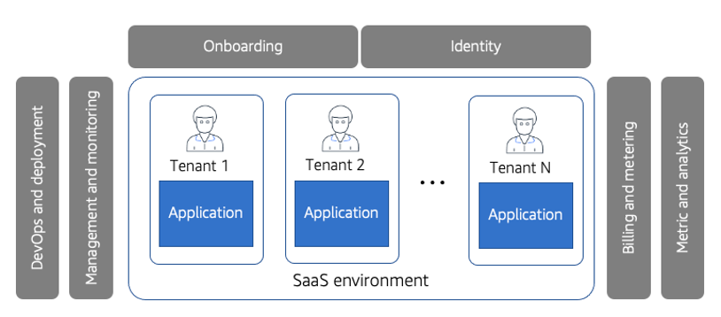
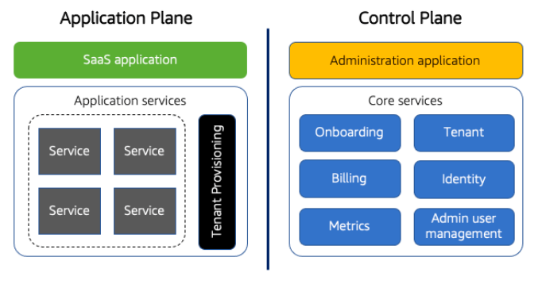
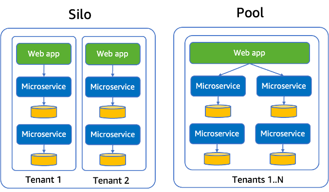
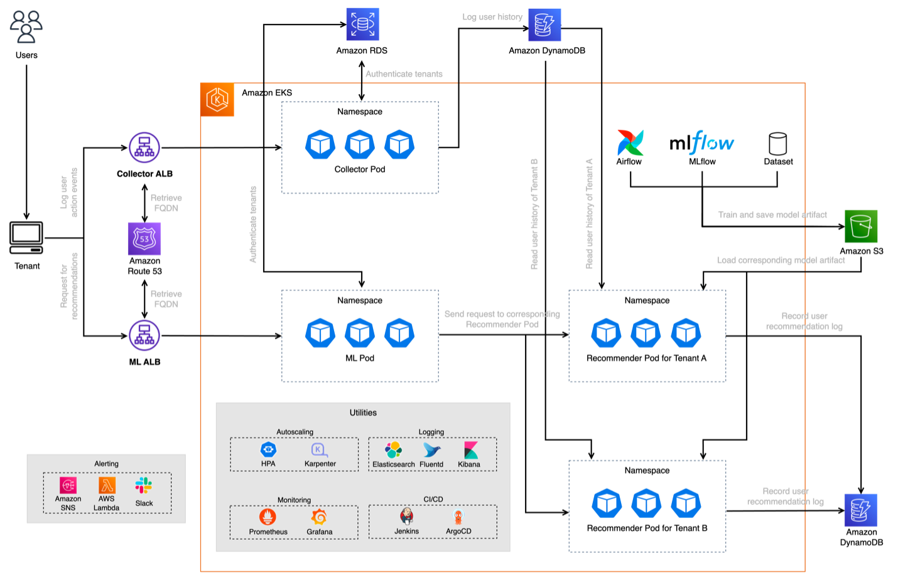
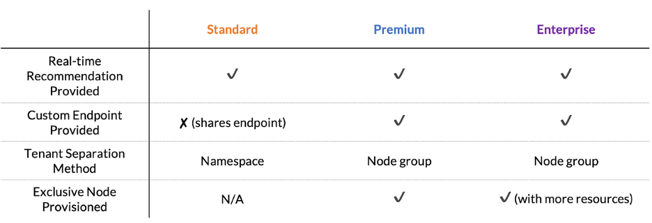
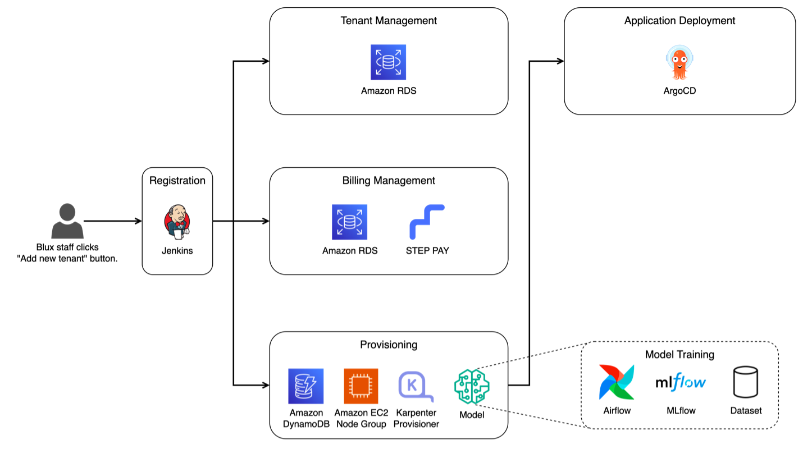
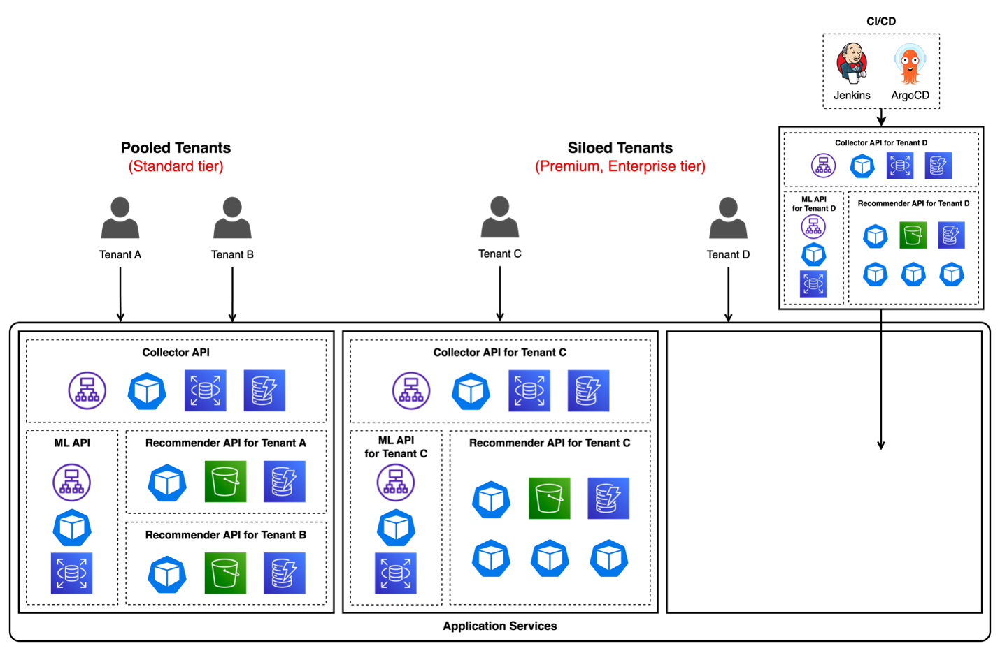
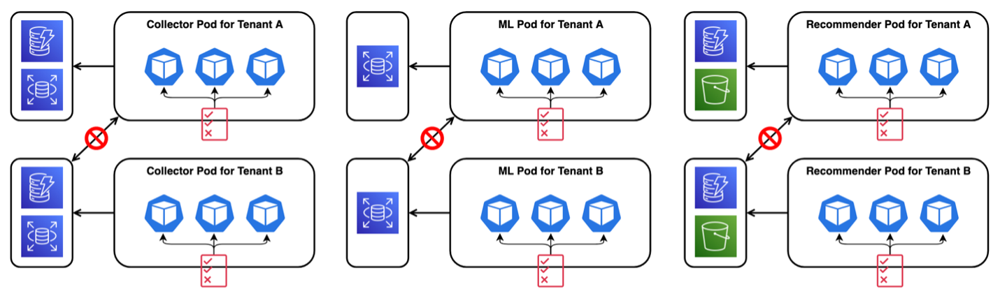

> **원문:** 이 글은 [AWS 기술 블로그](https://aws.amazon.com/ko/blogs/tech/blux-adopting-aws-saas-architecture/)에 게시된 글을 저자의 개인 블로그에 재게시한 것입니다. 이 글은 김진아(AWS), 서호성(AWS), 민선홍(blux) 세 명이 공동으로 작성하였습니다.

Blux는 월 구독 기반 개인화 상품 추천 솔루션을 기업들에게 제공하는 B2B SaaS(Software-as-a-Service) 스타트업입니다. 월간 1,000만 명 이상의 최종 사용자에게 100% 실시간으로 작동하는 추천을 제공하고 있으며, 주로 커머스 기업들의 구매전환 관련 지표를 최적화하여 도입 이전에 비해 최대 7배의 효율을 발생시키고 있습니다. Blux 서비스는 맞춤형 인공지능 모델 개발부터 개인화 추천 시스템 적용에 이르기까지의 모든 과정을 담당하여, 자체 구축으로 진행하는 경우 6개월 이상의 시간이 걸리는 추천 솔루션 구축 작업들을 최적의 환경에서 2~3시간 내에 가능하게 합니다. 이번 글에서는 Blux가 AWS SaaS 아키텍처 패턴을 적용하여 [Amazon Elastic Kubernetes Service(Amazon EKS)](https://aws.amazon.com/ko/eks/) 환경에서 SaaS 솔루션을 성공적으로 고도화한 사례를 공유합니다.

## 1. AWS SaaS 아키텍처 패턴 소개

*그림 1 – SaaS 환경*

SaaS는 최종 사용자에게 애플리케이션을 제공하는 클라우드 기반 소프트웨어 모델입니다. 고객은 SaaS 서비스를 사용하면 서비스의 유지 관리 방식이나 기본 인프라 관리 방식에 대해 고민할 필요가 없습니다. 또한 고객은 모든 기능을 한번에 크게 구매할 필요없이 사용량에 따른 요금제 모델 또는 구독 기반으로 요금을 지불합니다.

SaaS는 모든 고객이 동일한 버전의 애플리케이션을 실행하는 환경에서 제공됩니다. 이러한 이유로 SaaS 환경에서는 단일 공유 프로세스를 통해 모든 테넌트에게 새 기능을 배포할 수 있는 장점을 갖습니다. 또한 모든 테넌트를 관리하고 운영할 수 있는 공통된 운영 환경을 통해 테넌트를 관리하고 모니터링하여, 운영 오버헤드를 늘리지 않고 새 테넌트를 추가할 수 있습니다.

*그림 2 – SaaS의 Control Plane과 Application Plane*

SaaS 아키텍처는 그림 2와 같이 Control Plane과 Application Plane으로 구성됩니다. Control Plane은 모든 테넌트를 관리하고 운영하는 데 필요한 온보딩, 인증, 관리, 운영 및 분석 서비스를 포함합니다. Application Plane은 SaaS 솔루션의 비즈니스 로직 및 기능 요소가 구현되는 곳입니다.

SaaS Control Plane은 온보딩, 관리 및 운영하는 데 필요한 서비스로 구성되어 있습니다.

- **온보딩** : 온보딩 서비스는 SaaS 환경에 새로운 테넌트를 도입하는 역할을 수행합니다. 온보딩은 인프라 프로비저닝, 테넌트, 사용자 자격증명, 격리 정책, 청구 및 테넌트 구성 등 새 테넌트를 도입하는 데 필요한 모든 단계를 포함합니다. 온보딩 과정에서 마찰을 줄이면 운영 효율성과 조직의 민첩성이 향상됩니다.
- **자격 증명(Identity)** : 자격 증명 서비스는 인증받은 사용자를 특정 테넌트 컨텍스트에 연결합니다. SaaS 환경에서 테넌트와 사용자를 연결한 것을 SaaS의 자격 증명이라고 합니다. 자격 증명은 애플리케이션 내에서 테넌트의 로그를 생성하고, 매트릭을 기록하고, 요금을 측정하고, 테넌트를 격리하는 데 사용됩니다.
- **빌링** : 빌링 서비스는 주로 타사 결제 서비스를 이용하여 테넌트를 위한 청구서를 생성하는 데 필요한 소비 및 활동을 수집하고 테넌트에 비용을 청구합니다.

SaaS Application Plane은 SaaS 솔루션의 비즈니스 로직 및 기능을 포함합니다.

*그림 3 – 배포 모델의 예 : Pool 모델과 Silo 모델*

- **배포 모델** : Application Plane을 구성하는 컴퓨팅, 스토리지 등의 리소스는 여러 테넌트에 의해 공유되거나 테넌트 별로 전용으로 배포될 수 있습니다. 배포 모델은 티어에 따라 결정될 수도 있습니다. 예를 들어 합리적인 가격을 지불하는 베이직 티어의 테넌트는 공유되는(pool) 리소스를 사용하고, 더 많은 비용을 지불하는 프리미엄 티어의 테넌트는 전용의(silo) 리소스를 사용할 수 있습니다.
- **테넌트 격리** : 멀티테넌트 환경에서 리소스를 여러 테넌트 간에 공유하더라도 각 테넌트의 리소스는 격리되어야 합니다. 테넌트 격리는 리소스에 대한 액세스를 엄격하게 제어하고 다른 테넌트의 리소스에 액세스하려는 시도를 차단하는 매커니즘을 구현하는 것입니다.

SaaS 아키텍처에 대한 상세한 내용을 확인하고 싶다면 [AWS SaaS 아키텍처 백서](https://docs.aws.amazon.com/ko_kr/whitepapers/latest/saas-architecture-fundamentals/saas-architecture-fundamentals.html)를 확인해보시길 바랍니다.

## 2. Blux의 SaaS 솔루션 변천사

초창기 Blux는 자체 클러스터를 관리할 필요 없이 컨테이너를 빠르고 안정적으로 배포 및 관리하기 위해서 [Amazon Elastic Container Service(ECS)](https://aws.amazon.com/ecs/)를 선택했습니다. Amazon ECS는 컨테이너식 애플리케이션의 배포, 관리, 크기 조정을 간소화하는 완전관리형 컨테이너 오케스트레이션을 제공하는 서비스입니다. 안정적이고 빠르게 고객들에게 서비스를 제공하고 싶었던 초창기 Blux에게 Amazon ECS는 적합했습니다.

Blux는 다수의 고객, 즉 다수의 테넌트가 사용하는 환경으로 기존에는 모든 테넌트마다 완전히 격리된 환경을 제공해줬습니다. 그러나 Blux는 비용 및 운영 효율적으로 자원을 활용하기 위해, 자원을 공유하면서도 테넌트 간에 격리된 환경을 제공하기를 원했습니다. Kubernetes는 애플리케이션의 배포, 확장, 관리를 자동화하여 높은 자유도와 유연성을 제공해주는 컨테이너 오케스트레이션 플랫폼으로서 Blux에게 최고의 선택지였습니다.

Kubernetes는 다양한 비즈니스 요구사항을 수용할 수 있을 만큼 유연한 반면에 관리의 복잡성을 지니고 있었습니다. 이러한 이유로 Blux는 Kubernetes와 완벽히 호환되며, 컨트롤 플레인의 가용성과 확장성을 관리해주는 Amazon EKS를 사용하기로 결정했습니다. Amazon EKS는 자체 Kubernetes 컨트롤 플레인을 설치 및 운영할 필요 없이 Kubernetes를 손쉽게 실행할 수 있도록 지원하는 관리형 서비스입니다. Blux는 복잡한 컨트롤 플레인 관리를 Amazon EKS에 맡기고, 컨테이너가 실행되는 데이터 플레인만 관리하면 되므로 유연성을 가지면서도 운영 부담을 크게 줄일 수 있었습니다.

Blux는 이와 같이 Kubernetes의 장점을 활용하기로 결정하였고, 더불어 Blux의 성장으로 인해 테넌트 수가 증가하면서 SaaS 솔루션을 고도화해야 하는 상황이 되었습니다.

먼저 단일 티어 구조에서 여러 테넌트의 요구사항을 수용할 수 있는 추가적인 티어가 필요해졌습니다. 각 테넌트는 서로 다른 요구사항을 가졌고, 일부 테넌트들은 전용 자원을 통한 더 높은 격리 수준을 요구했습니다. 이러한 다양한 테넌트 요구사항을 반영하기 위해, Blux는 기존의 단일 티어 구조를 벗어나 새로운 다중 티어 구조를 적용하기로 결정하였습니다.

또한 다중 티어 구조로 변경하면서 티어마다 성능 수준, 비용 측정 방법을 다르게 적용하는 것이 필요했습니다. 예를 들어 MAU가 높거나 더 높은 성능 요구하는 테넌트에게는 완전히 격리된 자원을 할당하여 다른 테넌트에 영향을 최소화하는 것이 중요했습니다.

마지막으로 테넌트가 증가하면서 수동으로 수행하였던 온보딩 절차를 자동화하는 것이 더욱 중요해졌습니다. 기존에는 테넌트가 Blux 서비스 사용을 결정하면 Blux 담당자가 테넌트를 위한 리소스를 수동으로 생성하고 배포했습니다. 그러나 테넌트가 증가하면서 온보딩의 민첩성을 높이고, 수동 과정에서 발생할 수 있는 휴먼 에러를 줄이는 것이 매우 중요해졌습니다.

이러한 이유로 Blux는 SaaS 솔루션을 고도화하기로 결정했습니다. 이번 블로그에서는 Blux에 어떻게 Amazon EKS 기반 AWS SaaS 아키텍처 패턴을 적용했는지 소개합니다.

## 3. Blux의 Amazon EKS 기반 SaaS 아키텍처 적용사례

Blux 서비스는 유저에게 100% 실시간 추천을 제공합니다. 먼저 쇼핑몰 화면에서 유저에게 연관 상품 등을 추천하는 지면이 있다고 가정해보겠습니다. Blux는 어떤 유저가 A, B, C라는 상품을 보고 홈 화면으로 돌아갔을 때 유저의 직전 히스토리(A, B, C라는 상품을 본 기록)까지 반영하여 유저가 가장 관심가질만한 상품을 홈 화면의 지면에 노출하는 방식으로 추천 기능을 수행합니다.

### 3.1 Amazon EKS 기반 SaaS 아키텍처

*그림 4 – Blux 아키텍처*

그림 4는 AWS의 SaaS 아키텍처 패턴을 적용하여 고도화한 Blux의 상위 수준의 아키텍처입니다.

#### 아키텍처 구조

기본적으로 모든 워크로드는 Amazon EKS 클러스터에서 고가용성과 안정성을 보장하며 실행됩니다. Amazon EKS 클러스터에서 Horizontal Pod Autoscaler(HPA)가 Pod를, AWS에서 오픈 소스로 제공하는 [Karpenter](https://karpenter.sh/)가 Node를 오토스케일링을 담당합니다. 또한, EFK(Elasticsearch, Fluentd, Kibana) 스택을 이용한 로깅, Prometheus와 Grafana를 이용한 모니터링, 그리고 Jenkins와 ArgoCD를 이용한 CI/CD 구성 등 다양한 써드파티 도구들을 활용해 전체 아키텍처를 구성하고 있습니다.

#### 아키텍처 흐름

Blux의 테넌트들은 Blux에서 제공하는 SDK를 통해 Collector API 또는 ML API를 호출할 수 있습니다. Collector API는 유저의 행동 데이터를 수집하는데 사용되고 ML API는 유저에게 추천을 제공할 때 사용됩니다. 모든 API의 요청은 [Application Load Balancer(ALB)](https://aws.amazon.com/ko/elasticloadbalancing/application-load-balancer/)를 거쳐 Amazon EKS 클러스터 내의 파드에 전달되어 처리됩니다.

우선 Collector API가 호출되었을 때, RDS 데이터를 바탕으로 인증이 통과되면 Collector 워크로드가 DynamoDB 테이블에 유저의 행동 데이터를 쌓습니다. 이러한 유저의 행동 데이터는 추후에 추천 모델을 학습할 때도 사용되고, 실제 추천을 제공할 때에도 사용됩니다.

학습된 모델을 바탕으로 추천을 제공받기를 원하는 테넌트가 ML API를 호출하면, Collector API와 동일한 방식으로 인증을 거친 후 그 테넌트에 해당하는 Recommender 워크로드로 요청을 전달하게 됩니다. Collector 나 ML 워크로드는 모든 테넌트에 의해 공유되는 반면, Recommender 워크로드는 각 테넌트마다 따로 존재하기 때문입니다. 요청을 전달받은 Recommender 워크로드는 앞서 Collector 워크로드에서 Amazon DynamoDB 테이블에 저장한 유저의 최신 행동 데이터를 읽어들이고, S3를 통해 해당 테넌트 전용의 추천 모델을 읽어들입니다. 그리고 이 모델에 유저 행동 데이터를 파라미터로 전달하여 실시간 추천을 응답합니다. 추천을 위해 필요한 모델은 Airflow, MLflow 등 써드파티 도구들을 활용해 일정한 주기마다 학습하고, 배포됩니다. 최종적으로 Recommender 워크로드에서 어떤 유저에게 어떤 추천을 제공 했는지에 대한 정보도 Amazon DynamoDB 테이블에 기록합니다.

### 3.2 테넌트 티어

*그림 5 – Blux의 티어*

그림 5는 Blux의 테넌트 티어 별 제공되는 주요 리소스의 공용 혹은 전용 사용 여부를 나타냅니다. 현재 Blux에는 Standard, Premium, Enterprise 총 세 개의 티어가 있고, 이 중 Premium과 Enterprise 테넌트의 경우 테넌트 전용의 자원이 제공됩니다. Standard 테넌트들은 ALB의 API Endpoint를 공유하는 반면, Premium과 Enterprise 테넌트에게는 전용의 ALB API Endpoint가 제공되어 해당 테넌트의 더 많은 사용자 트래픽을 처리할 수 있습니다. 그리고 Enterprise 테넌트는 Premium 테넌트보다 높은 성능의 더 많은 자원을 이용할 수 있습니다.

기본적으로 Kubernetes 네임스페이스를 이용해서 모든 테넌트의 컴퓨팅 자원이 구분되고, 특히 Premium과 Enterprise 테넌트의 경우에는 테넌트 전용의 노드 그룹이 제공됩니다. 이로써 다른 테넌트와 노드(Amazon EC2)를 같이 사용하면서 발생할 수 있는 Noisy Neighbor 문제를 해결할 수 있고 더 높은 수준의 성능과 격리를 보장할 수 있습니다.

### 3.3 온보딩 자동화

*그림 6 – Blux의 온보딩*

그림 6은 추천서비스에 새로운 테넌트가 등록될 때 자동으로 처리되는 온보딩 과정을 도식화한 것입니다. 테넌트의 등록 요청이 들어오면 Jenkins를 통해 온보딩 과정을 오케스트레이션 합니다. 먼저 테넌트의 고유 정보를 저장하여 새로운 테넌트를 생성합니다. 이후 빌링을 위해 구독 결제 시작일 등의 정보가 빌링관리 서비스에 의해 처리되고, SaaS 전문 구독 결제 솔루션인 STEP PAY에 결제 수단을 등록합니다. 또한 해당 테넌트만을 위한 자원들이 프로비저닝되는데, Amazon DynamoDB 테이블과 같이 모든 티어의 테넌트에게 동일하게 생성되는 자원도 있는 반면, 전용 노드 그룹과 Karpenter Provisioner과 같이 Premium과 Enterprise 티어의 테넌트에게만 생성되는 자원도 있습니다. Premium 과 Enterprise 티어의 테넌트의 경우 온보딩 과정에서 전용의 Endpoint가 생성되어 별도의 Collector API 및 ML API가 제공됩니다. 마지막으로 Blux의 추천 모델 추론 전용 API인 Recommender API가 ArgoCD를 통해 생성됩니다.

### 3.4 배포 모델

*그림 7 – 티어 기반의 배포 모델*

그림 7은 배포 모델에 따른 티어별 온보딩의 프로비저닝 과정을 나타낸 그림입니다. 3.2 절에서 설명한대로 Blux에는 Standard, Premium, Enterprise 총 세 개의 티어가 있는데, Standard 테넌트들은 Collector와 ML의 API를 공유하게 됩니다. 이에 반해 Premium과 Enterprise 테넌트는 전용의 Endpoint를 가진 Collector 및 ML API를 사용합니다. Premium과 Enterprise 테넌트의 경우, 대규모의 트래픽을 발생시키는 테넌트들이 구독하기 때문에 이와 같이 별도의 자원을 제공하는 것입니다. 다만, Recommender API 경우에는 모든 테넌트에게 전용으로 제공됩니다. 이는 Recommender 워크로드에서 해당 테넌트 전용의 모델을 S3로부터 다운받아 사용하기 위함입니다.

새로운 테넌트가 들어올 경우, Standard 티어를 구독한 테넌트는 기존의 다른 Standard 티어의 테넌트들(그림 7의 Tenant A, B)과 Collector 및 ML API를 공유하게 됩니다(Recommender API는 새로 생성). 이에 반해 Premium과 Enterprise 테넌트가 온보딩 되는 경우, Recommender API는 물론이고 전용 Endpoint를 가진 Collector 및 ML API도 새로 프로비저닝 됩니다. 이와 같은 배포 과정은 Amazon EKS 클러스터에 구축한 CI/CD 도구인 Jenkins와 ArgoCD을 통해서 자동으로 진행됩니다.

### 3.5 테넌트 격리

*그림 8 – 테넌트 격리*

그림 8은 Blux가 각 테넌트의 자원을 격리하기 위해 [IAM Roles for Service Accounts(IRSA)](https://docs.aws.amazon.com/eks/latest/userguide/iam-roles-for-service-accounts.html)를 활용하고 있는 모습을 도식화 하고 있습니다. Kubernetes에서 Service Account 객체를 통해서 파드의 사용 권한을 관리 할 수 있습니다. 파드에서 AWS 자원에 접근을 하려고 할 때 Service Account에 Annotation으로 자원에 대한 사용 권한을 가진 IAM 역할을 지정해주면, 해당 파드가 그 IAM 역할을 위임(Assume)받아 해당 자원에 대한 정해준 권한에 따라 사용할 수 있게 됩니다.

Blux는 Recommender 워크로드와 같이 각 테넌트별로 제공하는 파드에 대해 각 테넌트를 위한 IAM 역할을 Service Account에 설정하고, 그 IAM 역할에는 해당 테넌트의 AWS 자원에만 접근할 수 있도록 한 IAM 정책을 연결하여 테넌트 격리를 적용하고 있습니다. Premium이나 Enterprise 테넌트의 경우 Recommender 파드뿐만 아니라, 전용의 Endpoint가 생성된 Collector 및 ML 파드에도 이와 같은 격리가 적용되어 있습니다.

## 4. Blux의 SaaS 솔루션 고도화 결과

Blux는 AWS SaaS 아키텍처 패턴을 적용함으로써 다음의 효과를 얻을 수 있었습니다.

### (1) 다중 티어 구조 도입의 효과

- 고객마다 상이한 요구사항을 다중 티어를 통해 반영할 수 있었습니다.
- 티어마다 자원 공유 및 격리 수준을 다르게 제공하고, 이에 맞는 요금 측정 방법을 제공함으로써, 다양한 고객들의 요구사항을 만족시키는 SaaS 구독 솔루션을 제공할 수 있었습니다.

### (2) 다양한 성능과 격리 수준 적용

- MAU가 많은 테넌트의 경우 별도의 노드 그룹에 격리함으로써 Noisy Neighbor 문제를 원천 차단할 수 있었습니다.
- 상위 티어의 테넌트의 경우 독립된 자원을 보장해주어 테넌트의 만족도를 높였습니다.
- 상위 티어의 테넌트에게 강한 격리 환경을 보장해 줄 수 있었습니다.

### (3) 온보딩 자동화의 효과

- 수동 과정에서 종종 발생했던 모델 경로 오기입, 공급 자원 누락, 의존성이 있는 작업 간의 선후 관계 착각 등의 휴먼 에러를 줄일 수 있었습니다.
- 단순 반복 작업이 전부 자동화되면서 기존에 수 일이 소요되던 온보딩, 초기 데이터 설정 그리고 모델 학습과 배포 과정이 약 2~3시간 내외로 줄어들었습니다.
- 새로운 SaaS 아키텍처를 적용함으로써, 온보딩 안내, SDK 삽입, 추천 모델 개발, 자원 확보를 담당했던 인원들의 투입 리소스가 상당히 줄었습니다.

### (4) AWS SaaS 아키텍처의 Best Practice 반영

- AWS의 SaaS 아키텍처 구축 패턴을 적용함으로써 보다 높은 안정성, 확장성 그리고 보안성을 갖춘 SaaS 솔루션을 구축할 수 있었습니다.

## 5. 마무리

Blux는 지금까지 구축한 SaaS 아키텍처를 적용하며, 지속적으로 고도화하고 있습니다. 특히 현재는 고도화된 트래픽 관리 및 높은 수준의 테넌트 격리를 위해 Istio의 도입을 진행 중에 있습니다.

Amazon EKS 기반의 SaaS 아키텍처 구축을 고민하고 계신 분들은 [SaaS 아키텍처 백서](https://docs.aws.amazon.com/ko_kr/whitepapers/latest/saas-architecture-fundamentals/saas-architecture-fundamentals.html)에서 SaaS 아키텍처에 대해 자세히 알아보시기 바랍니다. 그리고 [SaaS Amazon EKS Reference Architecture](https://github.com/aws-samples/aws-saas-factory-eks-reference-architecture#saas-amazon-eks-reference-architecture)를 통해 Amazon EKS 환경에서 SaaS 솔루션을 구축하는 데 참고할 수 있는 샘플 아키텍처와 코드를 확인하실 수 있습니다.
