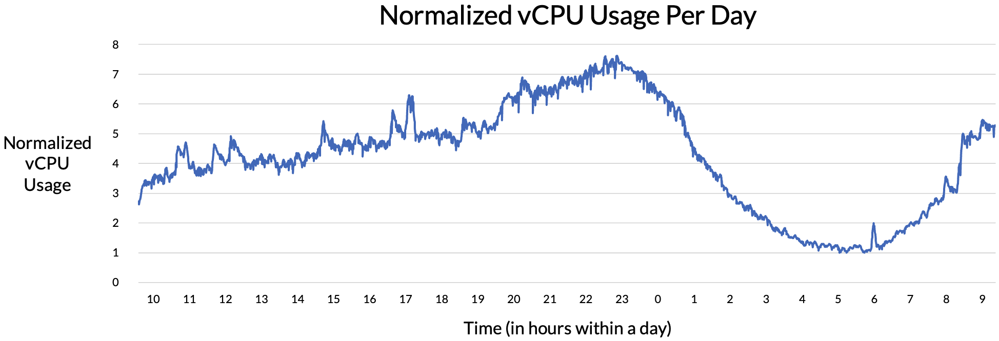
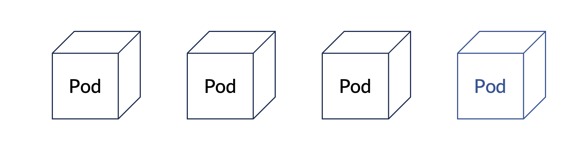
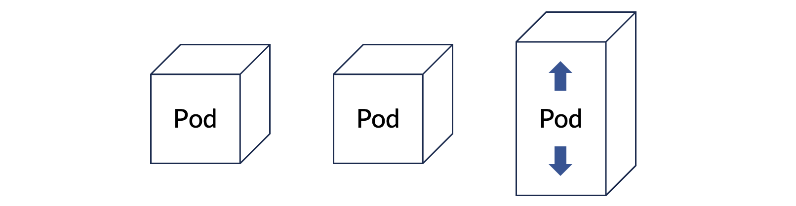

> **원문:** 이 글은 [blux 기술 블로그](https://blog.blux.ai/kubernetes-%ED%99%98%EA%B2%BD%EC%97%90%EC%84%9C-hpa%EC%99%80-karpenter%EB%A5%BC-%EC%9D%B4%EC%9A%A9%ED%95%98%EC%97%AC-autoscaling-%EC%8B%9C%EC%8A%A4%ED%85%9C-%EA%B5%AC%EC%B6%95%ED%95%98%EA%B8%B0-17394)에 게시된 글을 저자의 개인 블로그에 재게시한 것입니다.

쿠버네티스(Kubernetes, 컨테이너화된 애플리케이션의 배포, 관리, 확장을 자동화하는 오픈 소스 플랫폼) 환경에서 안정적이고 효율적으로 애플리케이션을 운영하기 위해서는 트래픽 변동에 자동으로 대응할 수 있는 시스템이 필요합니다. HPA(Horizontal Pod Autoscaling)와 '카펜터(Karpenter)'는 이러한 요구를 충족하는 강력한 도구입니다.

HPA는 애플리케이션의 부하에 따라 자동으로 포드(Pod, 쿠버네티스에서 가장 작은 배포 단위로, 하나 이상의 컨테이너와 이들 간의 네트워크 및 스토리지 리소스를 포함한 실행 환경)의 수를 조절하여 확장하거나 축소하고, 카펜터(Karpenter)는 클러스터의 요구 사항에 따라 노드를 동적으로 생성, 삭제하여 최적화하는 역할을 담당합니다.

이번 글에서는 쿠버네티스 환경에서 운영 중인 애플리케이션에 트래픽이 갑자기 몰렸을 때 HPA와 카펜터를 활용해 '오토스케일링(Autoscaling, 시스템의 부하에 따라 자동으로 리소스를 확장하거나 축소하는 기능)'하는 방법에 대해 알아보겠습니다.

---

## 어떤 상황에 오토스케일링이 필요할까?

다음은 실제 저희 블럭스(Blux) 애플리케이션 중 하나의 자원 사용량을 나타낸 그래프입니다. 가로축은 시간으로 총 24시간을 나타내고, 세로축은 vCPU 사용량을 최저치 기준으로 '정규화'하여 나타낸 것입니다.



그래프를 보시면 사람들의 취침 시간인 오전 2시~8시에는 자원 사용량이 적고, 그 이후로는 점점 사용량이 늘다가 자정 이후로 다시 줄어드는 것을 확인할 수 있습니다.

서버의 데이터 전송량을 트래픽이라고 하는데, 이처럼 트래픽은 일정하지 않고 여러 요인에 의해 영향을 받습니다. 트래픽은 위 그래프에 나타난 것처럼 시간대에 따라 다른 양상을 보이기도 하고, 푸시 알림 등 특정 이벤트 발생 여부에 의해서도 영향을 받습니다.

따라서 애플리케이션을 안정적으로 운영하기 위해서는 (1) 일정 수준의 트래픽을 평소에 무리 없이 처리할 수 있어야 하고, (2) 예상치 못하게 트래픽이 많아졌을 경우 이에 적절히 대응할 수 있어야 합니다. 여기서 '적절히 대응한다'는 것은 사람의 개입 없이 자동으로 서버의 증설과 같은 액션이 일어나서, 트래픽이 몰리는 상황에서도 이용자 입장에서는 아무런 차이를 느끼지 않고 문제없이 사용할 수 있게 보장하는 것을 말합니다.

이렇게 일시적인 트래픽 증가 등에 대응하여 서버 자체의 '캐퍼시티(Capacity, 시스템이나 장비가 처리할 수 있는 최대 용량이나 성능)'나 서버의 숫자를 자동으로 늘리는 행위를 '오토스케일링(Autoscaling)'이라고 말합니다. 저희는 쿠버네티스 환경에서 모든 애플리케이션을 운영하고 있기 때문에 컨테이너가 띄워진 '포드'의 숫자 혹은 포드 자체에 할당된 자원을 늘리는 것이 오토스케일링 방법이 될 수 있습니다.

'포드 오토스케일링(Pod Autoscaling, 애플리케이션의 부하에 따라 자동으로 포드의 수를 조절하여 확장하거나 축소하는 기능)'의 방법으로는 대표적으로 'HPA(Horizontal Pod Autoscaling)'와 'VPA(Vertical Pod Autoscaling)'가 있습니다. HPA은 아래 그림과 같이 수평적인 방향으로 포드의 개수를 늘리는 방식으로 동작합니다.



반대로 VPA은 아래 그림과 같이 수직적인 방향으로, 포드에 더 많은 자원을 할당하는 방식으로 동작합니다.



여기서 '포드 오토스케일링'은 CPU나 '메모리(Memory)'를 기준으로 동작하는 것이 기본이나, 사용자가 정의한 '커스텀(Custom)' 또는 '익스터널 메트릭(External Metric, 외부 시스템이나 서비스에서 수집한 성능 지표)'을 기준으로 동작하게끔 설정할 수도 있습니다. 포드 오토스케일링이 일어나는 상황과 기준에 대해서는 아래에서 좀 더 자세히 다루도록 하겠습니다. 쿠버네티스의 '[Autoscaler GitHub Repository](https://github.com/kubernetes/autoscaler/tree/master/vertical-pod-autoscaler#known-limitations)'를 보면 CPU나 메모리를 기준으로 포드 오토스케일링을 할 때 VPA와 HPA은 함께 사용되어서는 안 된다고 명시되어 있습니다. 저희는 이 둘 중 HPA을 '프로덕션(Production, 개발 및 테스트 과정을 거쳐 실제 운영 환경에서 서비스가 배포되고 사용되는 단계)' 환경에서 사용하고 있는데 그 이유는 다음과 같습니다.

**(1) '스테이트리스(Stateless, 서버가 클라이언트의 상태를 저장하지 않는 아키텍처 방식)' 애플리케이션에 적합**합니다. 저희는 '마이크로서비스 아키텍처(Microservice Architecture, 애플리케이션을 독립적으로 배포 및 확장할 수 있는 작은 서비스들로 구성하여 개발하는 소프트웨어 아키텍처 방식)'를 표방하고, 이에 따라 모든 애플리케이션들이 상태를 저장하지 않기(즉, 스테이트리스하기) 때문에, 자원이 부족할 때 애플리케이션의 개수를 늘리기에 용이합니다. HPA은 애플리케이션을 호스팅하고 있는 포드의 개수를 조절하는 방식으로 동작하기 때문에 이러한 스테이트리스 애플리케이션에 적용하기에 적합합니다.

**(2) '스케일러빌리티(Scalability, 시스템의 성능이나 용량을 확장할 수 있는 능력)' 측면에서 유리**합니다. 이론적으로 HPA은 VPA와 달리 '어퍼 리밋(Upper Limit, 최대 한도)'이 없습니다. VPA은 아무리 포드의 자원을 많이 늘리고 싶어도 해당 포드가 실행되고 있는 '노드(Node, 쿠버네티스 클러스터에서 컨테이너화된 애플리케이션이 실행되는 물리적 또는 가상 머신)'의 자원보다 더 늘릴 수는 없습니다. 하지만 HPA은 자원 부족, 배포할 수 있는 포드의 개수 초과 등의 이유로 해당 노드에 포드를 더 띄울 수 없으면 다른 노드를 찾아 여기에 포드를 더 띄울 수가 있습니다. 이러한 점은 '클러스터(Cluster, 여러 대의 노드들이 하나의 시스템처럼 동작하며, 리소스를 공유하고 작업을 분산 처리하는 컴퓨팅 환경)' 전체의 관점에서 봤을 때 자원을 더욱 효율적으로 사용하는 장점으로 작용합니다.

**(3) 구현이 용이**합니다. 일반적으로 VPA을 적용할 때는 HPA을 적용할 때보다 애플리케이션의 자원 사용 패턴에 대해 더욱 잘 파악하고 있어야 하고, 필요에 따라 자원 사용량을 '파인 튜닝(Fine-Tuning, 모델이나 시스템의 성능을 최적화하기 위해 세부 매개변수를 조정하는 과정)' 해야 할 수도 있습니다. HPA은 VPA보다 상대적으로 적용하기가 용이합니다.

HPA은 포드가 사용하고 있는 자원이 일정 '스레숄드(Threshold, 특정 작업이 수행되기 위한 기준값)' 이상이면 그 개수를 늘려 트래픽을 분산시키고, 다시 그만큼의 포드가 필요 없어지면 개수를 줄입니다. 이런 방식으로 동작하기 위해서는 포드가 사용하는 자원의 양을 알아야 하는데, 여기에서 '쿠버네티스 메트릭스 서버(Kubernetes Metrics Server, 쿠버네티스 클러스터에서 리소스 사용량 데이터를 수집하고 제공하여 자동 확장 및 모니터링에 활용되는 서버)'라는 것이 활용됩니다.

[쿠버네티스 메트릭스 서버](https://github.com/kubernetes-sigs/metrics-server)는 클러스터 전반에 걸쳐 자원의 사용량 정보를 수집하는 역할을 합니다. 아마존 웹 서비스(Amazon Web Services, AWS)에서는 전제 조건으로 (1) 쿠버네티스 클러스터, (2) 쿠버네티스 메트릭스 서버, 그리고 (3) '쿠보컨트롤 클라이언트(Kubectl Client, 쿠버네티스 클러스터와 상호작용하기 위한 명령줄 도구로, 클러스터의 상태를 관리하고 애플리케이션을 배포하는 데 사용)'를 듭니다.

HPA은 쿠버네티스 API와 '컨트롤러(Controller, 쿠버네티스에서 시스템의 상태를 원하는 상태로 유지하기 위해 지속적으로 모니터링하고 조정하는 제어 루프)'의 형태로 구현되어 있는데, '쿠버네티스 컨트롤러 플레인(Kubernetes Control Plane, 클러스터의 상태를 관리하고 원하는 상태를 유지하기 위해 모든 제어 작업을 수행하는 쿠버네티스 컴포넌트들의 집합)'에서 돌고 있는 HPA 컨트롤러가 주기적으로 '타깃(Target, 시스템이나 작업이 목표로 하는 대상 또는 목표 지점)'의 자원 사용량을 체크하는 핵심적인 역할을 수행하게 됩니다. 보다 구체적인 동작 원리는 [이 링크](https://kubernetes.io/docs/tasks/run-application/horizontal-pod-autoscale/)에서 확인하실 수 있습니다.

그럼 예시를 통해 HPA가 어떻게 동작하는지 살펴보겠습니다.

다음 YAML 파일을 통해 애플리케이션을 배포한다고 가정하겠습니다. 파일은 간결성을 위해 필요한 부분만 남겼고, `Deployment`와 `HorizontalPodAutoscaler`만 나타냈습니다.

```yaml
apiVersion: apps/v1
kind: Deployment
metadata:
  name: blux-sample-api
  labels:
    app: blux-sample-api
spec:
  replicas: 1
  selector:
    matchLabels:
      app: blux-sample-api
  template:
    metadata:
      labels:
        app: blux-sample-api
    spec:
      containers:
        - name: blux-sample-api-base
          image: ${BLUX_AWS_ACCOUNT_ID}.dkr.ecr.ap-northeast-2.amazonaws.com/blux-sample-api:0.0.1
          ports:
            - containerPort: ${BLUX_SAMPLE_API_PORT}
          resources:
            requests:
              memory: 2Gi
              cpu: 1000m
            limits:
              memory: 4Gi
              cpu: 2000m
---
apiVersion: autoscaling/v2
kind: HorizontalPodAutoscaler
metadata:
  name: blux-sample-api
spec:
  minReplicas: 1
  maxReplicas: 10
  scaleTargetRef:
    apiVersion: apps/v1
    kind: Deployment
    name: blux-sample-api
  metrics:
  - type: resource
    resource:
      name: memory
      target:
        type: Utilization
        averageUtilization: 150
  - type: resource
    resource:
      name: cpu
      target:
        type: Utilization
        averageUtilization: 100
```

위 예시에서는 `blux-sample-api`라는 `Deployment`를 정의하고 있는데 눈여겨 볼 부분은 `spec.template.spec.containers`의 `resources`입니다. 해당 애플리케이션은 `2GiB`의 메모리와 `1` vCPU를 요청하고 있고, 최대 `4GiB`의 메모리와 `2` vCPUs를 쓸 수 있음을 정의하고 있습니다. `HorizontalPodAutoscaler`가 정의된 부분을 보면 메모리, vCPU가 각각 `150%`, `100%` 사용됐을 때를 기준으로 HPA가 동작하게끔 되어 있습니다. 여기서 퍼센트는 `resources.requests`를 기준으로 적용됩니다. 다시 말하면, 메모리가 `2GiB`의 `150%`인 `3GiB` 이상 쓰일 때, 그리고 vCPU가 `1000m`의 `100%`인 `1000m` 이상 쓰일 때 HPA가 더 많은 포드를 띄우도록 '트리거(Trigger, 특정 조건이 충족되었을 때 자동으로 작업을 수행하는 메커니즘)'된다는 것입니다.

최초로 위 파일에 정의된대로 쿠버네티스 환경에 배포하였을 때 `kubectl get hpa` 명령어를 치면 아래와 같이 나옵니다.

```
shawn@desktop:~$ kubectl get hpa
NAME             REFERENCE                   TARGETS               MINPODS   MAXPODS   REPLICAS   AGE
blux-sample-api   Deployment/blux-sample-api   39%/150%, 1%/100%     1         10        1          2h
```

여기서 저희는 자체적으로 제작한 '로드 테스팅 툴(Load Testing Tool, 시스템의 성능을 테스트하기 위해 부하를 가하는 도구)'을 이용해 고의적으로 해당 애플리케이션에 많은 요청을 보내보았습니다. 일정 시간 동안 부하를 주었을 때 다시 `kubectl get hpa` 명령어를 치면 아래와 같이 vCPU 사용량이 늘었음을 알 수 있습니다. (`TARGETS`에서 전자가 memory, 후자가 vCPU를 의미합니다.)

```
shawn@desktop:~$ kubectl get hpa
NAME             REFERENCE                   TARGETS               MINPODS   MAXPODS   REPLICAS   AGE
blux-sample-api   Deployment/blux-sample-api   47%/150%, 166%/100%   1         10        2          2h
shawn@desktop:~$ kubectl get deployment blux-sample-api
NAME             READY   UP-TO-DATE   AVAILABLE   AGE
blux-sample-api   1/1     2            2           2h
```

vCPU 사용량이 `166%`로 미리 지정한 `100%`를 넘었기 때문에 HPA이 작동되었고, 그 결과 기존 1개의 Pod보다 하나 더 많은 총 2개의 포드가 생성되었습니다. '로드 테스팅(Load Testing, 시스템에 다양한 부하를 가하여 성능과 안정성을 평가하는 테스트 방법)'을 끝내고 조금 기다리면, 아래와 같이 포드의 개수가 다시 1개로 줄어든 것을 확인할 수 있습니다.

```
shawn@desktop:~$ kubectl get hpa
NAME             REFERENCE                   TARGETS               MINPODS   MAXPODS   REPLICAS   AGE
blux-sample-api   Deployment/blux-sample-api   38%/150%, 2%/100%     1         10        1          3h
```

지금까지 예시와 설명을 통해 저희가 미리 설정한 '스레숄드' 이상의 자원이 사용되면 HPA이 작동하여 자원의 '유틸라이제이션 레이트(Utilization Rate, 시스템이나 리소스가 사용되는 비율)'가 스레숄드 이하로 떨어질 수 있게끔 더 많은 포드를 생성하는 것을 알 수 있었습니다. 그러나 현 상황에서는 포드를 무한정 많이 생성할 수는 없을 겁니다.

일단 당연히 노드의 자원 한도 내에서만 포드를 생성할 수 있을 것이고, 노드별로 띄울 수 있는 포드의 개수에 제한(i.e., max Pods per node)도 있습니다. 예를 들어 AWS의 m5.2xlarge instance는 8 vCPUs, 32GiB 메모리의 자원 한도가 정해져 있고, 여기에 최대 58개의 포드를 띄울 수 있습니다.

만약 클러스터를 구성하고 있는 모든 노드에 할 수 있는 한도 내에서 포드를 빽빽히 생성하고 나서도 여전히 트래픽이 감당하기 힘들 정도로 들어오고 있다면 어떻게 해야 할까요? 이때 저희가 택한 방법이 바로 카펜터를 이용한 자동화된 '노드 프로비저닝(Node Provisioning)'입니다. 카펜터에서는 오토스케일링을 통해 노드를 추가로 공급하는 것을 **'노드를 프로비저닝한다'**고 말합니다.

카펜터는 쿠버네티스 환경에서 사용하기 위한 오픈 소스의 노드 프로비저닝 프로젝트로, 최초에 AWS에서 활용되기 위해 만들어졌습니다. 그렇지만 현재는 '클라우드 애그노스틱(Cloud-Agnostic, 특정 클라우드 제공업체에 종속되지 않고 여러 클라우드 환경에서 동작할 수 있는 특성)'하기 때문에 다른 '클라우드 프로바이더(Cloud Provider, 사용자가 인터넷을 통해 컴퓨팅 리소스와 서비스를 제공받을 수 있도록 하는 클라우드 컴퓨팅 서비스 제공업체)'의 애플리케이션에서도 사용할 수 있습니다.

## 오토스케일링 시 카펜터의 장점

제가 사용해보면서 느낀 카펜터의 장점을 몇 가지 나열하자면 아래와 같습니다.

**(1) 굉장히 빠릅니다.** 카펜터가 새로운 노드를 '프로비전(Provision, 노드 등을 새롭게 할당하고 준비하는 과정)'해야겠다고 판단하는 순간부터 실제 프로비저닝이 이루어지기까지 _수십 초~수 분_ 밖에 걸리지 않습니다. 네트워크 연결 등 실제 노드의 활용이 가능하기까지 필요한 시간이 그렇습니다. 일반적인 클라우드 환경에서 직접 노드를 추가하더라도 꽤 시간이 걸린다는 것을 생각했을 때 놀라울 만큼 빠른 속도입니다.

**(2) 비용 측면에서 효율적입니다.** 카펜터는 프로비저닝을 할 때 사용자가 미리 정의해놓은 '인스턴스 타입(Instance Type, 클라우드 환경에서 가상 서버의 크기와 성능을 정의하는 사양)'의 '풀(Pool, 자원을 효율적으로 관리하기 위해 모아 놓은 리소스 집합)'을 보고 이 중에서 부족한 자원을 '서브(Serve, 서비스를 제공하는 것)'할 수 있는 인스턴스 중 _가장 저렴한 것을 알아서 찾아서 프로비전_ 합니다. 뿐만 아니라 해당 노드의 사용이 끝났으면 사용자의 설정에 따라 일정 시간이 지난 후에 바로 '디프로비저닝(Deprovisioning, 사전에 할당된 노드 등을 회수하거나 비활성화하는 과정)'해서 불필요한 비용이 드는 것을 막아줍니다.

**(3) 설치와 운영이 쉽습니다.** 카펜터의 설치는 [공식 document](https://karpenter.sh/docs/getting-started/)를 따라 하면 쉽게 할 수 있고, 운영에 있어서도 크게 신경 쓸 것이 없습니다. 가장 큰 장점은 노드를 늘릴 것인지 줄일 것인지 판단하는 것에서부터 실제로 늘렸다가 줄이는 것까지 _알아서_ 한다는 것입니다. 클러스터 전반에 걸쳐 합리적인 자원 '리퀘스트(Request, 쿠버네티스에서 컨테이너가 안정적으로 동작하기 위해 예약하는 최소한의 리소스 양)' 및 '리밋(Limit, 쿠버네티스에서 컨테이너가 사용할 수 있는 최대 리소스 양)'을 설정해두고, '카펜터 프로비저너(Karpenter Provisioner, 클라우드 환경에서 리소스를 자동으로 생성하고 관리하는 역할을 하는 도구나 서비스)'를 초기에 잘 정의해서 배포해 둔다면 그 이후로는 사용자가 신경 쓸 일이 없습니다.

카펜터를 활용할 수 있도록 다음과 같은 YAML 파일을 통해 '프로비저너' 등을 정의했습니다. AWS의 EC2 instance를 사용한다고 가정하였고, 주석을 통해 세부 요소를 설명하였습니다.

```yaml
apiVersion: karpenter.sh/v1alpha5
kind: Provisioner
metadata:
  name: sample
spec:
  providerRef:
    name: sample
  # 카펜터로 프로비전된 모든 노드에 적용될 "labels" 입니다.
  labels:
    type: karpenter

  # 카펜터로 프로비전된 모든 노드에 적용될 "annotations" 입니다.
  annotations:
    maintainer: "blux"

  # 프로비전할 노드에 대한 "requirements" 입니다.
  requirements:
    - key: "node.kubernetes.io/instance-type"
      operator: In
      values: ["m5.large", "m5.xlarge", "r5.large", "r5.xlarge"]
    - key: "kubernetes.io/arch"
      operator: In
      values: ["amd64"]
    - key: "kubernetes.io/os"
      operator: In
      values: ["linux"]
    - key: "karpenter.sh/capacity-type"
      operator: In
      values: ["on-demand"]

  # 해당 프로비저너가 프로비전할 수 있는 모든 노드의 자원의 "limits"입니다.
  limits:
    resources:
      cpu: "256"
      memory: 1Ti

  # "consolidation.enabled"를 "true"로 설정하면 카펜터가 더 이상 필요없는 노드를 디프로비전합니다.
  # 디프로비전하기가 불가능하면 더 낮은 비용의 노드로 변경하려는 시도를 합니다.
  # consolidation:
  #   enabled: true

  # 노드가 더 이상 사용되지 않을 때 정의된 시간이 지난 후에 디프로비전됩니다.
  # consolidation.enabled가 true라면 이 설정을 함께 사용할 수 없습니다.
  ttlSecondsAfterEmpty: 30

  # 동시에 여러 프로비저너가 적용 가능할 때 우선 순위로 적용할 상수입니다.
  # 높은 "weight"이 더 높은 우선 순위를 의미합니다.
  # weight: 10
---
apiVersion: karpenter.k8s.aws/v1alpha1
kind: AWSNodeTemplate
metadata:
  name: sample
spec:
  subnetSelector: # 필수로 작성되어야 하며, 해당 태그가 설정된 서브넷(Subnet, 대형 네트워크를 더 작은 네트워크로 나누어 관리하는 네트워크 분할)을 찾습니다.
    karpenter.sh/discovery: blux-cluster
  securityGroupSelector: # 필수로 작성되어야 하며 해당 태그가 설정된 보안 그룹(Security Group, 클라우드 환경에서 인스턴스에 대한 트래픽을 제어하고 접근을 제한하는 가상 방화벽 규칙)을 찾습니다.
    karpenter.sh/discovery: blux-cluster
  # amiFamily: AL2 # 선택적으로 작성될 수 있습니다.
  # blockDeviceMappings: # 선택적으로 작성될 수 있으며 스토리지 디바이스(Storage Device, 데이터를 저장하고 접근하는 데 사용되는 하드웨어 장치)에 대한 정보입니다.
  #   - deviceName: /dev/xvda
  #     ebs:
  #       volumeSize: 10Gi
  #       volumeType: gp2
  #       iops: 3000
  #       deleteOnTermination: true
  #       throughput: 125
```

지금까지 실제로 저희가 활용하고 있는 HPA와 카펜터를 활용해 오토스케일링을 하는 방법에 대해 설명드렸습니다. '프로덕션' 환경에서 일반적으로 많이 활용되는 사례로 소개했지만, 상황에 따라 HPA보다는 VPA를 활용하는 것이 나을 수도 있습니다. 또 카펜터 대신 '클러스터 오토스케일러(Cluster Autoscaler, 클러스터의 노드 수를 자동으로 조정하여 애플리케이션의 부하와 리소스 사용량에 맞게 최적화하는 기능)' 등 다른 노드 프로비저너를 활용하는 것이 나을 수도 있습니다.

각자 사용하시는 쿠버네티스 클러스터 환경과 애플리케이션의 특성을 고려해야하지만, 운영자 입장에서 좀 더 편안하게, 그리고 안전하게 들쑥날쑥한 트래픽을 문제없이 처리하기 위해서는 오토스케일링을 위한 시스템 구축이 필수적이라고 생각합니다.

저희처럼 HPA와 카펜터를 함께 활용하는 것을 고민하고 있다면 이 글이 조금이나마 도움이 되었기를 바랍니다.

**[참고 문헌]**

- [https://docs.aws.amazon.com/eks/latest/userguide/horizontal-pod-autoscaler.html](https://docs.aws.amazon.com/eks/latest/userguide/horizontal-pod-autoscaler.html)
- [https://github.com/kubernetes/autoscaler/](https://github.com/kubernetes/autoscaler/)
- [https://github.com/kubernetes-sigs/metrics-server/](https://github.com/kubernetes-sigs/metrics-server/)
- [https://karpenter.sh/docs/](https://karpenter.sh/docs/)
- [https://kubernetes.io/docs/tasks/run-application/horizontal-pod-autoscale/](https://kubernetes.io/docs/tasks/run-application/horizontal-pod-autoscale/)
