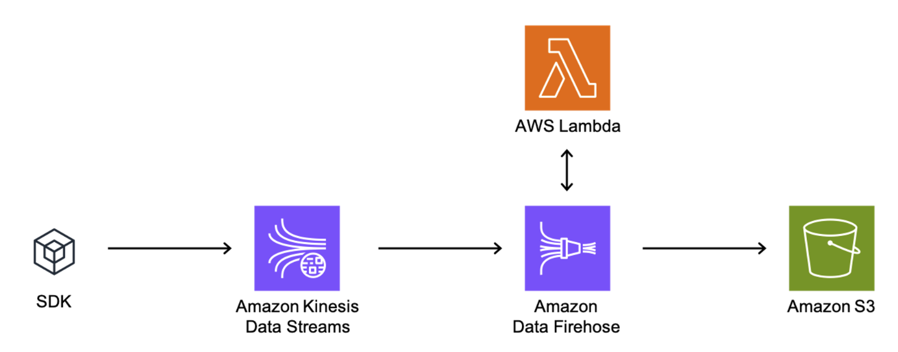

> **원문:** 이 글은 [blux 기술 블로그](https://blog.blux.ai/kinesis-%EC%8A%A4%ED%8A%B8%EB%A6%AC%EB%B0%8D-%EB%8D%B0%EC%9D%B4%ED%84%B0%EC%B2%98%EB%A6%AC-%EC%95%84%ED%82%A4%ED%85%8D%EC%B3%90-0522)에 게시된 글을 저자의 개인 블로그에 재게시한 것입니다.

블럭스에서는 고객들의 행동 데이터를 실시간으로 수집하고, 이를 여러 곳에서 활용하기 위한 서버를 운영하고 있습니다. 최근 CRM 마케팅 솔루션 신규 출시를 앞두고, 새로운 데이터 파이프라인 아키텍처 구축이 필요했습니다. 많은 양의 데이터를 실시간으로 처리하고, 수집된 데이터를 여러 곳에서 더 쉽게 활용하기 위해서입니다. 이번 글에서는 앞서 설명한 이유로 블럭스가 실시간 데이터 스트리밍 서비스 Kinesis Data Streams를 사용하기로 한 이유에 대해 설명해 보겠습니다.

## Kinesis Data Streams를 도입한 이유

AWS에서 제공하는 Kinesis Data Streams(이하 KDS)는 온디맨드로 구성할 경우, 들어오는 데이터의 양에 따라 처리 가능한 데이터의 양이 유연하게 변화합니다. 최대 200 MB/s의 쓰기 속도와 400 MB/s의 읽기 속도를 달성할 수 있으며, Support ticket을 활용하면 그 이상도 가능합니다.

KDS로 데이터를 쌓는 주체를 Producer, 데이터를 읽어가는 주체를 Consumer라고 하는데, 최대 20개의 Consumer를 등록할 수 있어서 이를 이용해 KDS에 쌓인 데이터를 여러 곳에서 활용할 수 있습니다. 이런 식으로 KDS의 데이터를 활용할 수 있는 서비스에는 Amazon Data Firehose, AWS Lambda, Managed Service for Apache Flink, Kinesis Client Library 등이 있습니다.

## Kinesis Data Streams 생성 시 유의할 점

KDS를 구축하는 것은 매우 간단합니다. Stream의 이름을 정하고 읽기/쓰기 Capacity mode를 On-demand로 할지, Provisioned로 할지만 결정하면 됩니다. 이 둘을 간단히 비교하면 다음과 같습니다.

| Capacity mode | On-demand | Provisioned |
|---|---|---|
| 최대로 생성할 수 있는 Data Streams의 숫자 | 50개 (Support ticket으로 상향 가능) | 제한 없음 |
| 최대로 생성할 수 있는 Shard의 숫자 | 제한 없음 | 계정당 500개 (Quota increase 요청으로 상향 가능) |
| 데이터 처리량 | 최대 200MB/s의 쓰기 속도 및 400MB/s의 읽기 속도 (Support ticket으로 상향 가능) | Shard 당 최대 1MB/s 또는 1,000 records/s의 쓰기 속도 및 2MB/s 또는 2,000 records/s 의 읽기 속도 |
| 데이터 payload 크기 | 최대 1 MB (base64-encoding 전 기준) | On-demand와 동일 |

이때 Data retention period는 기본값이 하루로 설정되지만, Stream을 생성한 후에 변경할 수 있습니다. 이를 하루보다 길게 설정할 경우 추가적인 과금이 들어갑니다.

## Amazon Data Firehose를 이용해 S3로 데이터 적재하기

Amazon S3는 원하는 양의 데이터를 저장하고 검색할 수 있도록 구축된 저장 공간으로, 어디서나 쉽게, 저렴한 요금으로 사용이 가능하기 때문에 많은 양의 데이터를 저장할 때 널리 사용됩니다. 저희는 앞서 만든 KDS에서 발생하는 데이터를 S3에 쌓기 위해 추가 작업을 진행했습니다. KDS에서 Stream은 Data retention period 동안 데이터가 쌓여있는 일종의 Queue라고 볼 수 있는데, 이 Queue에서 Consumer가 커서의 위치를 옮겨가며 쌓여있는 데이터를 읽어갑니다. 일반적인 Queue와는 달리 Consumer가 데이터를 읽어간다고 해서 Queue에서 데이터가 사라지지는 않고, Consumer가 데이터를 읽는 위치만 바뀝니다.

따라서 이 데이터를 적절한 포맷으로 S3에 옮길 필요가 있습니다. 그중 한 가지 방법으로 Amazon Data Firehose가 있습니다. Data Firehose는 실시간으로 쌓인 스트리밍 데이터를 수집 및 변환하여 AWS의 데이터 저장소나 분석 서비스 등으로 쉽게 로드할 수 있게 해주는 서비스입니다. 이 서비스를 이용하면 KDS에 쌓인 데이터를 Amazon S3뿐만 아니라 Amazon Redshift, Amazon OpenSearch Service 등 다양한 저장소 및 분석 서비스로 전송할 수 있습니다. 해당 아키텍처를 그림으로 표현하면 아래와 같습니다.



위 그림에서 Lambda는 아마존이 서비스 일부로 제공하는 이벤트 기반 서버리스 컴퓨팅 플랫폼입니다. Lambda는 데이터를 변형, 필터링, 압축 해제, 변환, 및 가공하기 위해서 사용될 수 있습니다.

## S3 저장 경로에 원하는 필드를 넣고 싶을 때

Data Firehose를 생성할 때는 여러 가지 파라미터를 함께 설정할 수 있는데, 이 중 Dynamic Partitioning이라는 옵션이 있습니다.

해당 기능은 원본 데이터에 있는 일부 필드를 Partitioning key로 사용하여 이를 S3 저장 경로에 포함하고 싶을 때 사용할 수 있는 기능입니다. 예를 들어, 데이터가 아래와 같은 형태로 들어올 때 데이터 안에 있는 client_id와 timestamp를 이용해 S3 경로를 설정하고 싶다고 가정하겠습니다.

```json
{
	"client_id": "1234567890",
	"type": {
		"device": "mobile",
		"event": "purchase"
	},
	"timestamp": 1711005364
}
```

이를 위해 Inline parsing for JSON 옵션을 Enabled로 하고, Dynamic partitioning keys를 아래와 같이 지정합니다.

| Key name | JQ expression |
|---|---|
| client_id | .client_id |
| year | .timestamp |
| month | .timestamp |
| day | .timestamp |
| hour | .timestamp |

이렇게 정의한 Dynamic partitioning keys를 이용해서 S3 bucket prefix를 다음과 같이 설정할 수 있습니다.

```
events/client_id=!{partitionKeyFromQuery:client_id}/year=!{partitionKeyFromQuery:year}/month=!{partitionKeyFromQuery:month}/day=!{partitionKeyFromQuery:day}/hour=!{partitionKeyFromQuery:hour}/
```

이런 식으로 S3 bucket prefix를 설정하면 KDS의 실시간 스트리밍 데이터가 Data Firehose를 통해 원하는 S3 경로에 쌓이게 됩니다. 만약 에러가 발생할 경우 어떤 S3 경로로 쌓을지도 별도로 정의해 줄 수 있습니다. 하지만 이때는 Dynamic partitioning 시 정의한 Partitioning key를 S3 경로에 사용할 수 없다는 점을 유의해야 합니다.

입력 데이터의 형식 등이 잘못돼서 Dynamic partitioning 자체를 수행하지 못할 수도 있기 때문에, Partitioning key를 S3 저장 경로에서 사용할 수 없는 것입니다. 따라서 다음과 같이 입력 데이터 내에 존재하는 timestamp가 아니라 실제 Data Firehose가 S3에 데이터를 쌓는 런타임 시점의 timestamp를 이용해서 S3 bucket error output prefix를 설정할 수 있습니다.

```
error-events/year=!{timestamp:yyyy}/month=!{timestamp:MM}/day=!{timestamp:dd}/hour=!{timestamp:HH}/!{firehose:error-output-type}
```

이와 같은 방식으로 S3 저장 경로에 원하는 필드를 넣을 수 있을 뿐만 아니라, 에러가 발생할 경우에도 Data Firehose 런타임의 timestamp에 따라 S3 경로를 구분해서 저장하여 원인 파악에 도움을 얻을 수 있습니다.

## 실시간 스트리밍 데이터 처리 아키텍처 고도화 계획

지금까지 실시간 스트리밍 데이터 처리를 위한 Kinesis Data Streams의 구축부터, Amazon Data Firehose를 이용해 S3에 데이터를 쌓는 방법까지 간략히 정리하여 설명했습니다. 앞으로 저희 팀은 이번에 구축한 실시간 스트리밍 데이터 처리 아키텍처를 더욱 고도화하여 이를 여러 방면에서 활용하기 위해 노력하겠습니다!
