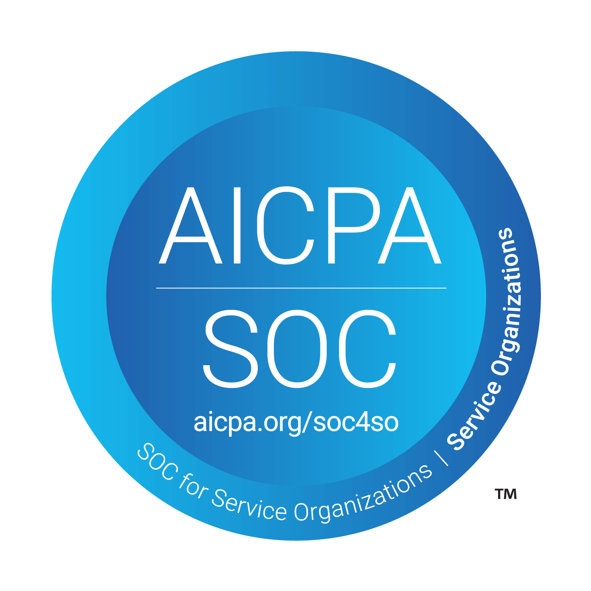

> **원문:** 이 글은 [blux 기술 블로그](https://blog.blux.ai/%EB%B8%94%EB%9F%AD%EC%8A%A4%EC%9D%98-soc-2-%EB%B3%B4%EC%95%88-%EC%97%AC%EC%A0%95%EA%B3%BC-%EC%9A%B0%EB%A6%AC%EA%B0%80-%EB%82%A8%EA%B8%B4-%EA%B8%B0%EB%A1%9D-49217)에 게시된 글을 저자의 개인 블로그에 재게시한 것입니다.

## 보안 표준 검증을 둘러싼 오해

많은 SaaS 기업이 보안 표준 심사 준비 시 다섯 가지 잘못된 가정을 하곤 합니다:

1. "보안 표준 검증은 1개월만 준비하면 통과할 수 있다"
2. "보안 표준 검증은 외부 업체에 전부 맡기면 된다"
3. "한 번 보안 표준 검증을 통과하면 평생 유효하다"
4. "보안 표준 검증을 통과하려면 대규모 보안 팀이 필요하다"
5. "보안 표준 검증을 통과하려면 보안 전문가를 반드시 채용해야 한다"

블럭스는 준비 과정에서 이러한 오해를 하나씩 바로잡으며 SOC 2 검증을 단순히 통과하는 것을 넘어 보안 체계 전반을 점검하고 개선하는 기회로 활용했습니다.

## SOC 2란 무엇이고, 왜 주목받을까?

SOC 2는 미국공인회계사협회(AICPA)에서 제정한 서비스 조직 통제 보고서로, 클라우드 서비스와 데이터 처리 조직의 보안 및 프라이버시 준수를 평가하는 "자발적 준수 표준"입니다. 오늘날 B2B SaaS 기업들에게 SOC 2는 선택이 아닌 "미국 및 글로벌 시장 진출을 위한 사실상의 필수 보안 표준"이 되었습니다.

### SOC 2의 5가지 신뢰 서비스 기준

- **보안(Security)** – 시스템 보호, 접근 통제, 보안 사고 대응
- **가용성(Availability)** – 서비스 성능, 모니터링, 재해 복구
- **처리 무결성(Processing Integrity)** – 데이터 처리 정확성 및 오류 관리
- **기밀성(Confidentiality)** – 민감 정보 보호, 데이터 접근 제한, 암호화
- **개인정보보호(Privacy)** – 개인정보 수집, 보관, 파기 및 정책 준수

보안은 필수 요소이며, 나머지는 조직의 필요에 따라 선택적으로 적용됩니다. 블럭스는 보안, 가용성, 기밀성을 선택했습니다.

### SOC 2 보고서 유형

| 구분 | SOC 2 Type I | SOC 2 Type II |
|------|-------------|--------------|
| 평가 기준 | 특정 시점에서 보안 통제 설계 적절성 평가 | 3~12개월 동안 보안 통제 운영 효과성 평가 |
| 핵심 질문 | 보안 통제가 적절하게 설계되었는가? | 보안 통제가 실제로 효과적으로 운영되고 있는가? |
| 고객 신뢰도 | 제한적(설계만 평가) | 높음(운영 실효성 평가) |
| 사용 사례 | 내부 프로세스 점검, 초기 신뢰 확보 용도 | 대기업 및 글로벌 고객 대상 서비스 운영 신뢰성 확보 |

흔히 'SOC 2를 통과했다'는 것은 Type II를 통과했다는 의미입니다.

## B2B SaaS 기업에게 SOC 2가 필요한 이유

### 고객 신뢰 확보와 글로벌 시장 진출

많은 기업 고객, 특히 대기업 및 글로벌 기업들은 SaaS 제품 도입 시 SOC 2 또는 동급의 보안 표준 검증 통과를 필수 요건으로 요구합니다. 블럭스도 대기업과의 파트너십을 위해 SOC 2 검증 통과가 선제 조건으로 요청된 경험이 있으며, 이는 "보안 표준 검증 통과가 단순한 내부 만족이 아니라, 외부 고객과의 신뢰 형성에 핵심적인 역할을 한다"는 사실을 보여줍니다.

<!-- TODO: replace with actual image — LinkedIn post about security certifications as B2B SaaS prerequisite -->

### 비즈니스 성장의 핵심 동력

SOC 2는 "세일즈 프로세스를 가속화"하고 "경쟁사 대비 우위를 확보"하는 중요한 수단입니다. 기업 고객은 신규 솔루션 도입 시 보안 검토 과정을 반드시 거치며, SOC 2는 신뢰할 수 있는 검증된 기업임을 입증하는 강력한 증거가 됩니다.

### 실질적인 보안 수준 강화

SOC 2 준비 과정은 "조직 전체의 보안 수준을 실질적으로 높이는 계기"가 됩니다. 보안 정책 정비, 위험 평가 체계 수립, 클라우드 인프라 내 기술적 조치 수행 등을 포함하며, 지속 가능한 보안 운영 체계의 초석을 마련합니다.

## 블럭스의 SOC 2 검증 통과 여정

### 2024년 8월 – 보안 컴플라이언스 SaaS 선정

블럭스는 SOC 2 준비를 위해 보안 컴플라이언스 SaaS 도구 선정을 시작했습니다. 평가 기준은:

- **스타트업 친화성**: Slack Connect 등 실시간 지원 채널 보유 여부
- **도입 속도**: 타임라인 및 고객 대응 속도
- **가격의 합리성**: 예산 내 지속 운영 가능성

**Drata**가 자동화 수준, UI/UX, 전문 컨설턴트와의 실시간 소통 환경에서 뛰어나 최종 선택되었습니다.

### 2024년 8월 29일 – Drata와 킥오프 미팅

<!-- TODO: replace with actual image — Drata GRC platform logo/interface -->

Drata는 GRC(Governance, Risk, Compliance) 플랫폼으로 AI 기반 자동화를 통해 감사 대응이 가능한 보안 조직 운영을 지원합니다. 주요 기능:

- 컴플라이언스 자동화: SOC 2, ISO 27001 등 보안 프레임워크의 최대 90% 업무 자동화
- GRC 관리: 리스크 평가 및 자동화된 감사 대응
- 보안 검증: 실시간 모니터링 및 증빙 자동 수집

### 2024년 9월 ~ 10월 – 보안 관련 필수 요건 수행

#### 협업 서비스 연결

<!-- TODO: replace with actual image — blux's connected services to Drata platform -->

슬랙, 구글 워크스페이스, AWS, 몽고DB 아틀라스, 깃허브 등 다양한 업무 협업 서비스를 Drata와 연결하여 자동화 기능을 활용했습니다.

#### 장치 보안 상태 검증

<!-- TODO: replace with actual image — Drata agent device security verification -->

각 구성원의 장치에 Drata 에이전트를 설치하여 다음을 자동으로 검증:
- 비밀번호 관리자 설치 여부
- 하드 디스크 암호화 여부
- 안티바이러스 소프트웨어 설치 여부
- 자동 업데이트 설정 여부
- 화면 보호기 설정 여부

#### 보안 정책 작성

<!-- TODO: replace with actual image — blux's security policies list -->

23개의 보안 정책을 정비했습니다. 주요 정책:
- Asset Management Policy: 조직 내 자산 관리 기준
- Backup Policy: 백업 절차 및 복구 기준
- Business Continuity Plan: 비상 상황 시 비즈니스 연속성 유지 계획

#### 위험 평가 및 대응 방안

약 60여 개의 위험을 식별하고 각각에 대한 대응 방안을 평가했습니다. 예를 들어, DoS 공격에 대응하기 위해 "AWS WAF의 rate-based rule을 활용"하는 방식으로 영향도와 발생 가능성을 평가했습니다.

#### AWS 보안 서비스 활용

| 서비스 | 설명 | 블럭스의 사용 사례 |
|-------|------|-----------------|
| AWS CloudTrail | AWS 계정 내 사용자 활동 및 API 호출 기록 | 누가, 언제, 어떤 작업을 수행했는지 확인; 보안 사고 원인 파악 |
| Amazon Inspector | AWS 환경 내 취약점 및 잘못된 설정 자동 분석 | EC2 인스턴스 및 컨테이너 이미지의 취약점 자동 스캔 |
| Amazon GuardDuty | AWS 환경 내 위협 자동 탐지 | 비정상적인 로그인 시도 및 악성 활동 감지 |

또한 모든 S3 버킷에 버저닝 조치를 취했으며, AWS WAF를 통해 Managed Rule Groups, IP 제한, Rate Limiting 기능을 활용했습니다.

### 2024년 11월 13일 – Drata와 사전 감사(Pre-audit) 진행

본격적인 감사 전에 Drata와 함께 다음을 점검했습니다:
- 모니터링 탭의 커버리지가 100%에 근접했는지
- 주요 벤더가 잘 정의되어 있는지
- 아키텍처 다이어그램이 적절한지

사전 점검을 통해 본 감사에서 불필요한 반복 작업을 줄이고 선제적 대응이 가능했습니다.

### 2024년 11월 29일 – AssuranceLab과 킥오프 미팅

<!-- TODO: replace with actual image — AssuranceLab audit partner organization -->

**AssuranceLab**은 전 세계 30개국 이상에서 기술 기업 800곳 이상의 보안 검증 심사를 수행한 신뢰할 수 있는 감사 기관입니다. SOC 2 외에도 ISO 27001, ISO 42001, CSA STAR, HIPAA 등을 지원하며 AWS 기반 클라우드 인프라에 익숙합니다.

### 2024년 11월 29일 ~ 12월 18일 – SOC 2 Type I 감사(Audit) 진행

<!-- TODO: replace with actual image — Google Sheet tracking Type I audit progress -->

AssuranceLab은 블럭스의 현재 보안 통제 상태를 진단하고 개선이 필요한 영역을 상세히 설명했습니다. 구글 시트를 통해 항목별 요구사항, 질의 내용, 증빙 자료 제출 상태 등을 실시간으로 소통했습니다. 예를 들어, CI/CD 환경 구축에 대해 GitHub Actions와 ArgoCD 사용 사례를 증빙으로 제출했습니다.

### 2024년 12월 18일 – SOC 2 Type I 보고서 발급

<!-- TODO: replace with actual image — SOC 2 Type I certification report -->

약 4개월의 준비 끝에 Type I 검증을 성공적으로 통과했습니다. Type I 보고서는 보안 통제의 설계가 적절하게 이루어졌는지를 평가합니다.

### 2024년 12월 19일 ~ 2025년 3월 19일 – SOC 2 Type II 감사(Audit) 진행

Type II 감사는 Type I과 동일한 통제 항목을 기준으로 하면서, 그 "통제들이 최소 3개월 이상 실제로 잘 운영되었는지를 평가"하는 과정입니다. 인시던트 대응 시나리오, 비즈니스 연속성 및 재해 복구 테스트 등을 점검하고 미비한 부분을 보완했습니다.

### 2025년 3월 21일 – SOC 2 Type II 보고서 발급

<!-- TODO: replace with actual image — SOC 2 Type II certification badge -->

약 7개월의 여정 끝에 SOC 2 Type II 검증을 성공적으로 통과했으며, 웹사이트 및 제안서 등에서 마케팅 자산으로 활용할 수 있는 배지를 획득했습니다.

## SOC 2 준비 과정에서 얻은 인사이트

### 글로벌 감사 기관 및 외부 담당자와의 협업: 성실성과 적극성

SOC 2 검증은 장거리 경주입니다. 외부 관계자들과의 커뮤니케이션에서 일정 지연은 피할 수 없지만, "내부 일정만은 반드시 준수하자"는 마음가짐이 중요합니다. 제가 컨트롤할 수 있는 부분은 성실하게, 제때 대응하는 자세가 전체 흐름을 지켜주는 핵심이었습니다.

<!-- TODO: replace with actual image — Drata remote access for real-time problem resolution -->

또한 Drata 지원팀에 상황을 최대한 상세히 기술해서 도움을 요청했으며, 문제 해결이 어려운 경우 원격 접속 활성화 등 실시간 해결 방법을 선제적으로 제안받았습니다. "단순한 업무 처리 이상의 적극성이 상대방의 협조를 유도하는 열쇠"입니다.

### 품질과의 타협은 금물

'일단 검증만 통과하자'는 유혹이 생기기 쉽지만, SOC 2를 준비하며 블럭스는 "실제 보안 수준을 높이는 것이 궁극적으로 더 큰 이점을 가져온다"는 점을 확인했습니다.

<!-- TODO: replace with actual image — Rising cyber attack trends -->

사이버 위협이 전 세계적으로 빠르게 증가하는 환경에서, 형식적인 보안 조치는 더 이상 충분하지 않습니다. 각종 보안 조치를 기준에 맞춰 적용하는 데 그치지 않고, 실제 보안 위협을 줄이기 위한 최선의 방법을 지속적으로 고민했습니다.

예를 들어, 외부 위협 대응 항목에서 WAF 기본 설정으로 충분했지만, 실질적인 보호를 위해 다양한 실험과 분석을 거쳐 블럭스 환경에 최적화된 WAF 정책을 직접 설계 및 적용했습니다. "모범 사례 기반의 보안 구조가 우리 제품과 조직을 지켜주는 핵심 자산이 될 것"이라고 확신했기 때문입니다.

<!-- TODO: replace with actual image — AWS FTR certification badge -->

처음 SOC 2에 도전하는 기업이라면 AWS FTR(Foundational Technical Review) 취득부터 시작할 것을 권장합니다. 블럭스는 2024년 4월에 AWS FTR을 먼저 취득했으며, 이를 통해 AWS의 모범 사례 기반 보안 조치를 정비한 경험이 SOC 2 준비를 더욱 수월하게 했습니다.

## SOC 2 그다음, 블럭스가 이어갈 보안 이야기

블럭스는 단순히 SOC 2 통과에 머물지 않고 "실질적인 보안 수준을 지속적으로 강화"하는 것을 다음 과제로 삼고 있습니다.

우선 검증 과정에서 우선순위에 따라 미뤄두었던 보안 개선 작업들을 순차적으로 수행할 예정입니다. Amazon Inspector에서 발견되었지만 취약도가 낮아 즉시 대응하지 않았던 항목들을 선제적으로 개선하고, 사고 대응 절차를 최적화하는 등 보안 프로세스 전반을 강화할 것입니다.

또한 블럭스는 **ISO 27001**(국제 정보보호 관리 체계 표준)에도 도전할 계획입니다. SOC 2가 주로 B2B SaaS 및 클라우드 서비스 기업의 보안 통제 수준을 검증하는 데 초점을 맞춘다면, ISO 27001은 산업과 조직의 구분 없이 전반적인 정보보안 리스크를 식별·평가하고 지속적으로 개선할 수 있도록 돕는 체계적인 관리 기준을 제공합니다.

ISO 27001 완료 후에는 **ISMS-P**(정보보호 및 개인정보보호 관리체계 인증)에도 도전할 계획입니다. ISMS-P는 한국인터넷진흥원(KISA) 주관의 국가 공인 인증으로, 기업이 고객의 개인정보를 안전하게 보호하고 있다는 것을 공식적으로 입증하는 제도입니다. 정보보호(ISMS)와 개인정보보호(PIMS) 기준이 통합되었으며, 특히 금융, 헬스케어, 공공 분야의 고객을 대상으로 서비스를 제공하려는 SaaS 기업에게는 필수 요건으로 자리 잡고 있습니다.

블럭스는 위 두 가지 추가적인 보안 표준을 통해 규제가 엄격한 산업 분야로 사업 영역을 확장할 수 있는 기반을 마련하고, 국내외 고객 모두에게 신뢰받는 최고 수준의 보안 역량을 갖춘 SaaS 기업으로 지속 성장해 나갈 것입니다.

---

**글쓴이: 민선홍(Shawn) 블럭스 Information Security and DevOps Lead**

"높은 보안 수준과 견고한 인프라 없이는 좋은 서비스가 나올 수 없다고 생각합니다. 고객들이 신뢰하며 사용할 수 있는 제품을 만들기 위해 끊임없이 고민합니다."
